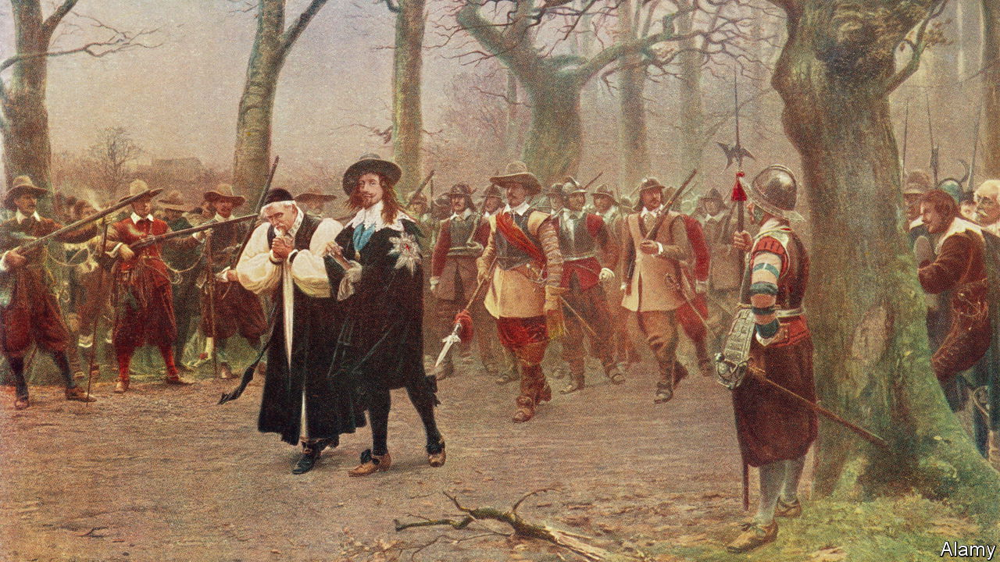

###### Heady times

# England’s 17th century was a ferment of ideas and revolution 

##### Jonathan Healey rattles through a tumultuous era in “The Blazing World” 

 

> Jan 26th 2023 

By Jonathan Healey. 

Writing an accessible history of Britain in the turbulent 17th century, as Jonathan Healey sets out to do in “The Blazing World”, is a noble aim. Starting with the seeds of one revolution and ending with a second, the period teems with ideas about what it means to be a citizen as opposed to a subject, and about how God should be worshipped. By the end of it, a modern concept of the state was emerging. Yet even in Britain it is neglected.

At the turn of the century nine out of ten people lived in the countryside. A tiny minority were literate. Famine and plague were regular scourges; a rising population and stagnant economy spelt misery. Fear of witchcraft was common, as were executions for petty crimes. Fornication could land you in court. By 1700 trade had replaced farming as the mainstay of a burgeoning market economy. Relief from extreme poverty was mandated by Parliament. Towns were hubs of commerce and culture; religious dissent was accepted by a relatively tolerant Anglican elite. Rich Protestant England was a force in Europe.

A continuous thread runs from the accession of England’s first Stuart king, , in 1603, to the dynasty’s fall in the so-called Glorious Revolution of 1688-89. Yet historians often balk at telling the tumultuous, ideologically charged story in one go. Often it is divided into three chunks. First come increasing resistance to absolutism and religious intolerance, civil war, the parliamentary army’s victory, the execution of , and the establishment of the Protectorate under . Next, the monarchy’s restoration under Charles II; finally, the disastrous reign of James II and invitation to William of Orange to take his place and establish a proto-constitutional monarchy.

Mr Healey takes on the whole saga in under 500 pages. It begins when the first James acceded to the throne and was struck by England’s apparent wealth compared with his native Scotland. But the monarchy itself was chronically broke, a condition made worse by the excesses of his court. Tension ensued between his need for cash (he even sold peerages) and Parliament’s traditional control over the royal purse strings. In an era in which absolutism had become the norm across Europe—but was a relatively newfangled notion in England—such restraints were seen first by James, then by his , as a direct challenge to the “divine right of kings”. All the dynasty’s calamities sprang from this clash.

A far less canny operator than his father, the priggish Charles I was widely seen to be trampling over ancient English liberties. Initially, this was a bigger cause for rebellion than the novel idea of government by and for the people: that developed later, particularly in the ranks of the radicalised parliamentary army. When the  began in 1642, nobody thought it would lead to the decapitation of a king and advent of a republic (albeit a short-lived one).

Wily and pragmatic as well as louche, Charles II may have been the only Stuart to see that public opinion, fed by the proliferating news-sheets and pamphlets, could confer or deny legitimacy. The clumsy attempt by James II, a Catholic, to restore absolutist rule was always doomed to failure. The ferment of ideas about politics, society and religion led inexorably to his ousting in the Glorious Revolution—and Britain’s emergence as a stable modern state.

The tempo never slackens in this erudite book. But sometimes the reader feels bombarded by detail (all those parliaments, the Short, the Long, the Rump…). Worse, there is too little attempt to flesh out the luminaries of the age, such as the outrageous editor and propagandist Marchamont Nedham, or John Lambert, the brilliant parliamentary general who drafted England’s first written constitution, and whom the author thinks would have made a more enlightened Lord Protector than Cromwell. Mr Healey’s is avowedly a narrative history. A bit more attention to its characters would not have gone amiss. ■


