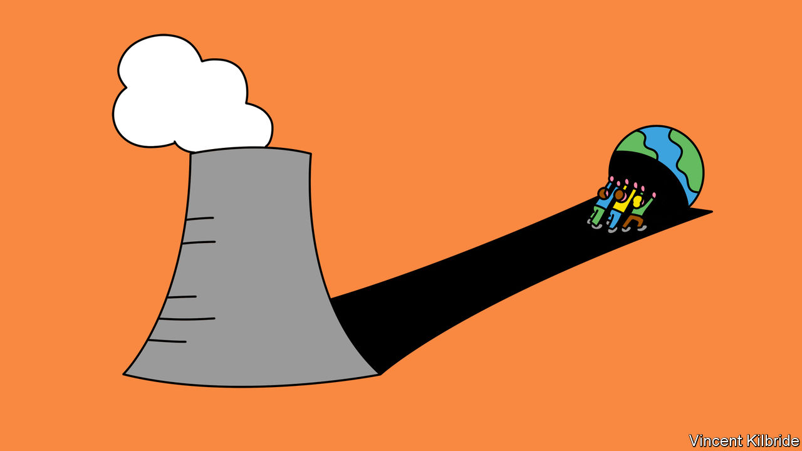

###### The future of energy

# How much innovation is necessary to see off fossil fuels? 

##### Mark Jacobson contributes to an urgent debate in “No Miracles Needed” 

 

> Jan 25th 2023 

By Mark Jacobson. 

“THE Stone Age did not end for lack of stone, and the Oil Age will end long before the world runs out of oil.” That sounds like the oath of environmentalists opposed to the use of fossil fuels. In fact, the prediction was made by Sheikh Zaki Yamani, a Saudi Arabian oil minister who shot to prominence as the face of the Arab oil embargo of 1973. He was convinced that innovations in  and fuels would ultimately loosen  on the global economy.

It has not happened yet. This year marks the 50th anniversary of the . Far from innovating its way to a clean-energy future, the world slipped into complacency as the disruptions of the 1970s faded from memory. Oil, coal and natural gas still make up over four-fifths of the world’s primary energy supply. That addiction—plus a concatenation of war, policy mistakes and economic trends—has now inflicted another energy crunch on the world. Will this squeeze also be forgotten, or could it lead to an overdue revolution in energy?

There are two reasons to think change is coming. The first force is familiar: . Five decades ago, it was the oiligopolists of the opec cartel who clumsily manipulated energy markets. This time Russia, an oil-and-gas powerhouse, has provided an ugly reminder of the dangers of relying on nasty authoritarian regimes. The second factor is rising anxiety about climate change. To avoid its worst effects, almost 200 countries have agreed to restrain emissions of greenhouse gases (GHGs); many are already moving towards a decarbonised energy system. Those twin forces have redoubled efforts to phase out fossil fuels.

Responding to cuts in gas supplies from Russia, the European Commission has put in place aggressive policies to ramp up home-grown renewable alternatives, including electricity from wind power and green hydrogen. The International Energy Agency (IEA), an official forecaster, predicts that full implementation of existing policies alone will lead to peaks in global consumption of coal and gas by 2030 and of oil by the mid-2030s. The hard question is what happens after that. Will innovation end the Oil Age, as Yamani predicted?

That hope is championed by a camp of thinkers which includes Bill Gates, the co-founder of Microsoft.  Mr Gates argued that the pressing need to decarbonise the global economy requires big bets on a variety of nascent but promising technologies, ranging from advanced nuclear energy to “direct air capture” of GHGs. He warned against placing too much faith in wind and solar power, highlighting the constraints imposed by their intermittent generation.

Investing in  may seem uncontroversial. John Kerry, America’s special presidential envoy for climate change, discovered it is not. In the run-up to a un climate summit in Glasgow in 2021, he pointed to scientific assessments suggesting that perhaps half of GHG reductions needed by the middle of this century will “come from technologies we don’t yet have”. Mr Kerry was denounced by those who saw that as an attack on existing technologies. Michael Mann, a climate scientist, dismissed his comment as “pernicious technophilia”. Greta Thunberg, an activist, declared: “Great news! I spoke with Harry Potter and he said he will team up with Gandalf, Sherlock Holmes and the Avengers and get started right away!”

Blow, winds, and crack your cheeks

Now Mark Jacobson, an influential engineering professor at Stanford University—whose research was the basis of the policy approach known as “”—is furthering the debate. In “No Miracles Needed” he says the world must urgently tackle the related scourges of global warming, energy insecurity and local air pollution. This, he insists, will require no “miracle technologies”. On the contrary, “we have 95% of the technologies that we need already commercially available. We also know how to build the rest.” The heart of his plan is a dramatic expansion of wind and solar power (alongside some hydro- and geothermal energy) and, relatedly, of energy storage and transmission.

At first blush, that sounds plausible. Wind and solar are not only commercially viable and operating at scale around the world; they are the cheapest forms of new power generation in most countries. Renewable capacity is set to grow by 2,400GW from 2022 to 2027, equal to the entire power capacity in China today.

Meanwhile, the technologies involved in power transmission are so well-established that America’s National Academy of Engineering hailed grid electrification as the greatest engineering feat of the 20th century. And though energy storage is not yet ubiquitous and affordable, large battery-based systems are operating successfully on grids from California to Australia.

Professor Jacobson’s scholarly and analytical book is persuasive in other ways, too. In common with Mr Gates, he believes everything that can reasonably be electrified should be. He rightly denounces the inefficiency of internal-combustion engines and other fossil-burning generators in comparison with electric alternatives. He acknowledges that long-distance transport and certain industrial applications will require fuels such as hydrogen, rather than electricity, if they are to be decarbonised. And he cleverly rebuts concerns about the variability of wind and solar generation: big power plants, he notes, are themselves often unavailable owing to scheduled maintenance and outages. Much of France’s nuclear fleet has recently been offline, wreaking havoc on its grid.

But there are two wrinkles in his argument. One is overreach. Other proponents of rapid decarbonisation advocate using renewables for the great majority of power within a couple of decades. Professor Jacobson wants them to cover a full 100% by 2035. “Did Magellan aspire to circumnavigate 99% of his way around the Earth?”

Yet a big study by America’s Department of Energy in 2021 found that, though getting close to 100% could be cost-effective, the final few percent would be disproportionately pricey. A dash to supersize what are still smallish industries could stumble on bunged-up supply chains and shortages of talent. Other obstacles liable to raise costs and cause delays include NIMBYism and regulatory backlogs. In America proposed solar projects dawdle in queues for interconnection for more than twice as long as in 2005. In each of Germany, Italy, Poland and Spain, over eight times as much wind capacity is waiting for permits as is under construction. Professor Jacobson acknowledges these problems but has no convincing answers to them.

The second flaw in his case is that, by forswearing technological “miracles”, it is needlessly dismissive of potential game-changers such as nuclear fusion, a risky but alluring long-term bet that has recently attracted billions of dollars in private investment. The UN’s authoritative Intergovernmental Panel on Climate Change keeps the door open to various technologies for carbon-dioxide removal (CDR), from direct air capture of GHGs with giant machines to the use of carbon capture and sequestration in the generation of bioenergy. The author wants to rule out such kit, in part because he thinks it is less green than wind or solar and “diverts funding from lower-cost renewables”.

That is a false economy. The IEA, which is firmly with Professor Jacobson in calling for a peak in fossil consumption, nevertheless insists getting to net-zero GHG emissions by 2050—a goal adopted by many countries—requires “massive leaps in innovation” in advanced batteries, hydrogen, synthetic fuels, carbon capture and other technologies that are not yet commercial. “This is a Herculean task,” Fatih Birol, the agency’s boss, has said. Pressing on without investing in breakthrough innovation would make it even harder. ■


