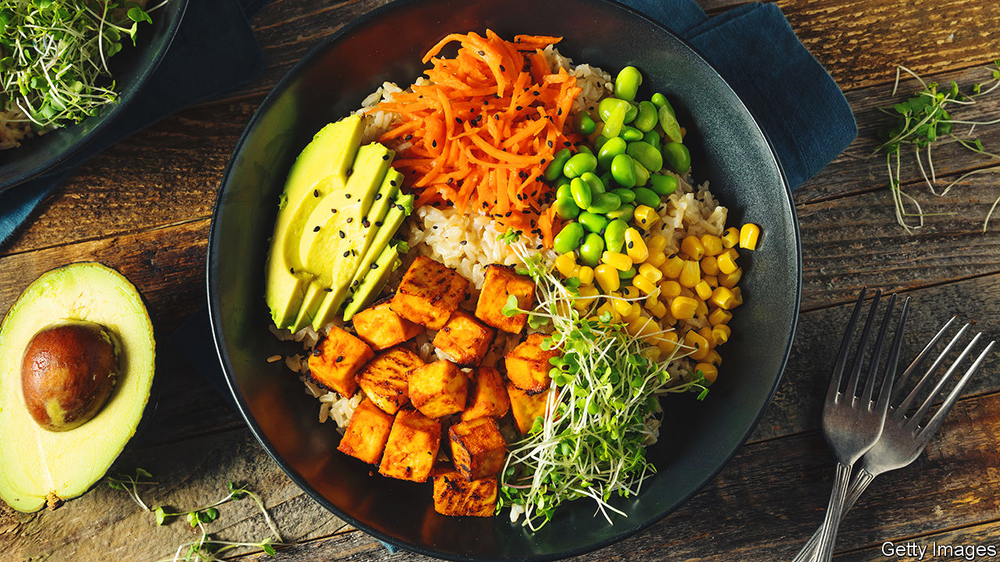

###### World in a dish

# How to eat to 100 

##### Dan Buettner’s book explores America’s healthiest cuisines 

 

> Jan 25th 2023 

NEARLY 70% of American adults are overweight; over a third are obese. Grocery shops contain aisle after aisle of salty crisps, sugary drinks and processed snacks. Cues to eat unhealthily abound. But if this is your archetypal American diet, argues Dan Buettner in “The Blue Zones American Kitchen”, a work of anthropological reporting posing as a cookbook, you are looking in the wrong places.

Mr Buettner studies and writes about “Blue Zones”, areas where people tend to , with unusually high numbers of centenarians and long life expectancy in middle age. In this book, he finds the principles of Blue Zone diets—very little meat and , with most calories coming from whole grains, greens, tubers, nuts and beans—in the cuisines of four demographic groups: Native Americans, African-Americans, Latinos and Asian-Americans.

The recipes that Mr Buettner presents do not necessarily represent what most people in these groups actually eat. For a variety of reasons, for instance, Native Americans and Latinos suffer higher obesity rates than non-Hispanic whites—which would probably not be the case if they all ate as this book recommends. But, historically, each of these groups had healthy cuisines, and Mr Buettner talks to people trying to revive them.

African-American cuisine is often unfairly maligned for over-relying on fried and processed foods. Mr Buettner says this aspect of it is an artefact of the Great Migration, when black people left bountiful gardens in the South, which provided greens, beans and root vegetables, for industrial northern cities. And so the recipes in this part of the book feature crops such as okra, collard greens and Carolina Gold rice, a delicious west African strain. All these played crucial roles in  for centuries.

Diverse as the recipes collected here are, most rely on seasonal, fresh produce, often home-grown. Mr Buettner recounts his confusion when following his GPS directions to meet a Hmong woman in her garden, and ending up in the car park of Target, a department store. Behind a row of trees, he found a  bought by Hmong refugees in the 1970s that, he says, “looked like Cambodia in the morning, [with] fields of bitter melon and zucchini, and people walking around with wicker baskets.”

He says the encounter left him convinced that “there’s so much culinary genius in America that also lines up perfectly with the dietary patterns that produced the longest-lived humans in history. It’s so easy if you look for it.” The truth is a bit more complicated. For urbanites without a garden, these recipes may prove expensive and time-consuming. And as Mr Buettner’s other work on Blue Zones attests, food is just one part of the longevity puzzle. Centenarians tend to live active, purposeful lives centred on family and community.

So this book is not a shortcut to a 100th birthday. But anyone who wants a shot at a century should probably eat less meat and munch more legumes and whole grains. ■


