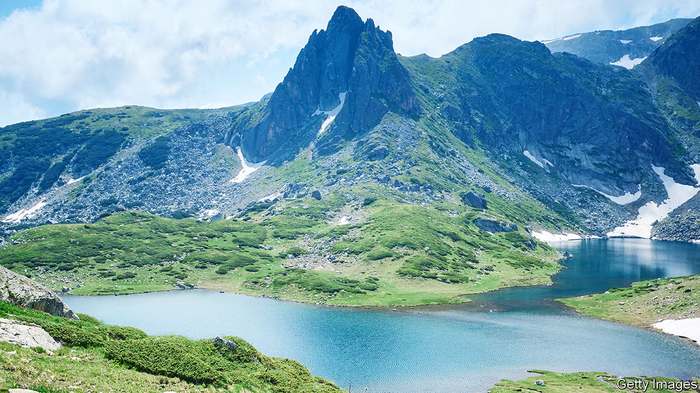

###### Travels in the Balkans

# Kapka Kassabova traverses a landscape that time forgot 

##### The author was born in Bulgaria and revisits it in “Elixir” 

 

> Jan 26th 2023 

By Kapka Kassabova. 

The Scottish HighlanDS and the mountain valleys of Bulgaria are among the wildest places in Europe, measured by their variety of flora and fauna. Both locales are dear to the heart of Kapka Kassabova—and as she roams the south-eastern extremes of Europe, her mind keeps returning to Scotland.

Hers has been a life of seamlessly accomplished switching. , Bulgaria’s capital, in communist times, she changed languages after migrating to New Zealand as a teenager. She moved to Edinburgh in 2005, later settling in a remote riverside spot, near Inverness, which surprised her with daily intimations of “joy for no reason”, and connected her with the childhood summers she spent in the care of rural grandparents.

That goes some way to explain her ability to enter the pre-modern world of Bulgarian valley-dwellers and write about it in subtle prose that mingles empathy with perspective. Her previous books have explored  convulsed by geopolitics but better understood, she argues, through the prisms of . Her new book adds another lens: botany. It is about Bulgarian people, places and plants on either side of a mighty river called Nestos by the ancient geographer Ptolemy, Mesta by the Bulgarians and Karasu (“black water”) by the Turks.

One sketch after another introduces characters who, in various senses, have deep roots in that landscape. Rocky, a man with milky blue eyes and a “humousy smell”, runs a little business selling fungi and herbs; he hires the author to lug crates of earthy stuff in return for instruction in the surprising properties of the local foliage. The root of burdock, Ms Kassabova learns, turns sweet if you boil it for long enough, and can soothe several ailments.

Then there is her new friend Gyulten, whose name means “rose skin” in Turkish. A “wildish” ponytailed grandmother, she was married at 15 on the instructions of her pastoralist father and found herself widowed by 45—leaving her alone to battle, successfully, with cancer. She reports that herbs worked when conventional medicine had given up.

Meeting such people, Ms Kassabova has the sense of connecting with a European substratum of lore and folk religion that clerical and worldly authorities tried hard to suppress. She admiringly recalls , an English herbalist of the 17th century who denounced priests, physicians and lawyers as unworthy and self-serving gatekeepers of knowledge.

All this might sound contrived for urban readers with a modish yearning for Shangri-La. But on the whole the author has enough humour, vulnerability and self-awareness to avoid sinking into bourgeois nostalgiaIn any case, as she makes clear in passing, this is no lotus-eating land where wonderful plants keep cruelty at bay. On the contrary, the people she meets are survivors of—or possibly collaborators with—a form of communism that abused the Pomaks, a community of Muslims who speak a version of Bulgarian and straddle the border with Greece. In the early 1970s Bulgaria’s army shot many who refused to change their Islamic names.

Yet these interlocutors, being hardy highlanders, seem remarkably unscathed. Even their Islam seems a light covering for more ancient forms of veneration. If anything threatened their way of life it was, apparently, the fall of communism and the lure of the richer parts of the European Union. Although she does not make the point explicitly, this precarious survival forms a striking counterpoint to Ms Kassabova’s other beloved landscape. For reasons to do with the Highland clearances of 200 years ago, when sheep replaced peasants, her Caledonian riverbank is pretty empty; many who do live there are, like her, newcomers in search of tranquillity.

Her Balkan heartland has experienced at least as much collective trauma, and far more recently, but its people and parts of their traditional way of life have endured. For how much longer, Ms Kassabova’s readers are left wondering. ■


