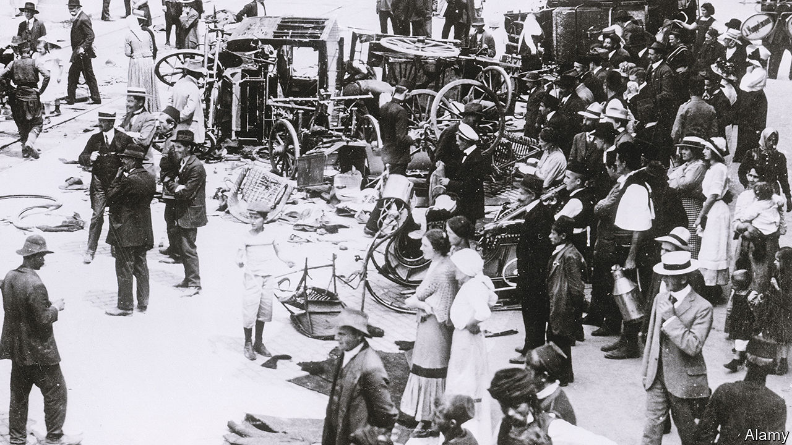

###### Panoramic fiction

# Love, loss, history and exile in Aleksandar Hemon’s new novel 

##### “The World and All That It Holds” spans continents and a century 

 

> Jan 26th 2023 

 By Aleksandar Hemon. 

“You go to sleep in one world, wake up in another,” muses the narrator of Aleksandar Hemon’s fourth novel. Something similar happened to the Sarajevo-born author himself. In 1992 the implosion of  shattered his Bosnian homeland and left him stranded in Chicago. He weathered odd jobs and hard knocks to emerge—with the publication in 2000 of his short-story collection, “The Question of Bruno”—as an English-language writer of verbal agility and ethical finesse.

Migration, dispossession and their legacies . “I live for tales of displacement and oblivion,” this book’s afterword acknowledges. “The World and All That It Holds” is both ampler and simpler than some of his past experiments. Its story of love, hope and survival traverses the Eurasian land mass and the 20th century, from the trenches of the first world war to the chaos of occupied Shanghai.

The story begins in June 1914. An assassin’s bullets  in Sarajevo, and an epoch ends. Soon, in the blood-drenched dugouts of Galicia, the Jewish pharmacist Rafael Pinto meets—and falls in love with—a Muslim fellow Sarajevan, Osman Karisik. Their secret passion will span decades of mayhem, in which they arduously learn that “Cities come and go, as do worlds, as do souls.”

Mr Hemon’s nightmarish battle scenes, offset by the couple’s ecstatic, defiant sensuality, have a visceral impact. Indeed, these “hard and heavy days” of war and desire overshadow the novel’s later acts. After capture by Russians, Pinto and Osman reunite in post-revolutionary Tashkent with baby Rahela (possibly Osman’s daughter) in tow, before dodging Red and White warlords along the . Into this lavish tableau of slaughter and adventure, Mr Hemon weaves the yarns of an enigmatic British spy, Major Moser-Ethering. This fruity fabulist, with “few regrets and no contrition”, may owe something to the style of Marshal Tito’s old pal, Sir Fitzroy Maclean.

Osman vanishes on the plains of Turkestan. His kindly, merry spirit remains a constant guide for Pinto as the story leaps across wars and years in a splintered, lyrical chronicle. Pinto and Rahela join the émigré flotsam in the Shanghai of the 1930s, their self-fashioned father-daughter bond—sealed by a private argot of Bosnian, Ladino and German—supplying emotional ballast. Mr Hemon’s scene-painting has flair and colour but can feel secondhand: pre-cut backcloth, not background.

Pinto loses Rahela to a scheming American until, in 1949, the Communist takeover of China spins fortune’s wheel again. A poignant epilogue, set in Jerusalem in 2001, returns to the frontier zone between fact and fiction, memory and history, where Mr Hemon thrives. His novel encompasses thrilling sequences and flatter patches of period melodrama. Yet within this widescreen epic, he drills as piercingly as ever into the questions of language and freedom, choice and chance, that made the refugee a writer. “You cannot fathom my rules,” Pinto’s God insists. Literature, and love, must make their own. ■


