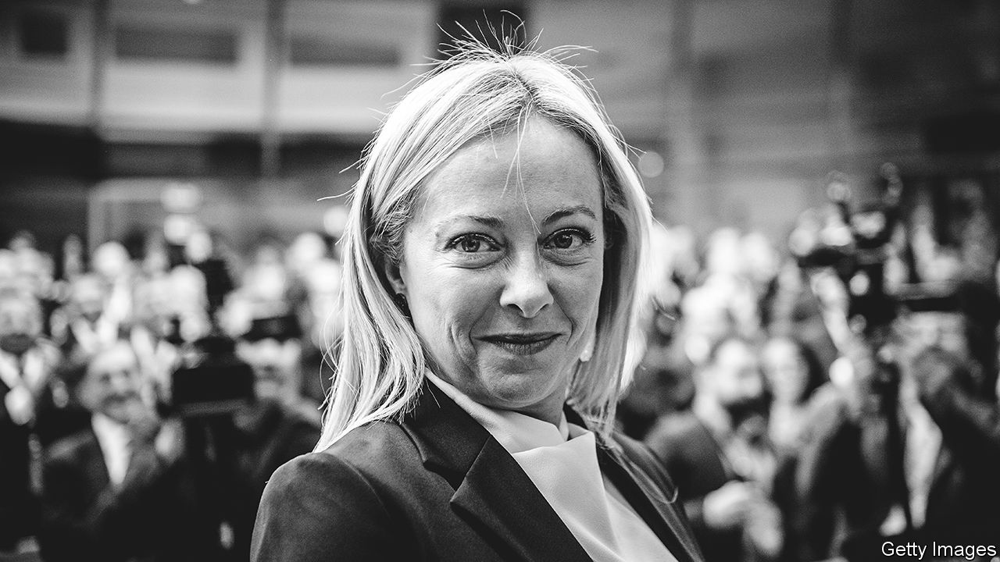

###### Plain sailing

# After a steady first 100 days, choppier waters await Giorgia Meloni 

##### Division and disunity could rock her boat 

 

> Jan 26th 2023 

Few governments approach the end of their first 100 days in such good shape as Giorgia Meloni’s right-wing coalition. In the run-up to that milestone on January 31st, Ms Meloni held convivial meetings with both Ursula von der Leyen and Pope Francis. These were seen in Italy as endorsements from the European Commission, which Mrs von der Leyen heads, and the Vatican—two organisations that Italian prime ministers always need to keep on their side. Then, on January 16th, came a different sort of gift for a government vaunting a tough line on law and order: police in Sicily nabbed Italy’s most wanted man, Matteo Messina Denaro, a Mafia boss who had evaded capture for 30 years. 

Despite having only ten weeks to do it, the government also successfully framed and steered through parliament a budget for 2023. And it claims to have met the conditions for the payment in the weeks ahead of a third tranche of grants and soft loans worth €19bn ($21bn) from the EU’s post-pandemic recovery fund.

With all this going her way, Ms Meloni’s party, the Brothers of Italy (FdI), has unsurprisingly gained in popularity, from 26% at the general election on September 25th to an average of almost 30% in the latest polls. Support for the main opposition Democratic Party has fallen over the same period from 19% to a dismal 16%.

Arguably, though, it is what has not happened since the right took power that is most telling: the markets have scarcely flinched at the advent of a government spearheaded by a party that traces its origins to neo-fascism and was once unabashedly Eurosceptic. The spread between Italian and German ten-year government bonds, a key indicator of concern over Italy’s ability to service its debts, has narrowed. Since the new cabinet was sworn in, it has shrunk from 2.33 percentage points to around 1.8 points.

The change reflects an appreciation for Ms Meloni’s budget, which envisages the deficit falling from 5.6% of gdp to 4.5% this year and 3.7% next. But it also reflects the perception that she has two strong reasons for sticking to the path of prudence. The first is Italy’s giant public debt. By the end of last year, gross debt stood at around 145% of GDP. A second reason stems from the post-pandemic recovery fund. Italy is set to receive the largest share, almost €200bn. It is thus in the interests of the government to avoid spats with Brussels or its EU partners until the last euro has been disbursed. The government initially tried to block ships bringing rescued migrants to Italian ports. But when France pointed out that the move contravened Italy’s treaty commitments, it backed down.

In other, less well-publicised areas, however, the thinking and behaviour of Ms Meloni’s government are clearly at odds with Italy’s European partners, and also with the commission in Brussels. Take digitalisation. With Europe’s oldest population, Italy still ranks low (18th out of 27) on the EU’s Digital Economy and Society Index. But over the five years to 2022 it showed the fastest improvement of any member state. In the previous government, under Mario Draghi, a former CEO of Vodafone, Vittorio Colao, headed a ministry for digital transition with wide powers to promote and integrate the use of digital technology in the Italian administration. Ms Meloni has dispensed with his services and handed the task to one of 17 departments in the prime minister’s office, headed by a civil servant who, by his own account, has elementary English.

A similar aversion to the future surfaced in early drafts of the 2023 budget, which included a provision allowing shopkeepers and others to refuse card payments for less than €60. The proposal raised fears in Brussels that it could hinder efforts to combat tax evasion, and it was eventually withdrawn. But the final draft contained no less than 12 tax amnesties, as well as an increase from €2,000 to €5,000 in a legal limit on any cash transaction. These will hold back Italy’s transition to a cashless society and make it easier for Italians to dodge taxes in future.

So far Ms Meloni has navigated relatively calm waters. But at least three dark clouds can be seen on the horizon. The first hangs over the recovery fund. It remains to be demonstrated that all 55 of the deadlines and targets set by the commission for the latest tranche have actually been met. And Italy’s disbursement of what it has already received is way behind schedule. 

Ms Meloni’s boat could also be rocked by disunity within her coalition. The fear when she took office was that her two partners would balk at her support for sanctions on Russia and arms supplies to Ukraine. Matteo Salvini, the leader of the Northern League, was once a fan of Vladimir Putin. Silvio Berlusconi, who heads Forza Italia, still is. So far neither has dared to challenge the government’s stance. 

But an arguably more divisive issue has emerged: constitutional reform. For the FdI and Forza, that means the introduction of a semi-presidential system. For the League, it means greater regional autonomy—a reform critics argue would widen the already troubling gap between the richer north and the poorer south. 

And then there is the third and scariest threat to the government’s plain sailing: the ECB’s plan to raise interest rates while tapering its bond-buying programme, a policy Ms Meloni and her ministers have repeatedly deplored. Italy’s gross government debt as a proportion of GDP has fallen from the peak of 155% reached during the pandemic. But it is still quite enough to make Italy vulnerable to a sell-off in the bond markets if investors take fright at political instability or fresh economic disruption. Ms Meloni has so far proved to be an adept skipper. But even the best can find themselves at the mercy of the weather. ■

