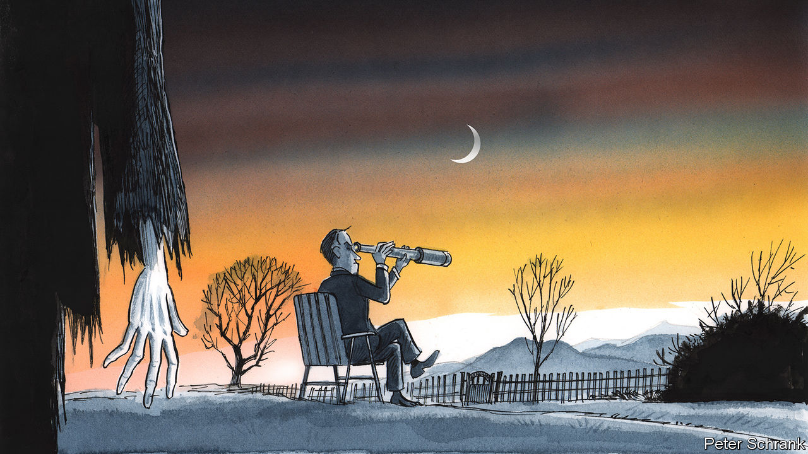

###### Charlemagne

# Experience from a past crisis suggests Europe should shake off any complacency 

##### The ghost of 2009 haunts Europe 

 

> Jan 26th 2023 

Consider the start of 2009 and see if it sounds familiar. A swathe of Europe was wondering how to keep itself warm after Russia cut off gas supplies over a dispute with Ukraine. A global shock the previous year had threatened economic meltdown, but was starting to look manageable. Europe wondered how to respond to a vast subsidy programme designed to mollycoddle American carmakers without destroying its own single market. France’s president demanded an end to unfettered free trade. A first-term German chancellor stood accused of putting national interest ahead of the European kind. Foreign policy wonks wondered how to engage with Russia in the wake of its attempts to invade its neighbour. Taylor Swift topped the charts. Recep Tayyip Erdogan looked to be dragging Turkey ever further from democracy. France was crippled by strikes. History may not repeat itself—but it can come pretty close.

Besides the antics of French workers, Mr Erdogan and Ms Swift—a feature of just about every year, not just 2009 and 2023—the parallels ought to be enough for European policymakers to study the events of 14 years ago. The conclusions they might draw are sobering. For the sensation of having narrowly averted disaster felt in early 2009 turned out to be misplaced. Europe thought it had weathered the effects of the global financial crisis. In fact it had plodded through the mere prequel to the more serious euro-zone miasma that ensued. In hindsight, the start of 2009 was a period when a bit more prevention might have prevented several years’ worth of emergency late-night EU summits. If 2024 even half-rhymes with 2010, best to be worrying now.

A sense of smugness certainly pervades Europe once again. Warm weather has helped blunt the gas weapon Russia had hoped would prove decisive (unlike the case in 2009, when a cold snap had left much of eastern Europe shivering). Partly as a result, a recession that once seemed inevitable now looks less likely. Nor is there much of a sense of urgency around dealing with the war in Ukraine: witness how long it has taken to agree to send Kyiv tanks to take on Russia. Germany a year ago promised a —a change in the spirit of the times—but has less to show for it than was originally expected. On the economic front, the EU’s big idea is to neutralise a fresh dollop of American subsidies with a new fund designed to back European industry. But even an outline of what that will look like won’t be revealed much before summer. Yet another summit of European leaders has been called for February 9th, the tenth in a year. But not much is likely to come out of it.

If 2023 is, like 2009, merely the eye of the storm, what horrors might await Europe on the other side? One depressing possibility is a variant replay of the euro-zone crisis. The flaws in the single currency that caused a run-of-the-mill recession to degenerate into something far graver after 2010 have never been fully addressed. There is still no permanent euro-zone budget to buttress economic shocks, nor a functioning banking union to prevent an ailing financial system from contaminating public finances (though banks themselves are safer). The once-a-century pandemic led to an exceptional downturn and a hugely costly stimulus in response. Nonetheless the financial tools for the currency bloc devised in the wake of the Greek crisis remain partly untested. Worse, the pandemic has left national governments laden with far more debt than in 2009. The European Central Bank has helped by snapping up lots of bonds issued by Italy and Spain, allowing them to borrow cheaply. But inflation is forcing it to move away from low interest rates. A year ago investors demanded less than 2% a year in interest to lend to Greece. Today they want over 4%. Fiscally prudent Finland has said it expects its borrowing costs this year to triple compared with 2022. 

Having lived through it, policymakers are alive to a rerun of the euro saga and will have ideas on how to fend it off. More likely the next crisis will fall under the category of “things that will look obvious in retrospect” and could have been fathomed ahead of time. The mere possibility of an isolationist Republican winning the White House next year—either an ideological clone of Donald Trump, or the man himself—is one possibility. Having warned Europe that it should pay for its own defence once before, a Trumpian America will have even fewer qualms about putting itself first. The Biden administration pays lip service to Europe’s travails as American green tax breaks threaten to suck investment and jobs across the Atlantic; an isolationist American will not even do that. Or take China. Mr Biden is trying to nudge Europe away from doing business with its geopolitical rival. A less diplomatically inclined president might pursue the same objective but not care much when it leaves Europe in the lurch. 

Whatever shape Europe’s next crisis comes in, it will be exacerbated by divisions within the bloc. After 2009 it was the German-led “core” pitted against the Club Med “periphery”. The dividing line this time separates the eastern flank of the continent from the EU’s original members in the west. Impatience has festered in Poland and the Baltics over the cautious approach taken by Germany and France in helping Ukraine. The feeling is mutual—and will be much worse if the war starts going Russia’s way in the spring. That might spark starker disagreements within NATO, too. 

The 14-year-hitch

Europe has not done a bad job of handling Ukraine, just as it once navigated the post-Lehman turmoil as best it could. But crafting complex compromises to handle crises at EU level tends to be time-consuming, if not downright exhausting. The prudent course is for more attention to be spent on looking beyond the immediate problem and dealing with what might ail the continent next, rather than assuming the worst has already passed. Railway crossings in France warn that “one train can conceal another”. Much the same is true of crises. ■


