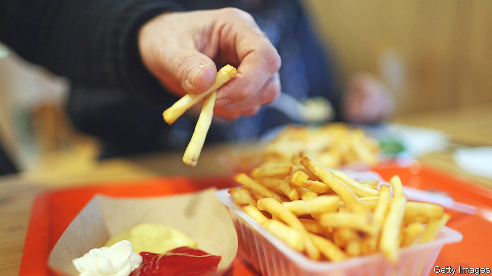

###### French obesity

# France sees a surprising surge in obesity 

##### The trend is worrying public-health officials 

 

> Jan 26th 2023 

AS haute couture fashion week got under way in Paris on January 23rd, the city of light was treated to the ritual display of fabric draped over skinny frames. In France the slimline silhouette seduces consumers off the catwalk too, year round, on billboards and in advertising spots. This body ideal persists, despite the fact that even in France obesity is on the rise. Between 1997 and 2020 the share of obese French adults doubled, to 17%, or 8m people.

France’s obesity rate is still well below that in America (40%), Mexico (33%) or Britain (26%). But the trend worries French public-health officials, for reasons ranging from mental-health issues to weight-related conditions such as diabetes. The government has set up a task force on obesity, under Martine Laville, a professor of nutrition in Lyon. It will report back in March. 

Obesity in France is most marked among those on low incomes, in the ex-industrial north-east and, perhaps surprisingly, among women (French men still have on average one of the lowest rates in the European Union). A poor diet high in processed food is one explanation for the income gap. According to a report by the French Senate, the obesity rate among manual workers in France reached 18% in 2020, whereas for managerial workers it is below 10%. 

Living with obesity is particularly difficult in a culture that celebrates thinness. In 2017 France did ban the use of excessively thin catwalk models. “ (fat phobia) hurts,” said Marianne James, a talent-show judge weighing 138kg (304 pounds), who graced a magazine cover this week. But such images remain rare. One of the “singular achievements of French civilisation”, wrote Mireille Guiliano, in a best-selling book in 2004, is that “French women don’t get fat”. Such claims now seem as unhelpful as they are untrue.

