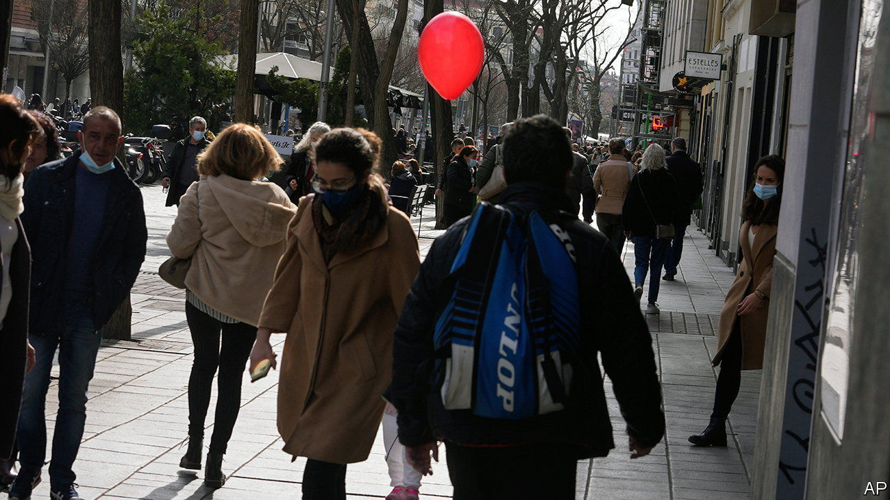
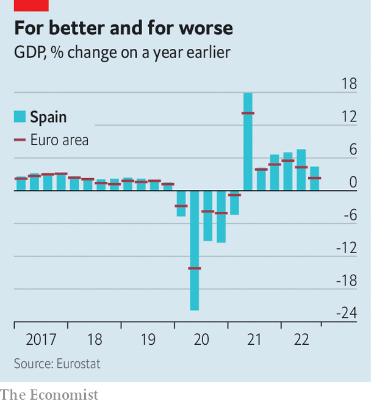

###### Bouncing back

# Spain’s economy is recovering from the pandemic, but problems persist 

##### The government must grapple with chronic issues 

 

> Jan 26th 2023 

It was the worst of times, then the best of times. In January 2022, an index by , ranking 23 countries’ recoveries from the pandemic, put Spain in last place. The government criticised the index, while the opposition was bound to jeer. 

A year later, a similar exercise put Spain in 4th place, and it was the government’s turn to strut. And the flattering numbers continue to appear. Annual inflation, running at 5.6% in December, is the lowest in the euro zone, in part because Spain consumes little Russian gas. The main share-price index has made up most of its losses. The unemployment rate is the lowest since 2008, when the financial crisis burst a construction bubble. Tourism rebounded strongly last year. 

 


So on January 27th the country is expected to announce GDP growth of more than 5% for 2022; the IMF put the number at 5.2%. In 2023, the IMF forecasts growth of just 1.1%. But even that would still be ahead of the growth currently expected for the euro area as a whole. The news is well timed for the government led by Pedro Sánchez’s centre-left Socialists. Spain holds local elections in May, and a general election at the end of the year. 

The opposition People’s Party (PP) argues that, international comparisons notwithstanding, things are objectively bad. GDP and consumption have been slow to return to pre-pandemic levels. With wage growth subdued, inflation has bitten into real incomes. The prices of prominent products are up by more than inflation—olive oil, which Spaniards use in great quantities, shot up by around 40% last year. 

What the government can truly claim credit for, or take the blame for, should be the key question for voters. Last year’s growth may be expected for a country that typically overshoots its neighbours’ ups and downs. The modest growth expected in 2023, say analysts, is largely the result of the European Union’s pandemic-recovery programme, of which Spain is the second-biggest beneficiary: it is getting some €77bn in grants, plus loans. Spain was quick to design its programme for the funds, but has been slow to spend them—thanks partly to its heavily decentralised government, says Nadia Calviño, the economy minister. The money should finally flow in earnest this year.

Once it does, Ms Calviño says it should support a virtuous circle. Productivity has grown feebly for two decades. The money is meant help change that, with public-private projects making high-value-added products like electric cars, and digitising small businesses and health care.

The most common criticism is that Spain’s fiscal homework remains undone. Its tax-collection numbers are up, thanks to black-market jobs entering the licit sector during the pandemic, when being officially employed brought with it the ability to take advantage of aid programmes. But the structural deficit is still worryingly high—perhaps 4.5-5.0% of GDP, says Ignácio de la Torre of Arcano, an investment firm. The EU’s deficit limit of 3% of GDP, suspended in the pandemic, returns next year. Pensions remain in deficit, with the general budget used to cover annual shortfalls of at least 1.5% of GDP, says Ángel de la Fuente of FEDEA, a think-tank. But few expect the reforms currently being discussed to be enough to make the system sustainable when Spain’s younger-than-average baby-boom generation retires. 

The opposition leads in most polls for now. The sunny economic news, provided it continues, will give the government a strong closing argument. But whoever wins the elections will not have long to enjoy their victory before needing to grapple with Spain’s chronic problems. ■

