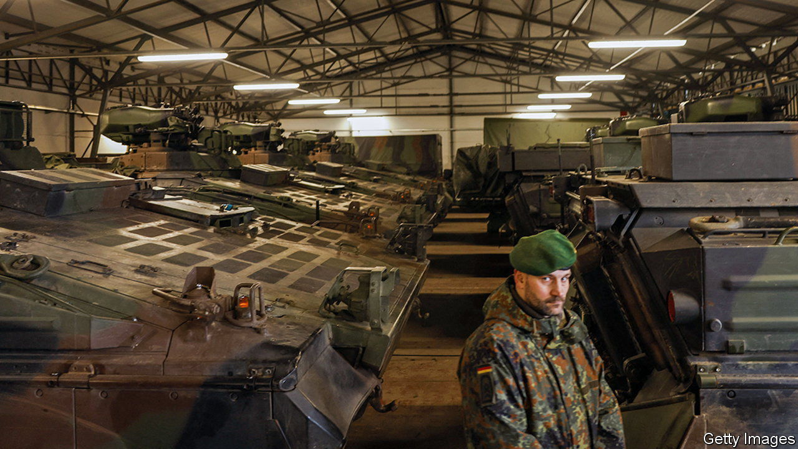
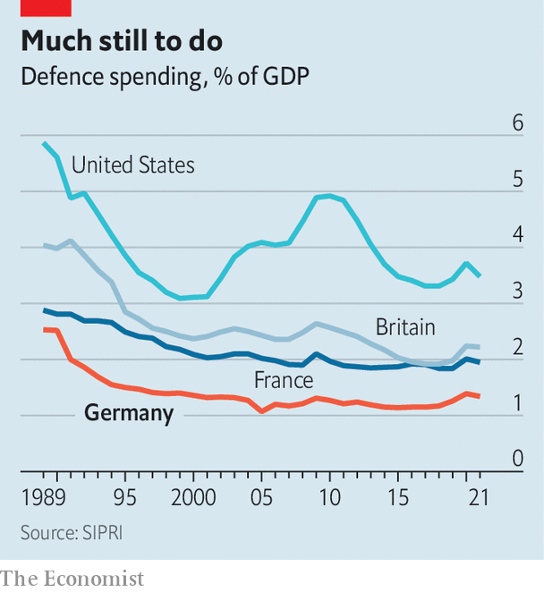

###### Germany’s armed forces

# The state of the Bundeswehr is more dismal than ever 

##### A critical year to reform was lost 

 

> Jan 26th 2023 

“The Bundeswehr, the army that I am allowed to lead, is more or less depleted,” wrote General Alfons Mais, chief of the German army, on the day Russia attacked Ukraine, in an emotional post on social media. “We all saw it coming and were not able to get through with our arguments, and draw and implement conclusions from the annexation of . It doesn’t feel good! I am fed up!”

Almost a year after the general’s much-noted post,  are more depleted than ever, owing to the kit they are sending to Ukraine. Their stockpile of ammunition would last only a few days, rather than the 30 recommended by nATO. The radio equipment used by troops is 40 years old and analogue—and hence easy to intercept. Of its 350 Puma infantry fighting vehicles, just 150 are operational. The Bundeswehr does not even have enough Band-Aids, according to a report in December by Eberhard Zorn, the inspector-general of the armed forces.

 


For pundits and military personnel, the dismal state of the Bundeswehr is not news, but until Russia’s attack on Ukraine Germany’s leaders did not care enough to do anything about it. War in Europe seemed unthinkable. Political leaders watched the Bundeswehr shrivel to a force that could deploy several hundred men to help fight in international trouble spots such as Afghanistan or Mali but had lost its ability to defend Germany and fulfil its NATO obligations. 

A year ago it seemed that the shock of Russia’s invasion would force radical and rapid change on the Bundeswehr. Three days after the attack, Olaf Scholz, Germany’s chancellor, signalled to the world that Germany was determined to have a strong, cutting-edge army when he announced a “turning point” in parliament, which included establishing an extra fund of €100bn ($107bn) for the armed forces, twice the annual defence budget. He also promised to meet NATO’s defence-spending target of 2% of gDP. “The speech hit us like a thunderbolt,” says a senior German soldier. At last the armed forces would be a priority for policymakers.

Eleven months later, Germany’s soldiers are again feeling frustrated. The Bundeswehr has so far seen little of the promised massive investment. Germany has ordered 35 F-35 fighter jets made in America that will replace its fleet of Tornados, but they will be delivered only in 2027. 

After a series of gaffes, Christine Lambrecht, the defence minister, resigned on January 16th. She should have overseen a big reform of the armed forces but preferred to take baby steps. “We lost a decisive year,” says Christian Mölling of the German Council on Foreign Relations, a think-tank, who thinks Mr Scholz was unaware when he made his speech of the full extent of the armed forces’ problems. 

The long-term malaise is such that the job of defence minister is known in Berlin as “career killer” or “ejector seat”. Mr Scholz tried and failed to persuade a top politician to take Ms Lambrecht’s job. Boris Pistorius, who was sworn in on January 19th, was previously interior minister of Lower Saxony. He was thrown into the deep end on his second day in his new job when he had to try to justify Mr Scholz’s prevarications about sending heavy tanks to Ukraine. 

Mr Pistorius will not have a moment to rest. He needs to rebuild the Bundeswehr and continue to help Ukraine while meeting Germany’s NATO commitments, says Rafael Loss of the European Council on Foreign Relations, another think-tank. On January 1st Germany took over as leader of the Atlantic Alliance’s Very High Readiness Joint Task Force. This includes 11,500 soldiers, more than half of whom are provided by Germany. Yet if the VJTF were to deploy, the German contingent would need to scrounge kit from other Bundeswehr units as it is so poorly equipped. It would be hard put to be operational within 48 to 72 hours, as NATO requires.

Germany has also pledged to make 30,000 fully equipped men and women available for NATO service by 2025. Experts doubt it can do this. The entire armed forces consist of some 183,000 men and women, compared with almost 500,000 at the end of the cold war, when West Germany spent almost 3% of its gdp on defence. Three decades of underfunding and an increasingly bloated bureaucracy have taken a heavy toll. But more than money is needed to fix the Bundeswehr. Soldiers—and their chief—must not feel fed up any more. Otherwise the armed forces will not attract the men and women to grow to 203,000 by 2032, as the plan demands. ■

