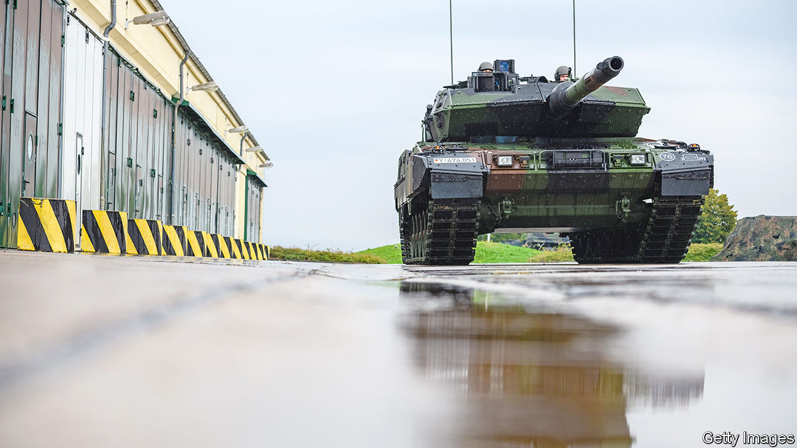

###### The great Panzerwende

# What Western tanks should give Ukraine in the next round of the war 

##### A new armoured fist will help Ukraine repel Russia, but the stakes are rising 

 

> Jan 22nd 2023 


EACH PHASE of the war in Ukraine brings its iconic weapons. Around Kyiv last winter the shoulder-fired Javelin anti-tank and Stinger air-defence missiles had starring roles. When fighting shifted to the eastern Donbas region in the spring, it was the 155mm howitzer. As Ukraine advanced in the autumn, plaudits went to the  rocket launcher. Now, as both sides prepare for new offensives, the spotlight has turned on the Leopard tank.

Russia still occupies about 17% of Ukraine’s territory—including Crimea, the peninsula it annexed in 2014 and which poses some of the trickiest questions about the future of the war. Right now, the war has become one of static but bloody attrition. In the air, Russian missiles and drones seek to cripple Ukraine’s electrical grid. On the ground, artillery barrages and human-wave attacks have allowed Russian forces to inch forward around . 

The spring fighting season may prove decisive. Ukraine’s edge in battlefield manpower is eroding, now that the Kremlin has mobilised 200,000-300,000 soldiers and may soon call up more. With Russia’s arms factories working triple shifts, Ukraine cannot outmatch it in brute firepower, given the West’s depleting stocks of arms. Ukraine needs a game-changing strategy. So America and its allies have shifted from providing weapons in piecemeal fashion to training and equipping entire armoured units for manoeuvre warfare. The aim is to help Ukraine not just repel the next Russian push, but to take back lost lands.

In large military-aid packages this month, the allies first promised hundreds of  and other armour—American Bradleys and Strykers, German Marders, French AMX-10RCs and Swedish CV90s. To create truly armoured units, though, Ukraine also needs lots of Western . 

These have proved unusually divisive. The tanks Ukraine most needs are German-built Leopards. Unlike the British Challengers, they are plentiful (about 2,000 Leopards are in service with Western armies). And unlike the American M1 Abrams, they are relatively easy to supply and maintain: they are powered by diesel engines rather than gas turbines. But to the growing fury of allies at home and abroad, the German chancellor, Olaf Scholz,  against giving Leopards, or letting other countries supply theirs. 

This obstacle was overcome on January 25th when America and Germany announced they would send 31 M1 Abrams and 14 Leopard 2 tanks respectively. Britain is sending 14 Challengers, and Poland a similar number of Leopards. Finland, the Netherlands, Norway and Spain may send Leopards, too.

Mr Scholz performed what tankies call a “pivot steer”—ie, spinning on the same spot to change direction. “Germany will always be at the forefront when it comes to supporting Ukraine,” he declared. Yet he moved only with American covering fire. Having resisted sending the Abrams, President Joe Biden relented because, as one official put it, he was “extremely focused on the importance of transatlantic unity”. Though strengthened, Ukraine now has an added headache in managing a bewildering variety of armaments. As important as the kit is the training which America is providing to improve Ukraine’s combined-arms operations. This involves co-ordinating armour, infantry, engineers and drones in mutually reinforcing fashion. 

One disappointment, says Ben Hodges, a retired general who used to command the American army in Europe, is the lack of longer-range precision weapons. The GPS-guided missiles fired by HIMARS can strike up to 84km away. Russia has pulled back its main command posts and logistics hubs to keep out of range. America refuses to supply the 300km-range ATACMS missile, fearing it could escalate the war.

The Pentagon concedes that Ukraine needs help to wage a “deep fight”. But it is also withholding the Grey Eagle armed drone, not to mention military jets. Some had hoped for the deployment of a new HIMARS-launched missile known as a GLSDB with a smaller payload but longer range of 150km, but it has yet to be announced.

More and better armour, plus the means to strike deeper, would allow Ukraine to aim for the “decisive terrain” of Crimea, says General Hodges. Ukraine could make an armoured thrust to sever the land bridge between Russia proper and the peninsula. With long-range munitions, meanwhile, it could destroy the actual bridge to Crimea over the Kerch Strait, damaged by an explosion in October 2022. Ukraine could then pound Crimea, making Russia’s position untenable, he argues.

Being forced out of Crimea would be a devastating military and political blow to Vladimir Putin, Russia’s president, which is why some allies fear it might push Mr Putin to . America asserts that “Crimea is Ukraine”. Whether it would in practice support retaking the peninsula is another matter. Yet it may see advantage in Ukraine at least being able to threaten Russia’s hold on Crimea in order to force it to the negotiating table.

Talk of reconquering Crimea is premature, argues Michael Kofman of the CNA, an American think-tank. Since their retreat from Kharkiv and  last year, the Russians are defending a shorter front line with more soldiers and reserves. And both sides lack air superiority, a big part of Western combined-arms warfare. “If the next Ukrainian offensive goes poorly, it carries the risk of a Russian counter-offensive and, in the worst-case scenario, losing territory rather than gaining it,” he notes.

The foreboding is palpable. “For this year it would be very, very difficult to militarily eject the Russian forces from every inch of Russian-occupied Ukraine,” cautioned General Mark Milley, chairman of America’s joint chiefs of staff, evoking a “very bloody war”. 

In Moscow, meanwhile, air-defence weapons have appeared on rooftops. Dmitry Medvedev, deputy chairman of Russia’s security council, gave a grim warning: “The defeat of a nuclear power in a conventional war may trigger a nuclear war.” His nuclear bombast was nothing new; but acknowledging that Russia could be defeated was novel and striking. ■

