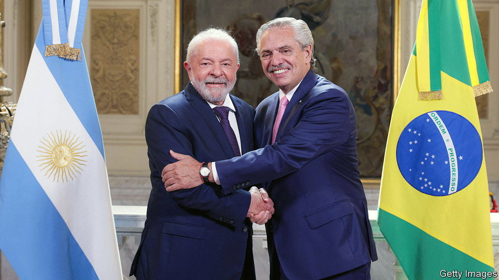

###### Gaucho, grilled

# Argentina and Brazil propose a bizarre common currency 

##### What are they thinking? 

 

> Jan 26th 2023 

Argentina is running out of vaults. With annual inflation nearing 100%, as the central bank prints bills to cover the government’s fiscal deficit, local banks are making space for ballooning stocks of pesos. Officials have tightened capital controls. Imports are at a standstill. The government is going through the motions with the imf to avoid its tenth sovereign default since independence in 1816. Yet on January 22nd Luiz Inácio Lula da Silva, Brazil’s president, and Alberto Fernández, his Argentine counterpart, announced they would start preparations for a common currency, possibly leading to a full currency union, which would hitch South America’s biggest economy to one of its sickest.

The idea has a history. First came the “gaucho”, a currency meant to replace Brazil’s cruzado and Argentina’s austral until the concept was abandoned amid economic turmoil in 1988. On its heels was a proposal by members of Mercosur, a trade alliance, to adopt a common currency, and sucre, an experiment led by Venezuela, which had ambitions to reduce the continent’s reliance on the dollar. Since it is prone to selling foreign reserves to prop up the peso, Argentina is always short of dollars to settle loans and pay for imports. A joint currency would create alternative reserves and make neighbourly trade easier. Brazil is Argentina’s largest trading partner. By supporting the idea Lula, as Mr Silva is known, gets a reputational boost from being seen to revive regional co-operation. 

That, at least, is the case for the idea. The case against is daunting. A full union, with a joint central bank, would surely crumble. Economists judge how well countries fit in a currency union using criteria devised by Robert Mundell, a Canadian economist, that measure economic similarities. Normally, central bankers tailor interest rates to individual economies; in a union, one rate has to do for them all. Policy rates in Argentina and Brazil are an astonishing 61 percentage points apart. Their business cycles are wildly out of sync as their main exports—agriculture and industrial commodities, respectively—are affected by different global headwinds. Argentina’s problems make its downturns deeper and booms shorter and shallower. 

Another condition specified by Mundell is that people and money should move smoothly across borders, acting as a means of adjustment when a shock hits one country but not the other. Whereas in Europe farm workers hop between jobs and countries, South America’s poor infrastructure makes travel a hassle, and Argentina’s capital controls make getting paid across borders nearly impossible. If workers do not end up where they are most productive, artificially high wages could spark inflation in parts of the union. Moreover, as long as Brazil was committed to the joint currency, it would be forced to bail out its southern neighbour. Secure in that knowledge, Argentina would have every reason to carry on spending irresponsibly. 

Brazil is already getting cold feet. Officials have stressed the new currency would be an addition to the two national ones, rather than a replacement, and that it is a long-term project. Other countries are not racing to join. Lula and Mr Fernández offered South American leaders the chance to do so at a press conference on January 25th: no one has so far taken them up. 

This watered-down union would still place Argentina’s problems at Brazil’s door. There would need to be a monetary policymaker, either a currency board or full-blown central bank, to watch exchange rates. The imf, to which Argentina owes $72bn, would be less willing to prop up the peso if Argentina had another legal tender. To top it all off, Lula would have to ignore his independent central bank, which has come out in opposition to the idea. On January 23rd, barely 24 hours after the grand announcement, Fernando Haddad, Brazil’s finance minister, implied the idea would only get off the ground as notes of credit that were backed by Argentinian commodities. That would not be currency at all. But it would be more borrowing, which is exactly what Argentina set out to avoid. ■


