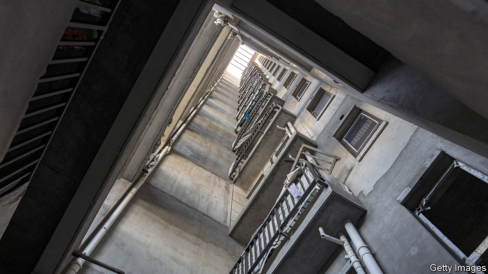
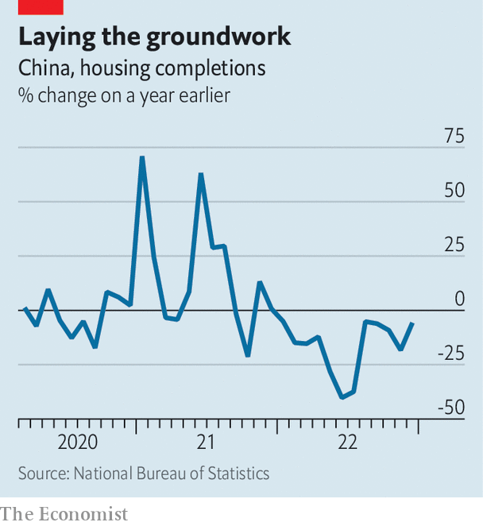

###### Disaster relief

# Can China fix its property crisis? 

##### Reforms risk another wave of excess 

 

> Jan 23rd 2023 

To judge by the high-rises dotted along the shore in Haiyang, a small coastal city, Country Garden’s prospects are pretty meagre. The firm, China’s biggest developer by sales, has sold few beachside flats. A handful of towers appear only partly built. A faux-German village with pointed roofs accommodates shops and restaurants, and adds a measure of flair. But it, too, is nearly empty. The company’s failure to sell homes was made clear when its profits for the first half of 2022 nearly evaporated altogether.

Country Garden is not the only Chinese developer to have faced such difficulties. The volume of floor space sold across the country fell by 24% in 2022, the biggest slump since data became available in 1992. Meanwhile, property investment was down 10% year on year, the first drop on record. Cross-border defaults are also proving difficult. , the world’s most indebted developer, which collapsed in 2021, has still not produced a restructuring plan originally due in July. The firm’s auditor, PwC, resigned on January 16th. This  has been catastrophic for , which derives around a fifth of its gdp from property. 

The country’s officials are currently redesigning policy on a vast scale. The government has  its “zero-covid” approach to the pandemic, while simultaneously signalling an end to a crackdown on technology firms. Policymakers are also trying to rescue the property industry. After two years of forcing developers to deleverage—which has pushed dozens to default on debts—regulators are now abandoning many of these measures in the hope of reviving sentiment. This has prompted a measure of optimism. Despite the bleak view in Haiyang, Country Garden’s share price has trebled since October.

The exact contents of the government’s reforms remain murky. On January 13th officials produced a draft 21-point plan which stated that the aim was to provide liquidity to “good-quality” developers. The task now is to differentiate between these companies and bad ones: no clear definition has been given of what constitutes good quality. The plan will also push policy banks to grant loans for stalled projects and state-owned asset managers to provide credit for mergers and acquisitions. Commercial banks, which had pulled back from property, have been told to start lending to reliable developers once again. And state media report that the “three-red-lines” policy, which capped debt, will be relaxed for 30 unnamed firms. 

Companies began rapidly raising new debt in December—a sign that policy easing kicked off well before the government announced the new measures. Local authorities have been lowering mortgage rates, and many are now at record lows. The state’s bail-out funds are targeting unfinished construction. About 60% of homes sold between 2013 and 2020 are thought not to have been delivered to buyers, many of whom have nevertheless started to make payments. Without funding, construction projects have stalled and cannot be finished. Fear of unfinished homes has put off prospective buyers.

The state also wants to avoid more messy defaults. Country Garden made a last-minute payment to bondholders on January 17th. This was enabled by support from local governments, something few companies aside from those as big and important as Country Garden have at the moment. According to Refinitiv, a data firm, some 950bn yuan ($140bn) in offshore dollar debts alone will mature this year, up from 810bn yuan last year. 

 


The plan is showing some early results. Home completions fell by 6% year on year in December, marking a recovery from the month before when they fell by 18% (see chart). This is a closely watched measure: unfinished homes prompted homebuyers to boycott their mortgage payments last year, as part of a wave of protests. The reforms have been assisted by the removal of covid-19 restrictions. A few weeks before the policy changes, moving about in Chinese cities (say, to look at a property) carried the threat of quarantine. Preliminary data from Beike Research Institute, a consultancy, suggest that sales of existing homes in 50 big Chinese cities may have risen by more than a fifth in the first ten days of the year, compared with the same period a month earlier.

Kaisa, a developer that defaulted in 2021, has been avoiding restructuring talks with foreign investors and looks to be far from an agreement with creditors. Yet despite its troubles, demand for the company’s homes appears to be growing. Analysts from CreditSights, a research firm, recently visited a project in Shanghai and found agents were no longer offering discounts on flats. The absence of price cuts suggests demand is beginning to pick up for properties in good locations.

A few foreign investors have been encouraged by the state’s plan. Firms have almost entirely been shut out from the offshore bond market, where many global asset managers and hedge funds are trying to recoup losses following missed payments. The funds raised by developers fell by a quarter last year compared with the year before. But on January 12th Dalian Wanda Commercial Management priced a $400m junk bond, the first in more than a year and a sign that some well-known developer-linked groups may slowly return to the offshore dollar-bond market in the coming year. Fidelity and BlackRock, two American asset managers, bought into the offering, according to Reorg, a research house.

Time for the tightrope

The reforms could bring about a stabilisation of the housing market and a slight rebound in sales in the second quarter of the year, according to analysts at Morgan Stanley, a bank—roughly what the government is hoping to achieve. But officials must tread a fine line. Too much funding would revive old problems of oversupply, and do so at a time when China’s population is beginning to decline. Vacancy rates hit 7% in China’s biggest cities last year and 12% in second-tier cities, much higher than the global average, reckons JPMorgan Chase, another bank. About 70% of homes sold since 2018 have been bought by people who already own at least one property. 

Speculation has made Chinese homes the most expensive in the world on a price-to-income basis. Hong Hao of grow Investment, an asset-management firm, says the three-red-lines policy at least obliged developers to slow the rate at which they took on debt. The campaign brought on huge problems for the Chinese economy, but without it “the situation would be much worse”, he adds. If the government ends up pouring too much money into the bail-out it could lead to another wave of excess, and more empty seaside projects. ■


