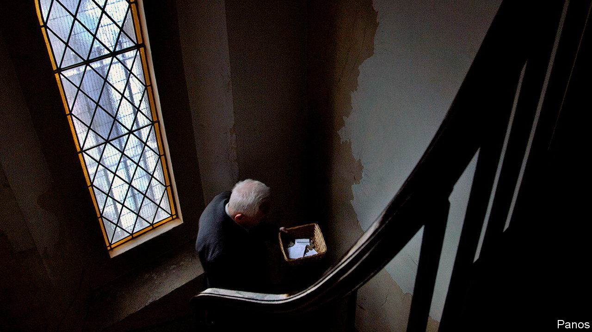

###### Religious investing

# Christians fight about how to serve God and mammon 

##### Is ESG simply a social-Marxist agenda? 

 

> Jan 26th 2023 

Is it possible to manage money successfully and be a virtuous Christian? For 2,000-odd years, followers of the world’s largest religion have debated the issue. Recently the debate has become fractious. The management of Christian money, once farmed out to professionals, is now a moral minefield, the negotiation of which has effects in the here-and-now, not just the hereafter. 

Christian investors mostly fall into three camps: those willing to forge a partnership with environmental, social and governance (esg) types; those stridently opposed to them; and Roman Catholics. Dave Zellner, who manages $24bn for Wespath, in effect the investment arm of America’s Methodists, is in the first. He calls his job a search for “the intersection between good business practice and church values”. Wespath lends to housing projects for the poor, but at market rates. It teams up with worldly lobby groups for shareholder activism, including a coalition called Climate Action 100+ which encourages energy companies to quit carbon. 

Robert Netzly, an American evangelical, is Mr Zellner’s mirror image. His firm, Inspire Investing, manages $2bn. It seeks to apply “Biblical principles” to all choices. Last year Mr Netzly renounced the esg label, saying it was “weaponised by liberal activists to push forward their…social-Marxist agenda”. But he agrees with esg advocates that non-financial criteria should be used to consider investments—he just employs different criteria, such as whether firms support abortion by, say, funding travel for employees’ procedures. He also engages in shareholder activism, pushing banks to accept business from religious conservatives. Properly mobilised, he says, the Christian investment industry could be powerful. He places the stock and bond holdings of America’s Catholics and Protestants at roughly $21trn. 

Straddling this chasm is the Roman Catholic church. In November Peter Turkson, a cardinal, issued the Vatican’s highest-level statement on where money should be directed. Its list of 24 things to avoid abetting where possible is broad: addictive products and pornography; embryo research, which conservatives hate; and genetically modified seeds, opposed by ecoleftists. In America, where Catholic bishops have issued their own rules, some conservative scholars called the paper muddled.

Dylan Pahman of the Acton Institute, a religious think-thank, argues churches are delving too deeply into economics. Although it is right to cherish the planet, for instance, energy policies involve trade-offs and calculating them is not the business of theology, he says. Given the rancour of today’s debate, his is likely to remain a voice in the wilderness.


