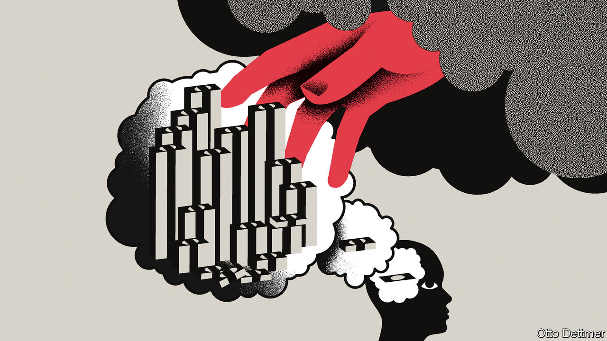

###### Free exchange

# Have economists misunderstood inflation? 

##### Government debt is at the core of rising prices, argues an important new book 

 

> Jan 26th 2023 

Imagine it is late 2024. Inflation in the rich world has fallen from its peak but stayed stubbornly high. At around 4%, it is well above the level at which most central banks are comfortable. Governments, weighed down by vast debts, must use precious revenues to pay interest on the debt, which itself is growing because of high interest rates. The energy transition and rising state spending owing to ageing populations add to the fiscal largesse. Raising taxes is politically fraught, so more money is printed. Inflation stays high and governments’ credibility worsens. Central bankers are scratching their heads, wondering how their powerful weapon—the interest rate—has failed so thoroughly.

A wonkish theory, laid out in glorious detail in a new book by John Cochrane of Stanford University’s Hoover Institution, would offer a potential explanation. “The Fiscal Theory of the Price Level” builds a theory of inflation as ambitious as that proposed by John Maynard Keynes’s “The General Theory” or Milton Friedman’s and Anna Schwartz’s “A Monetary History”. Mr Cochrane, whose own work on the subject spans four decades, spends nearly 600 pages reworking the maths of past economic models to incorporate fiscal theory, while chattily discussing how it explains past inflationary episodes. “[E]ven Milton Friedman might change his mind with new facts and experience at hand,” he speculates.

At the heart of Mr Cochrane’s theory is the idea that government debt can be valued like a firm’s equity, based on the returns to its owner’s pockets. The price level will adjust—and therefore drive inflation or deflation—to ensure that the real value of the debt equals the sum of a government’s future budget surpluses, appropriately discounted. Thus the true driver of inflation is government debt not monetary policy. Under this theory, money is valuable because it can be used to pay tax and generate surpluses. The set-up is not all that different from the gold standard, except it is tax, rather than gold, that backs money. 

Mr Cochrane is careful to note that the adjustment of the price level is not instantaneous. People can be poor judges of a government’s credibility when it comes to paying off debts. Just like stocks, prices are able to deviate from fundamentals. Yet in the long run, they adjust. A government that hands out money without eventually running surpluses will not avoid inflation for ever. 

History appears to offer support. Brad DeLong of the University of California, Berkeley, uses fiscal theory in his recent book, “Slouching towards Utopia”, to explain inflation in post-first-world-war Europe. In France hefty debt-interest payments led to an average of 20% annual inflation over seven years. In Germany things were worse. The public lost faith in the ability of the state to pay off its debts without inflation. Soon hyperinflation kicked in. 

Mr Cochrane also brings fiscal theory to bear on America’s inflation in the 1970s-80s. In the mid-1970s price rises exceeded 12%. The Federal Reserve lifted interest rates; inflation dropped to 5% by 1977. Yet Mr Cochrane points out that inflation shot up again to more than 14% by 1980, in part because America failed to get its fiscal house in order. Fiscal and regulatory reforms that raised expectations of future surpluses, along with another dose of monetary medicine, were needed to vanquish inflation.

How is fiscal theory faring today? For a decade after the global financial crisis of 2007-09, prices stayed stubbornly low despite a ballooning supply of money and interest rates sitting at or below zero in much of the rich world. A “crude monetarism” predicted an inflationary surge, which did not materialise. Other revamped “New Keynesian” models also proved unhelpful. When governments spent big during the covid-19 pandemic, many economists, reasoning from recent history, were sanguine about the possibility of inflation.

Mr Cochrane argues fiscal theory can explain both the period of low inflation and the return of rapidly rising prices after the pandemic. Inflation was meagre in the 2010s, despite soaring government debts, because politicians promised to get their books in order and low interest rates meant consumers and bondholders were willing to wait. Yet during the pandemic, governments took a different approach. They dropped enormous cheques into consumers’ pockets. The Fed purchased government debt immediately after its issuance. There was little talk of sustainability. Mr Cochrane argues that the direct nature of these “helicopter drops” informed people their newly fat pockets would not be drained by future taxes. Thus they were more willing to spend.

Heads I win, tails you lose

This story is perhaps too convenient. Indeed, Mr Cochrane admits that fiscal theory’s flaw is it offers a way of explaining nearly any series of historical events in an unfalsifiable manner. Yes, other theories of inflation have problems. But if it is so hard to prove fiscal theory wrong, are they really in a fair fight? Mr Cochrane’s story of how inflation ended in the 1980s is complicated by the fact that America actually cut taxes, suggesting politicians were not all that concerned by balanced budgets. Although deregulation may have boosted growth, many economists think the budget surpluses of the 1990s were mainly caused by globalisation and an it boom, which few consumers in the 1980s saw coming.

Fiscal theory also offers limited guidance to policymakers beyond what is already well-known. Under its approach, monetary policy remains important: interest rates can spread out an increase in the price level over a period of time. In addition, the theory suggests governments must maintain credibility when it comes to paying off their debts—hardly a radical idea. 

Fast-forward once again to late 2024. Imagine this time inflation has fallen to 2%. Interest rates are slowly coming down. Central bankers are running a victory lap. What of fiscal theory? Its supporters might take a victory lap, too, just as they would have done if inflation had remained high. ■


 (Jan 19th)


