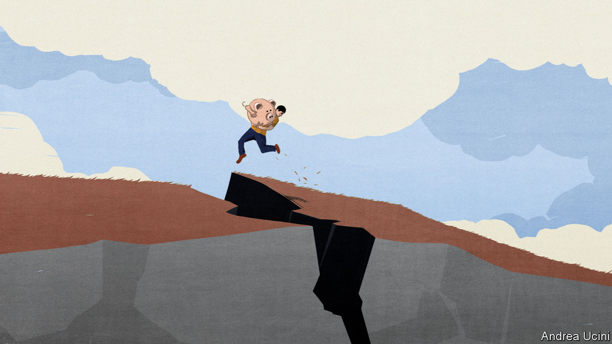
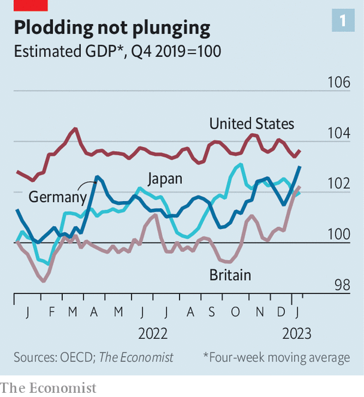
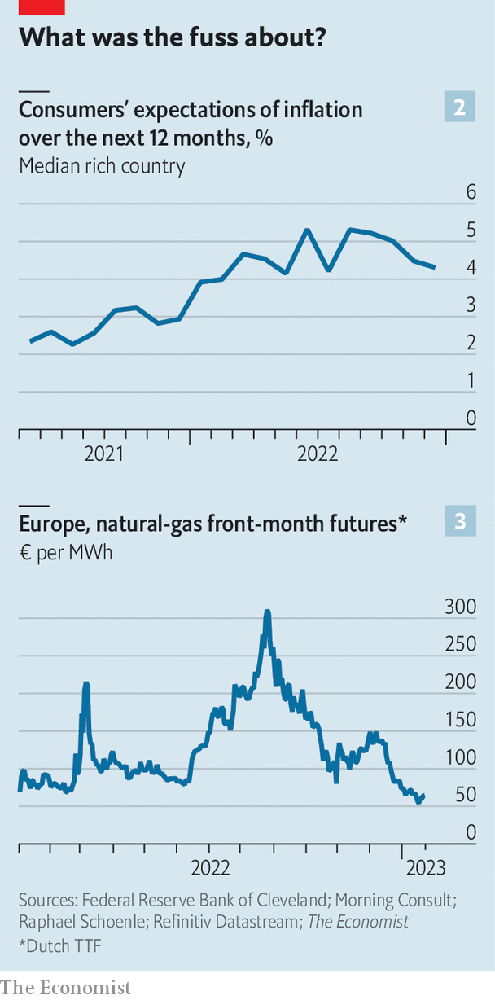

###### Dare to dream

# How the world economy could avoid recession 

##### Markets are giddy, but there is a long way to go 

 

> Jan 24th 2023 

Last year markets had a terrible time. So far  looks different. Many indices, including the Euro Stoxx 600, Hong Kong’s Hang Seng and a broad measure of emerging-market share prices, have seen their best start to the year in decades. America’s s&amp;p 500 is up by 5%. Since reaching its peak in October, the trade-weighted value of the dollar has fallen by 7%, a sign that fear about the global economy is ebbing. Even bitcoin has had a good year. Not long ago it felt as though a global recession was nailed on. Now optimism is re-emerging. 

“Hello lower gas prices, bye-bye recession,” cheered analysts at JPMorgan Chase, a bank, on January 18th, in a report on the euro zone. Nomura, a Japanese lender, has revised its forecast of  “to something less pernicious [than] what we originally expected”. Citigroup, another bank, said that “the probability of a full-blown global recession, in which growth in many countries turns down in tandem, is now roughly 30%, [in contrast with] the 50% assessment that we maintained through the second half of last year.” These are crumbs: the world economy is weaker than at any point since the lockdowns of 2020. But investors will eat anything. 

 


Forecasters are in part responding to real-time economic data. Despite talk of a global recession since at least last February, when Russia invaded Ukraine, these have held up better than expected. Consider a weekly estimate of gdp from the oecd, a group of mostly rich countries which account for about 60% of global output. It is hardly booming, but in mid-January few countries were struggling (see chart 1). Widely watched “purchasing-manager index” measures of global output rose slightly in January, consistent with gdp growth of about 2%.

Official numbers remain mixed. Recent figures on American retail and industry came in below expectations. In Japan machinery orders were far weaker than forecast. Yet after reaching an all-time low in the summer, consumer confidence across the oecd has risen. Shortly after we went to press, officials were due to publish their first estimate of America’s gdp in the fourth quarter of 2022. Most economists were expecting a decent number, though pandemic disruptions mean these figures will be less reliable than normal. 

Labour markets seem to be , too. In some rich countries, including Austria and Denmark, joblessness is rising—a telltale sign that a recession is looming. Barely a day goes by without an announcement from another big technology company that it is letting people go. Yet tech accounts for a small share of overall jobs, and in most countries unemployment remains low. Happily, in places where demand for labour is dropping, employers are withdrawing job adverts, rather than sacking people. We estimate that, since reaching an all-time high of more than 30m early last year, unfilled vacancies across the oecd have fallen by about 10%. Meanwhile, the number of people actually in a job has fallen by less than 1% from its peak. 

 


Investors pay attention to labour markets, but they really care about right now is inflation. It is too soon to know if this threat has passed. In the rich world “core” inflation, a measure of underlying pressure, is still 5-6% year on year, far higher than central banks find comfortable. The problem, though, is no longer getting worse. In America core inflation is coming down, as is the share of small firms which plan to raise prices. Another measure, from researchers at the Federal Reserve Bank of Cleveland, Morning Consult, a data firm, and Raphael Schoenle of Brandeis University, is a cross-country gauge of public inflation expectations. It also seems to be dropping (see chart 2). 

Two factors explain why the global economy has held up better than expected: energy prices and private-sector finances. Last year the cost of fuel in the rich world rose by well over 20%—and by 60% or more in parts of Europe. Economists expected prices to remain high in 2023, crushing energy-intensive sectors such as heavy industry. They were wrong. Helped by unseasonably warm weather, companies have proved unexpectedly flexible when it comes to dealing with high costs. In November German industrial gas consumption was 27% lower than normal, yet industrial production was only 0.5% down on the year before. And over the Christmas period European natural-gas prices fell by half to levels last seen before Russia invaded Ukraine (see chart 3). 

The strength of private-sector finances has also made a difference. Our best guess is that families in the g7 are sitting on “excess” savings—ie, those above and beyond what you would expect them to have accumulated in normal times—of around $3trn (or about 10% of annual consumer spending), accumulated through a combination of pandemic stimulus and lower outlays in 2020-21. As a result, although companies’ quarterly earnings in America suggest spending is faltering, it is not falling off a cliff. Consumers can weather higher prices and a higher cost of credit. Businesses, meanwhile, are still sitting on large cash piles. And few face large debt repayments right now: $600bn of dollar-denominated corporate debt will mature this year, compared with $900bn due in 2025.

Can the data continue to beat expectations? There is evidence, including in a recent paper by Goldman Sachs, a bank, that the heaviest drag from tighter monetary policy occurs after about nine months. Financial conditions started really tightening nine months ago. If the theory holds, then the economy soon might be on surer footing, even as higher rates eat away at inflation. China is another reason for cheer. Although removing domestic covid-19 restrictions slowed the economy in December, as people hid from the virus, scrapping “zero-covid” will ultimately raise global demand for goods and services. 

The pessimistic case, however, remains strong. Central banks have a long way to go before they can be certain that inflation is under control, especially with China’s reopening pushing up commodity prices. America’s forward-looking indicators are getting bleaker. In addition, an economy on the cusp of recession is unpredictable. Once people start to lose jobs, and cut spending, predicting the depths of a downturn becomes hard. And a crucial lesson from recent years is that if something can go wrong, it often does. But it is nice to have a glimmer of hope all the same. ■


