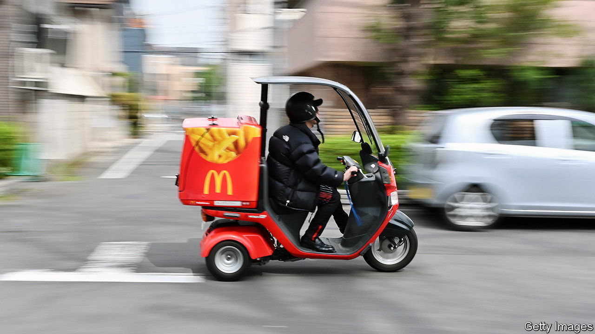

###### Overheated and overvalued

# What inflation means for the Big Mac index 

##### The competitive advantage of fast-food nations 

 

> Jan 26th 2023 

For much of the past two years, economists have argued fiercely about prices. As inflation in America and elsewhere has exceeded central-bank targets, analysts have dissected different components of the cost of living, including the prices of goods, services, energy and rents. 

But what about ? The iconic McDonald’s burger is an amalgam of rent, electricity and labour, as well as beef, bread and cheese. Its price is therefore indicative of broader inflationary pressures. And because the burger is basically the same wherever you are in the world, its price can also reveal how inflation has changed the relative costliness of different countries.

 


In America, for example, the median price of a Big Mac has risen by more than 6% to an average of $5.36 in the past two years. (The price tends to be a bit higher in big cities.) According to the theory of purchasing-power parity, when a country’s prices rise, its currency should fall, everything else equal. This stops the country’s prices moving too far out of line with those elsewhere in the world. 

Yet the dollar has risen, not fallen, over the past two years against the currencies of most other big economies. A trade-weighted exchange-rate index published by America’s Federal Reserve increased by more than 9% from December 2020 to December 2022. One reason for this is that inflation has also returned to lots of America’s trading partners. Indeed, in many places it is worse. Big Mac prices have risen by 14% over the past two years in the euro area and by 15% in Britain. But the dollar’s rise against the euro and pound has been more than required to offset this inflation gap.

The combination of rising prices and a rising currency threatens to move American prices out of whack with those elsewhere in the world. Two years ago, for example, the Big Mac was 26% cheaper in Japan than America. In principle, this suggests the yen was undervalued and should have risen against the dollar. In fact, the opposite occurred. A Big Mac is now more than 40% cheaper in Japan. 

There are exceptions where the theory of purchasing-power parity has held. Although Argentina’s peso has fallen against the dollar, prices in the country have risen even faster. A Big Mac now costs the equivalent of $5.31. That is high compared with the price two years ago and also compared with today’s price in Brazil ($4.44). If the two Latin American countries were to form a currency union at today’s exchange rate, Argentina would find itself at a hefty competitive disadvantage. It would be almost 20% more expensive than its larger neighbour, at least judging by burger prices.

 has been making comparisons of this kind since 1986. Converting Big Mac prices into dollars always reveals big differences in the cost of the same burger in different countries. One measure of the “fair value” of a currency is the exchange rate that would eliminate these gaps. But, of course, exchange rates are not the only thing that can adjust. Prices can also rise faster in one country than another. In the long era of low inflation, this was not where the action was. Over the past two years, prices have been on the move in many countries. Unfortunately, these bouts of inflation have done little to move burger prices closer together. ■


