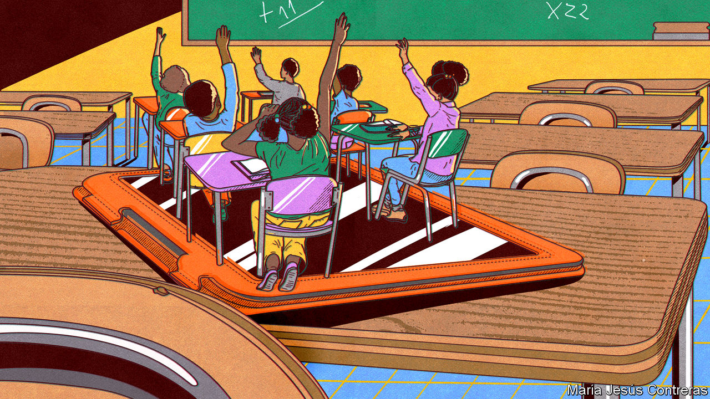
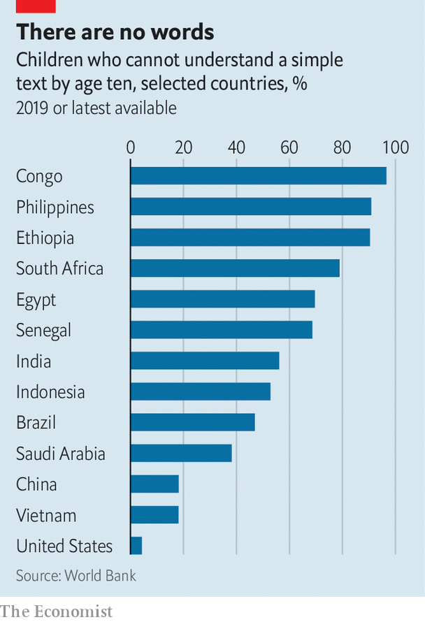

###### Education in a can

# Most children in poor countries are being failed by their schools 

##### Having teachers follow pre-baked lessons could help 

 

> Jan 26th 2023 

“Good job you!” shouts Pauline Bika, as a group of schoolchildren completes the hokey-cokey. “Good job me!” choruses her class. Ms Bika runs a small government primary school in Edo state, in southern Nigeria. It is reached by a mud track that starts not far outside Benin City, the state capital. Her school has 140 pupils, but only three teachers. She seems both pleased and a little embarrassed to offer a visitor a plastic chair. 

For all that it lacks, Ms Bika’s school has one advantage. At the start of last year the state education ministry gave each of her teachers a small tablet with a black-and-white touch screen. Every two weeks they use it to download detailed scripts that guide each lesson they deliver. These scripts tell the teachers what to say, what to write on the blackboard, and even when to walk around the classroom. Ms Bika says this new way of working is saving teachers time that they used to spend scribbling their own lesson plans—and her pupils are reading better, too.

 


That is sorely needed, for much of the education given in much of the world is strikingly bad. Across the developing world many schoolchildren learn very little, even when they spend years in class. Less than half of kids in low- and middle-income countries are able to read a short passage by the time they finish primary school, according to the World Bank. Across sub-Saharan Africa, as few as 10% can (see chart). Experiments like those under way in Nigeria mark one attempt to improve things. They also face fierce opposition from critics who are convinced they mark a wrong turn. 

The reforms in Edo began in 2018. Godwin Obaseki, the state governor, says that poor schools are one reason youngsters have often left the state for greener pastures (some fall victim to people-traffickers promising better lives in Europe). Since then, the government has provided tablets and training to more than 15,000 teachers. They in turn have given the new lessons to more than 300,000 children, most of them in primary schools. On any given day pupils throughout the state receive identical lessons, as dictated by the tablet.

The training and technology are provided by NewGlobe, an education company founded in 2007 by three Americans (Pitchbook, a data firm, valued the company at $250m following a funding round in 2016). NewGlobe developed its approach while running a chain of low-cost private schools, mostly in Kenya, under the brand “Bridge International Academies”. A study by academics including Michael Kremer, a development economist at the University of Chicago, found that, over two years, children who attended NewGlobe’s primary schools made gains equivalent to almost a whole year of extra schooling, compared with their peers in other schools. 

F is for factory

Though Edo was the first state in Nigeria to strike a deal with the firm, NewGlobe’s approach has since also been applied in Lagos, the country’s biggest city. The firm is starting work in Manipur, a state in north-eastern India, and in Rwanda. Around a million children are now studying in classrooms that use NewGlobe’s model—far more than its private schools have ever been able to reach.

Although it seems able to find plenty of clients, the company provokes ferocious arguments among educators. Its private schools have long faced energetic opposition from trade unions and some international NGOs, many of whom hate the idea of profit-seeking companies playing any role in education. Others resent the application of mass production to what they see as a skilled, artisanal profession.

Dennis Sinyolo of Education International, a global group of teachers’ unions, says scripted lessons “undermine teaching” and encourage “rote learning and exam drilling”. He says good lesson plans are written to match local contexts, and the needs of individual students. The freedom to change tack mid-lesson is invaluable if a lesson plan is not working. “There’s no one-size-fits-all in teaching,” he says.

Visits to schools in Edo provide some perspective on what is going on. There are doubtless many ways to teach a scripted lesson badly. But the idea in Nigeria is that they will tend to make classes more compelling. The scripts enforce instructional practices that are routine in many rich-country classrooms but often neglected in poor ones. These include techniques such as pausing frequently to pose questions to the class, instead of delivering long lectures at the blackboard, or encouraging pupils to try to solve a problem by chatting to the child sitting next to them.

Detailed, prescriptive lesson plans are also supposed to relieve teachers of the burden of having to write their own. That, advocates hope, will leave them more energy for other jobs—such as making sure their charges stay engaged. Teachers in Edo have been trained to lead their classes in short games and songs whenever they think pupils have grown restless (hence the hokey-cokey). Ms Bika says things are better than in the past. Before, bored children would occasionally wander home during the day. Inattention was sometimes punished with the cane.

The changes do more than alter teaching styles. A study published in 2010 estimated that on any given day around a fifth of Nigeria’s primary school teachers were absent from their classrooms. Earlier research suggested as little as one-third of class time is used productively. In Edo, tablets register when teachers arrive. They can tell if a teacher has scrolled through a lesson faster than appropriate, or if they have abandoned one halfway through. Beneath lies a low-tech foundation: a team of officials—about one for every ten schools—that observe lessons and coach teachers, helped by data from the tablets.

The depth of its scripting and the whizziness of its tablets set the work in Edo apart from many other attempts to improve schooling. But the programme has things in common with a broader family of reforms burdened with the clunky name of “structured pedagogy,” most of which are less controversial. This argues that isolated splurges on goodies such as textbooks often fail to bring benefits. Making big improvements seems to require pulling several levers at once. So the idea is both to give more materials to pupils and better lesson plans to teachers, alongside fresh training and frequent coaching.

In 2020 a panel convened by the World Bank and other bodies concluded that these are some of the best things education reformers can spend money on. In the past few years the approach has been applied in Gambia, Ghana, Nepal and Senegal. One programme in Kenyan government schools helped push up the number of children reaching the national standard in English by 30 percentage points.

E is for everywhere

But it is not only in poor countries where tightly structured approaches to schooling are gaining a following. In America, for example, there is growing awareness that schools have been clinging to modish but ineffective “child-led” ways of teaching reading that other developed countries such as Britain have junked. Literacy programmes that were dismissed as old-fashioned are coming back into favour.

McGraw Hill, an American publishing company, sells a series of highly scripted courses aimed at primary-school children. Bryan Wickman of the National Institute for Direct Instruction, a charity in Oregon, says that using the simplest, clearest language possible is crucial when teaching the smallest children. He says the idea that lessons based on scripts must inevitably bore children should surprise anyone who enjoys other things that are performed from scripts, such as plays. 

Success For All, a programme used in some British and American schools, puts much faith in “co-operative learning”—which involves encouraging children to solve problems together in small groups. But much else that goes on in its classrooms is structured and scripted. Such prescriptiveness helps teachers adopt techniques that research suggests work well, says Nancy Madden of Johns Hopkins University, one of Success for All’s creators. These include giving pupils quick and frequent feedback and keeping up a rapid pace to keep children interested. 

Ms Madden says teachers who have grown familiar with her programme’s techniques are not expected to keep following scripts to the letter. But when, in the past, her team relied mostly on training workshops to spread their approach, they found that only a fraction of teachers kept up the new practices once they were back in their classrooms. 

She admits that teachers sometimes bristle at the constraints that scripts impose: “It is not what they teach you in teacher school.” Sceptics often come round, she says, when they see kids making swift progress. Mr Wickman points out that other expensively trained professionals, such as pilots and surgeons, also have procedures that they must follow to the letter. After some initial complaints (similar to those expressed by dubious teachers) such regimented approaches have become widespread in those fields. They help reduce mistakes, and spread better ways of doing things. 

Back in Edo, Mr Obaseki’s transformation still has plenty to prove. An analysis published in 2019 by the state government and NewGlobe claims that during the first year of the reforms children learned as much in a single term as they were previously learning in one year. But the project has yet to undergo a rigorous independent evaluation. Much of the existing evidence that supports scripted schooling relates to basic literacy and numeracy among the youngest children. In Edo, lesson scripts are being used to teach almost every subject, and are being applied to teenagers in junior secondary schools.

Whether strict scripting is necessary remains a topic of debate. (The World Bank panel, for instance, argued that word-for-word scripts are less effective than simpler guides.) In 2018 rti, an American non-profit group, analysed 19 school-reform efforts it had been involved in across 13 countries, including Ethiopia and Uganda. It concluded that programmes with slightly less prescriptive guides—a page of notes per day, say, rather than a full-on script—produced better results. Advocates of a more relaxed approach say another advantage is that leaving teachers with a bit of freedom to tinker can help win their support.

Yet Edo’s approach appears to have persuaded most local teachers of its worth. Mr Obaseki, the state governor, says school staff had long felt ignored and unappreciated; he says that providing more training and equipment has brought fresh motivation. He insists that support for the project among unions was crucial to his re-election, in 2020. It has, he says, been “one of my best investments”. ■

