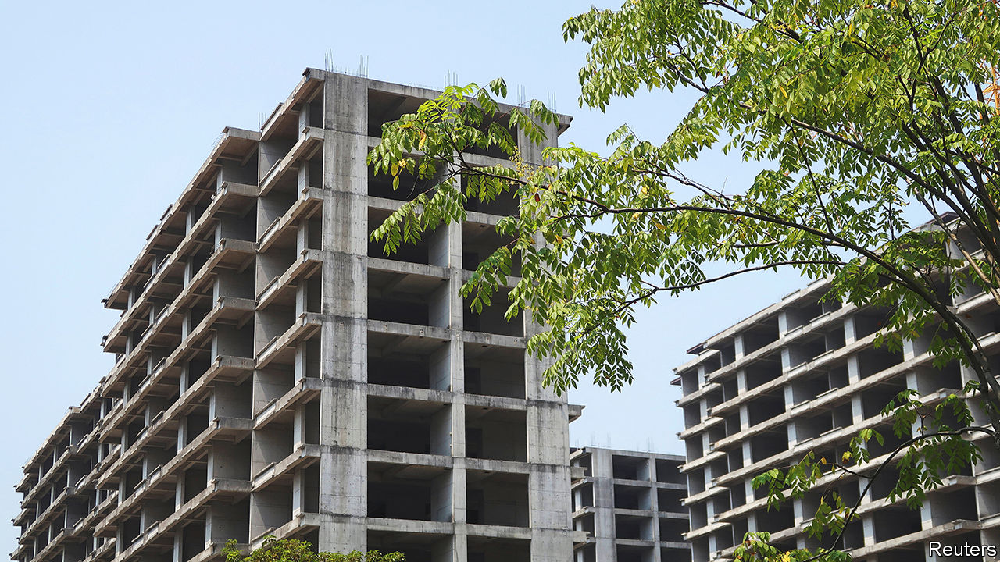

###### Rescue and repeat

# China’s property slump is easing, but the relief will be short-lived 

##### Without reforms, the sector is doomed to cycles of boom and bust 

 

> Jan 26th 2023 

The love-hate relationship goes on. For almost two years China’s leaders cracked down on borrowing to build and bet on property, plunging the market into a crisis. Now that the  has been weakened by the failures of the  policy, the government is racing to rescue real estate. Ni Hong, China’s housing minister, has said his ambition this year is to restore confidence; a series of measures announced in the past few months seek to make it easier for developers to raise capital. These efforts are reviving the property market. Unfortunately, they leave it just as vulnerable to boom and bust as ever. 

The downturn of 2022 was the most severe in recent memory. Sales of floor space plunged more sharply than ever before. Property investment fell for the first time since records began in 1999. Funds raised by developers fell by a quarter. For the past 15 years house prices in China mainly went up. They have spent the past six months sagging like a termite-weakened floor.

One reason for the pain was the government’s attempt to break the country’s addiction to debt-financed property. More than two-thirds of urban households’ wealth is tied up in real estate and the industry underpins a fifth of GDP. Developers have built up huge debts, worth about 33.5trn yuan ($5.2trn) in June 2021. In 2020 the government cut off many firms from capital markets, requiring them to reduce their debts. Dozens defaulted, spreading the pain to lenders and customers. Many new homes went unfinished, although they had been paid for. Borrowers suspended mortgage payments in protest.

Together with President Xi Jinping’s zero-covid policy, the crackdown proved a disaster for the economy. gdp grew by just 3% last year, one of the worst performances in decades. The covid lockdowns also worsened the housing crisis, as fewer prospective buyers were able to visit empty flats and many young people, worried about an uncertain future, put off big purchases.

Now zero-covid is over and policymakers are rushing to revive animal spirits. Limits on how much some developers are allowed to borrow have been suspended. The central government has ordered banks to rescue unfinished projects. Some local authorities are putting up guarantees for developers so that they can raise more debt. 

These measures are breathing new life into the market. The number of new homes that are being completed fell by only 6% in the 12 months to December, having plunged by 18% in the year to November. It appears that government funds are being channelled to pre-paid projects that have stalled. As people who have paid for homes finally start to get their hands on the keys, prospective buyers may be reassured and tempted to bid for pads of their own.

Sales of existing homes rose by more than 20% in the first ten days of 2023, compared with a month earlier. Some developers are no longer offering their flats at a discount. And, crucially, a property firm was able to raise dollar debts from foreign investors in mid-January, the first such instance in more than a year. 

All this means that the Chinese economy should bounce back more quickly in the near term, helping to propel global growth. The danger now, however, is that China goes too far. 

Technocrats tend to respond to crises with lots of liquidity. During the global financial crisis of 2007-09 much of China’s vast stimulus flowed into bricks and mortar. A property downturn in 2014 led to a bout of monetary easing that saw house prices in some places double in less than a year. Elsewhere the result was rampant overbuilding; hence the high-rise ghost cities that loom over parts of China.

Local governments, meanwhile, still rely heavily on land auctions for revenue, so they have an incentive to keep sales going. They are already stepping in to support large developers by guaranteeing their commercial paper. If they have their way, the property market will come roaring back. 

A rekindling of such forces would be disastrous for the central government. They would lift home prices to new heights and lead to another build-up of unsustainable debts among developers. Officials would be forced once again to crack down on leverage, repeating a cycle they have already been through several times. 

You might think that the recovery would instead offer room for more considered thinking. But China’s leaders have long lacked the will to implement the necessary reforms. A housing tax, for example, has been floated several times. It would curb speculation and generate much-needed income for local governments. But the urban elite, which stores much of its wealth in property, would hate it. So far only a few pilot schemes have been tried out. 

And so the funding model for local governments remains unchanged. Local officials will keep trying to pep up sales and prices. But who will live in all the new homes? Morgan Stanley, a bank, estimates there will be 90m new urban households in the next decade. But at its peak, China was adding about 15m homes a year. If supply is to match demand, construction will have to slow dramatically, especially as China’s population shrinks. Today’s bail-out may be reviving Chinese property, but without real reforms the sector will be doomed to boom and bust again. ■

