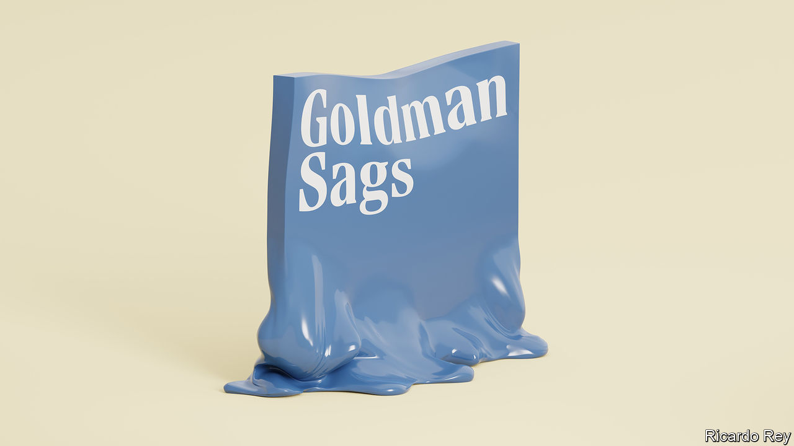

###### Goldman sags

# The humbling of Goldman Sachs 

##### The struggle to reinvent a firm trapped by its own mythology 

 

> Jan 26th 2023 

Goldman Sachs has always seen itself as exceptional. When the bank floated its shares in New York in 1999 it declared: “We have an uncompromising determination to achieve excellence in everything we undertake.” Conspiracy theorists have long paid it the backhanded compliment of imagining that it secretly runs the world. Yet lately the only exceptional thing about the Wall Street icon has been its mistakes.

Since October Goldman has made a u-turn on its plan to build a big consumer bank; booked one of its , measured by return on equity; and attracted a probe by the Federal Reserve. The firm is not yet in serious trouble, but it is trapped by its own mythology. Its  show how hard it will be to reform—and illuminate a new balance of power in global finance. 

To understand Goldman today, take a walk down Wall Street. After the financial crisis of 2007-09, two big American banks reinvented themselves. JPMorgan Chase successfully pursued vast scale across a wide range of business lines. Morgan Stanley built a thriving arm managing the assets of the wealthy, which mints reliable profits. Goldman, however, stuck to its game of trading, advising on deals and bespoke investing. Penal new capital rules made this less lucrative, but the firm staked a Darwinian bet that the resulting shakeout would kill off many competitors. Instead, it badly underperformed the stockmarket for years and got ensnared in the , in which officials in Malaysia and Abu Dhabi received $1.6bn of bribes in 2009-14. A Goldman subsidiary pleaded guilty to a criminal charge and the firm admitted “institutional failure”.

The firm’s boss, , took over in 2018. A man with a short fuse, he has tried to rebrand himself and to  by expanding its core and diversifying into new areas. Goldman now offers transaction banking to multinationals, helping them move funds globally. It has bulked up its asset- and wealth-management arm. And from their Manhattan skyscraper, flush Goldmanites dreamed of growing a mass-market digital bank for ordinary consumers, including a credit-card operation.

Parts of Mr Solomon’s strategy have paid off. Goldman’s market share in mergers and bond trading has risen, helping it make a monster $21bn in profits in 2021 as markets boomed. From taxpayers’ viewpoint, it is safer, with more capital and deposits. And, importantly, its share price has recovered lost ground, rising more than the market and those of most of its peers.

Yet look more closely and the project to remake the bank is vexingly incomplete. Diversification has been patchy: transaction-banking revenues are tiny and the asset-management arm is often dragged down by opaque proprietary bets. The dream of creating a consumer bank has soured. Goldman has 15m customers, but has also faced large losses and bad-debt charges, which is why it is now winding down part of the operation. 

As the prospects for a big new earnings machine have receded, everything still rests on the traditional business. The profitability of the trading arm has improved but remains volatile and, on average, pedestrian. Overall, Goldman has made reasonable use of its resources, generating a return on tangible equity of 14% over Mr Solomon’s tenure. But its performance is erratic, veering from 33% in early 2021 to just 5% in the latest quarter. It has lagged behind its American peers half of the time, and the two industry leaders, JPMorgan and Morgan Stanley, two-thirds of the time. Investors think that Goldman is worth only the net book—or liquidation—value of its assets, suggesting they doubt that it can generate consistently high returns or find lucrative new areas.

Goldman’s struggles point to several lessons. One is that it still excels, but in a bad industry. Investment banking combines the drawbacks of a regulated activity (capital requirements and red tape) with the vices of a speculative one (volatility and capture by employees). The firm says it has become more disciplined on pay but last year forked out $15bn, its second-highest salary and bonus bill since the financial crisis, even as profits halved to $11bn and the firm barely beat its cost of capital. The real action in finance is outside regulated banking, where a new cohort of stars rules, including Blackstone in private markets, BlackRock in index funds, and Citadel, an investing and trading house that made its clients $16bn in 2022. 

Another lesson is that it is hard to compete in winner-takes-all digital markets. Goldman thought that brains and brand were enough. Not true. It has spent billions, but its customer base remains a fraction of that of PayPal or Amazon. JPMorgan reaches 66m American households, but maintains a vast physical network of branches. Goldman has achieved digital scale by teaming up with Apple to provide a . However, given that the tech giant has almost a billion paying subscribers, Apple holds the whip hand in that relationship.

A final lesson is that the stagnation of globalisation has shrunk Wall Street’s horizons. In the decade after Goldman listed, international revenues provided half of its growth, as its bankers conquered Europe and then broke into Asia. Today they supply a third of growth, as local competitors have emerged and some countries have become wary of foreign financiers. The number-one arranger of shares and bonds last year in China was citic Securities; in India Kotak Mahindra and Axis led the pack. These are names that many on Wall Street may not know.

Raging bulls

Can Goldman recover its swagger? Mr Solomon is wisely laying off staff and shrinking the bank’s proprietary investments. Over time he may be vindicated by prosaic changes—running its asset-management arm better, say, or pioneering new tech to cut exorbitant labour costs—or even by orchestrating a merger. 

Yet there is something uniquely hard about reforming elite firms whose unwritten code is that they are smarter than everyone else. Just ask McKinsey, a scandal-magnet once known as the world’s most-admired consultancy. Goldman’s culture of self-regard remains at odds with the facts. Instead it now needs to be self-critical. For yesterday’s masters of the universe, that may be the hardest leap of all. ■


