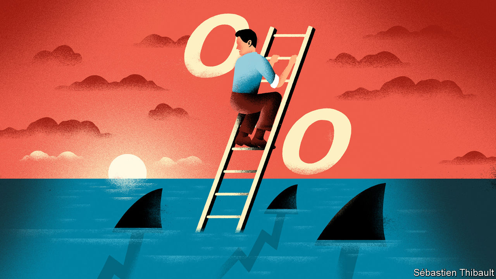
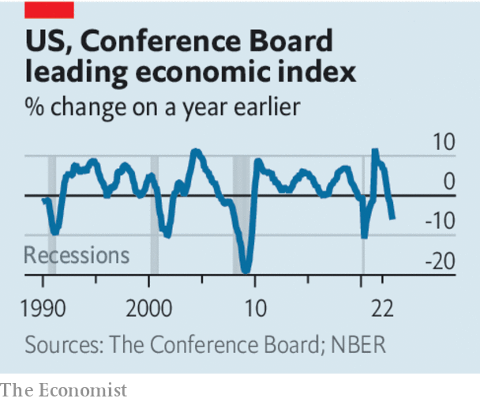

###### Polycrisis or polyrecovery?

# The world economy’s inflation problem is easing 

##### But recession is still likely 

 

> Jan 26th 2023 

After three chaotic years, investors have several reasons to be cheerful about the world economy. In America inflation is tumbling, raising hopes of a “soft landing”, in which price growth comes under control without a . Fortune has smiled on Europe, where a mostly warm winter has caused energy prices to plummet. And , freed from Xi Jinping’s destructive “zero-covid” policy, is poised to rebound. Markets are joyous. The S&amp;P 500 index of American stocks has risen by 5% since the start of the year. Share prices in Europe and emerging markets are up by even more. 

 


Alas, it is too soon to declare an end to the world economy’s problems. In America consumer prices fell in December, and annual inflation may dip below 2% this year thanks to cheaper energy and goods. Yet as price growth is plunging, so too is GDP growth. Retail sales and industrial production fell in December and leading indicators of output are down sharply—which usually indicates that a recession is nigh. The healthiest part of the economy is the labour market. But the red-hot demand for workers is not entirely good news: the Federal Reserve will find it harder to be sure that inflation has been tamed.

Despite headline-grabbing lay-offs by the big technology firms, America’s unemployment rate  and new claims for unemployment benefits are at their lowest in three and a half months. Annual wage growth has fallen according to some measures, but remains around 5%; on January 24th Walmart said it would raise starting wages from $12 an hour to $14. Because workers’ productivity is growing by only about 1% a year, fast wage growth portends price rises that far exceed the Fed’s 2% inflation target.

Some policymakers hope that companies, whose profits surged in 2021, can absorb rapid wage growth without prices having to rise further. Yet by last autumn, higher profit margins accounted for only an eighth of pandemic-era inflation. Given that Wall Street is expecting  for the fourth quarter of 2022, this suggests that firms will raise prices in line with their labour costs.

Markets expect the Fed to start cutting interest rates within a year as growth slows. But if the Fed is serious about reducing inflation to 2% and keeping it there, it will need to keep rates high until wage growth cools—even if that brings about a recession. 

Should America face a downturn, it is likely to take Europe with it. Despite falling energy prices, the euro zone also has an underlying inflation problem, as is apparent in rising wage growth. Christine Lagarde, the head of the European Central Bank, has warned that interest rates will have to rise significantly, contrary to the more doveish expectations of investors. A stronger dollar—which is likely if the Fed keeps raising rates and investors take fright at the consequences—would raise imported inflation and make the ecb’s job harder still, while also paring back the rally in emerging markets.

The end of zero-covid in China has lowered the chance that supply chains will gum up. However, its rebound is not an unalloyed good for the rest of the world, which has an inflation problem, not a shortage of spending. China’s extra imports will add more fuel to overheated economies. Europe’s gas storage is so full in part because China’s demand for liquefied natural gas in 2022 was 20% below its usual level. Demand is now likely to bounce back, which could cause prices to surge once again next winter. Only when the twin foes of overheated labour markets and the energy crisis have been vanquished will the world economy be out of the woods. ■

