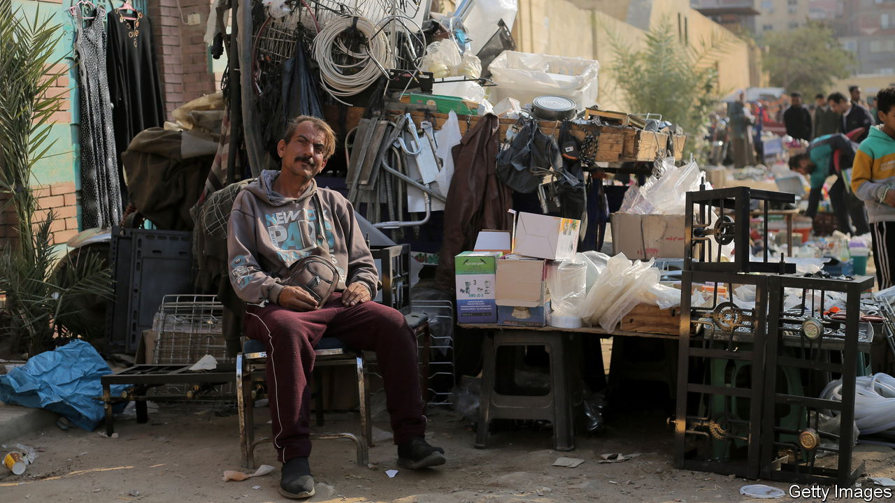
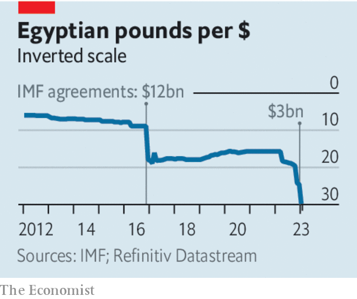

###### Debt on the Nile

# To save Egypt’s economy, get the army out of it 

##### Donors should not keep bailing out a state that enriches men in khaki 

 

> Jan 26th 2023 

TO THE LIST of spectacular ruins across Egypt, you can now add . The Egyptian pound lost half its value over the past year and has been the world’s worst-performing currency in 2023. On January 5th the government devalued it for the third time in less than a year. Nearly half of the state’s revenue goes to servicing its debts, which amount to 90% of GDP. Officially, inflation is running at 21%. The price of food is rising even faster. But official figures have not kept up with , so the reality is almost certainly worse.

This has brought misery to the Egyptian people. Around a third of them live on less than $2 a day. Another third are on the brink of joining them. They have been failed by officials who put their own interests above those of their citizens.

 


Egypt’s economic crisis has been a long time in the making, and is partly caused by forces beyond the state’s control. Russia’s invasion of Ukraine has hurt Egypt badly, since it is the world’s biggest importer of wheat and its two biggest suppliers have usually been Russia and Ukraine. Higher wheat prices have made it ruinously expensive for the government to provide the ultra-cheap, subsidised bread that Egyptians have come to expect (they may riot if it is unavailable). The war has also walloped tourism which, before the pandemic, generated about 5% of GDP. Costly grain and a lack of sunburnt Russians have put pressure on Egypt’s foreign-exchange reserves and the pound. Foreign investors have dumped Egyptian bonds. Egyptians now struggle to get hold of hard currency. 

But the country’s main underlying problem is the stranglehold on the economy exercised by the state, and specifically the army. Official statisticians are strangely reluctant to provide a measure of this. The government has said that the army controls just 1.5-2% of output. The true extent of its influence, both direct and indirect, is far greater. And under the rule of President Abdel-Fattah al-Sisi (previous job: commander-in-chief of the armed forces) it has expanded. 

The army’s empire now includes everything from petrol stations to mineral water and olives. It has hooked the fish-farming market and engineered control over carmaking. The security services have bought up big chunks of Egypt’s media. The army built a huge new cement plant, causing a supply glut that crushed private firms. In industry after industry it squeezes out or scares off competitors, deterring private investment. No ordinary company can compete with an outfit that pays no tax or customs fees and which can throw its rivals in jail. For ordinary Egyptians, the army’s crushing of competition means slower growth, higher prices and fewer opportunities. 

The imf should bear this in mind, as Egypt comes knocking on its door for the fourth time in six years begging for a bail-out. It is now the fund’s biggest debtor after Argentina. In the past Mr Sisi’s regime has agreed to carry out reforms in exchange for imf cash. Under the terms of a $12bn agreement struck in 2016, it has devalued the currency and trimmed subsidies. But Mr Sisi has conspicuously failed to keep his promises to reduce the state’s economic bootprint. 

Under its most recent deal with the IMF, struck in December, the government has vowed once again to withdraw the state and the armed forces from “non-strategic” sectors. But the men in (or recently out of) uniform who dominate it have little incentive to do so. Many have benefited handsomely from rent-seeking. And in any case, in a country with a history of coups, few would dare challenge the army’s privileges. 

Donors keep bailing out Egypt because they are terrified it might collapse if they do not. It is the most populous country in the Middle East and a key Western ally. An implosion might send fleets of refugees across the Mediterranean. These fears are not irrational. Yet supporting a regime whose refusal to reform makes Egypt steadily poorer and its people steadily angrier is no recipe for long-term stability. Egypt’s frustrated Gulf allies are becoming less generous. The IMF should now hold the government to its commitments. Egypt must start demilitarising the economy, or expect fewer handouts. ■

