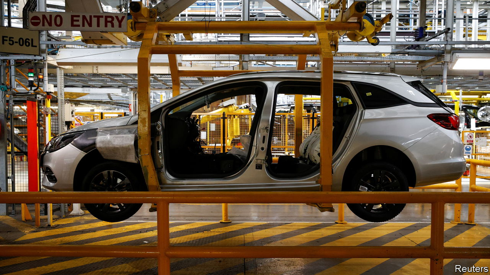

###### Handouts and arms races

# What should Britain’s industrial strategy be? 

##### Money matters a lot less than decent government 

 

> Jan 26th 2023 

When RIVAL countries have much deeper pockets and are digging into them, what is a government to do? That is the question facing Britain as it mulls what its  should be. A good way to think about the answer is to look at the country’s automotive industry.

 has long enjoyed ups and endured downs. But the down it faces now is graver than any in decades. The shift from internal-combustion engines to  is prompting an overhaul of the industry, which will spend about $1.2trn on electrification globally by 2030. Carmakers need new supply chains and new skills. Above all, they need batteries—lots of them, ideally within easy reach of assembly plants. To be a base for mass production, Britain must be home to huge battery-making facilities known as “gigafactories”.

Across Europe, more than 40 of these facilities are being built or planned. Barely any of them are in Britain. One is being set up in Sunderland by Nissan and Envision, a Chinese firm: it will start production in 2025. Britishvolt, a startup with lots of champions but no customers, collapsed earlier this month. Some manufacturers are already voting with their feet: BMW is  of electric Minis to China.

Other governments are happily splurging to encourage electric-vehicle manufacturing. Arrival, a British maker of electric delivery vans, moved production from Oxfordshire to North Carolina because of the handouts in America’s new Inflation Reduction Act. Northvolt, a battery startup in Sweden, counts the European Investment Bank among its investors. No wonder the pressure is on for the British government to shell out. Talks are thought to be under way with Tata, the Indian conglomerate that owns Jaguar Land Rover, on what subsidies might persuade it to site a gigafactory in Britain. 

In a subsidy race Britain will never be able to outspend America or the European Union—nor should it try. If the government wants to help British industry, it should focus on its most basic responsibility, to provide a stable, well-run environment in which the private sector can flourish. And here Britain can do so much better, for its automotive industry and for others, without spending anything at all on subsidies. 

The real problem for British carmakers is that the country has become a less attractive manufacturing base at just the moment when investment is needed. Britain’s carmakers export 80% of their output, more than half of it to the EU. Brexit has already made seamless access to European markets more difficult. And at the end of this year rules on how much of an electric vehicle’s parts have to be made in either Britain or the EU to qualify for tariff-free trade with Europe will start to tighten. An agreement to extend existing grace periods on these rules-of-origin requirements might help; better relations with the EU definitely would. 

Instead, unstable policy makes things worse. Boneheaded legislation committing Britain to replacing or repealing all retained EU law by the end of 2023 could mean friction with Brussels over labour-market standards. At home, too, uncertainty reigns. The government announced in 2021 that a zero-emissions vehicle mandate, laying out what share of manufacturers’ new sales needs to be emissions-free, would begin to apply in 2024. With 11 months to go, the industry is still waiting for details. Investment incentives are up in the air. A “super-deduction” on capital investment expires at the end of March; a plan to cut R&amp;D tax deductions for smaller firms that was unveiled in November may be reversed. Industrial policy itself is a muddle. A strategy from 2017 was junked by Boris Johnson’s government. 

Back to basics

There are times when Britain will need to spend money to promote its national-security interests or environmental priorities. But resources are finite and it is especially unwise to bail out whichever industry is first to get into trouble. Britain is the 18th-biggest carmaker in the world and has no obvious competitive advantage in this area (unlike in life sciences and clean energy). It is good news that the country’s industries would be a lot more successful if the government did the basics well. Sweeteners matter less when other things taste better. ■

