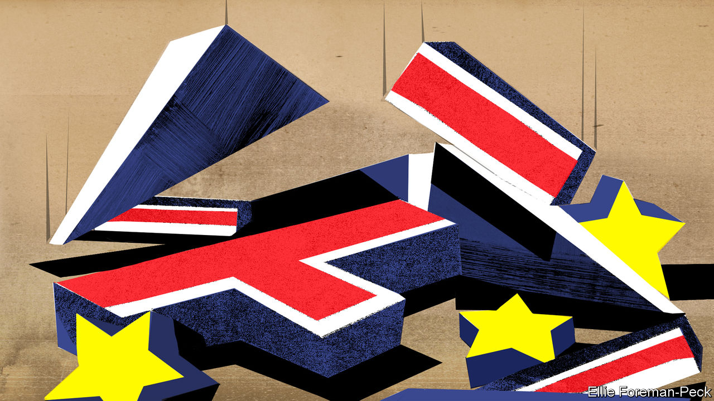
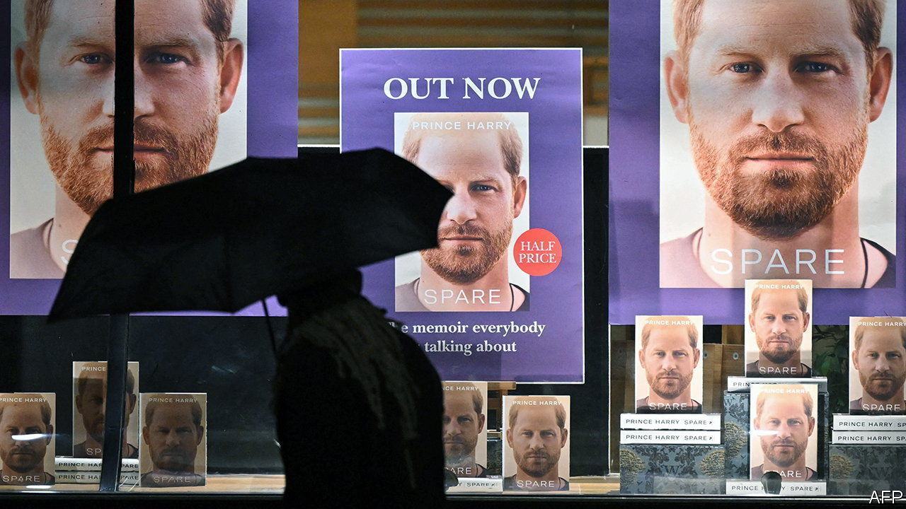

###### On Poland and Germany, Turkey, physical education, Britain’s economy, historical inflation, Prince Harry, retirement

# Letters to the editor 

##### A selection of correspondence 

 

> Jan 26th 2023 


Poland’s war claims

You think that Poland is wrong to keep pressing Germany on restitution for Nazi crimes during the second world war (“”, January 7th). Yet Germany’s recent payment to Namibia for the massacres it committed there in the early 1900s, its return of Benin bronzes to Nigeria and the belated verdicts for concentration-camp staff show that injustice is not expunged by time. 

Poland has received only derisory compensation for the millions of deaths, expulsions, colonisation, slave labour and destruction of a large chunk of its physical assets during the war. The “vast tracts of land” that Germany has ceded to Poland cannot compare to Poland’s loss of half its terrain after 1939, including the then majority-Polish cities of Wilno (Vilnius) and Lwow (Lviv). This loss was caused by Germany’s war. The contrast with Germany’s decent treatment 

of Israel is glaring. 

And it is incorrect to ascribe the push for compensation just to some zany folk in the ruling Law and Justice (PiS) party, even if its German scepticism is indeed extreme. Last September 418 out of 460 Polish MPs voted to press Germany for restitution. Around two-thirds of Poland’s population think Germany should finally pay for its war damage.

MATTHEW OLEX-SZCZYTOWSKI


It is a shame that the good case for raising the issue of German reparations to Poland, undermined previously by Soviet intervention, has been hampered by the counterproductive loudhailer diplomacy of Jaroslaw Kaczynski, the leader of PiS. Initially the €1.3trn ($1.4trn) claim was intended as a pre-election tactic to foil the Polish “unpatriotic” liberal opposition, who actually endorsed the principle of reparations and even asked why a similar claim was not being made against Russia.

Mr Kaczynski’s rantings should not be a reason for not trying to heal the intense buried national trauma, which includes six million dead, that previous Polish governments had neglected. 

WIKTOR MOSZCZYNSKI


 


Turkey responds

I was appalled by your leader on “” (January 21st). Labelling the prospect of the re-election of Recep Tayyip Erdogan, who has been elected many times through a free and popular vote, as a “dictatorship” is utterly wrong and unfair. I would like to remind you that Türkiye has a vibrant democracy with a clean record in its electoral system. Such biased claims about the democratically elected president of the country ignore the stainless electoral history of Türkiye.

Moreover, calling upon “Western leaders” to act over some baseless assumptions and underestimating the free will of Turkish voters is pointless arrogance to say the least. This approach contradicts with people’s free will and basic merits of democracy.

Ümit Yalçın

Ambassador for Turkey


 


Levels of fitness

The gutting of schools’ physical-education requirements is cited as one reason behind America’s obesity problem (“”, January 14th). However, school PE programmes often serve unfit students very poorly. They are designed by the fit, for the fit, and make little attempt to be rewarding and halfway-pleasant for the less-fit. They emphasise competition between students with little allowance for differing levels of ability. Seriously unfit children find them painful and humiliating rather than helpful. 

Schools could indeed do more to get children into better shape, but in this regard the focus should be on helping the less-fit to find sustainable ways to get more exercise, not on selecting and training top student athletes. 

Henry Spencer


 


Britain’s post-Brexit economy

The “phantom country” created by the Centre for European Reform to track Britain’s post-Brexit economic performance is invalid (“”, January 7th). Macroeconomic theory tells us that the only economy that behaves like Britain is one that has the same consumers, firms, institutions, policies and shocks, namely only Britain itself. A method that is valid is to interrogate Britain’s own relationships for evidence that they shifted because of Brexit. I have done this in a recent working paper with a colleague. 

We find statistically significant evidence of temporary disruption to trade, as you would expect, but none of the damage to investment or GDP. The main plainly observable effect of Brexit was to lower sterling. But our Britain model and the evidence of Brexit impacts on British behaviour imply that this and succeeding Brexit effects had quite small net effects on the economy, mainly on interest rates and inflation, during the covid era. 

Meanwhile, a long list of other shocks, including lockdowns and commodity impacts because of covid and the Ukraine war, have caused us substantial damage. It is unworthy of  to join in the sloppy Remainer thinking that blames our troubles on Brexit.

Patrick Minford

Cardiff Business School

 


You call for a better relationship between Britain and the European Union (“”, January 7th). I fear that you are engaging in some magical thinking yourself. It is undoubtedly true that there is “room for imagination” in rethinking the relationship. The big problem is the politicians doing the thinking. The Conservatives have been irredeemably bonkers about Europe ever since Boris Johnson defenestrated all the people in the party who did not support his woefully mis-described “oven-ready deal”. But so too are Labour. Ruling out freedom of movement and single-market membership, while saying that Labour will make Brexit work, is a contradiction in terms. 

Sir Keir Starmer recently said that he understood the basic message of Leave voters, who merely wanted decent public services and “opportunities for the next generation”. Yet he failed to mention that most public services have nothing to do with the EU, or that leaving the single market and stopping freedom of movement with your nearest neighbours are the quickest ways to reduce opportunities. Which is why Labour’s repeated assertion that Britain is both the best place to start a business and expand a business is simply not true. 

In short, nobody either running the country or hoping to run the country has the foggiest idea what they are talking about. The EU is dynamic and relevant. Countries still want to join it. Croatia quietly adopted the euro on January 1st. The end of magical thinking requires the end of British exceptionalism.

ROBERT SATCHWELL


The rich get richer…

“” (December 24th) focused on the lessons from inflation of the 1500s. One further contemporary parallel emerging from the 16th-century Scottish context is the uneven impact of inflation across the population. Even in the 16th century, inflation for essential goods outstripped that for luxury items. And wages lagged behind price rises. Accordingly it was the poor who suffered most and the rich who were cushioned by the relatively smaller portions of their budgets devoted to essential items. 

For example, in the decade following the replacement of gold and silver in coins with cheaper metals, known as the great debasement, the wages paid to wrights (skilled workers, carpenters or joiners) increased by 25%. But the cost of fabric canvas, used for workers’ clothing, went up by 68%, and ale, the drink of the people, by 50%. At the other end of the market, velvet went up by 41% in price. Wine, the luxury imported tipple of the rich, increased by 13%, but a few years later it was retailing at 20% below its price before the currency debasement. Velvet-clad wine connoisseurs had it far easier than their canvas-sporting, beer-drinking employees. 

In the 16th-century context this cushioning of the wealthy from the worst effects of rising prices offers an answer to a puzzling dilemma which transcends that century: why did successive governments, comprising the wealthiest in the land, pursue a policy the effects of which they knew to be inflationary? 

Dr Amy Blakeway

School of History

University of St Andrews


 


No room at the top

I enjoyed your article on Prince Harry’s autobiography (“”, January 14th). It reminded me of “elite overproduction”, an idea put forward by Peter Turchin, a complexity scientist, in which a society produces more members of the elite than the elite can absorb. This, Mr Turchin thinks, can lead to social instability, because those left out of power feel dissatisfied with their lower socioeconomic status. The royal family provides us with perfect examples of this. Those left out of power are causing a great deal of instability at Buckingham Palace. 

Phillip Jordan


Working in your 70s

In the unpopular political drive to raise the retirement age in France, Emmanuel Macron should remind his countrymen that Georges Clemenceau took over as France’s leader in 1917 at the age of 76, and led it to victory in the first world war in 1918 (“”, January 14th).

Patrick Slattery


