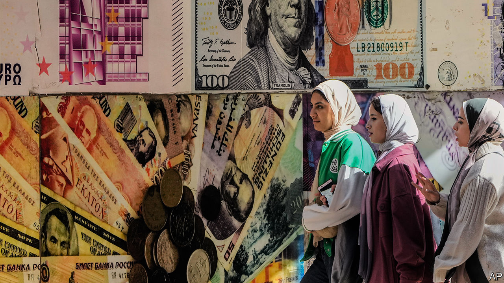
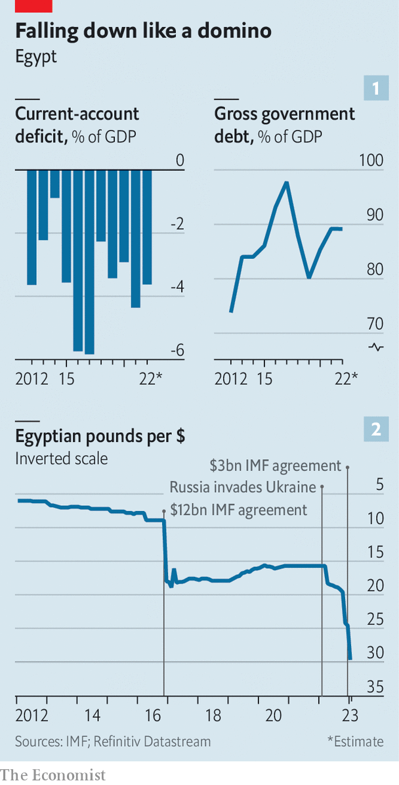

###### Pyramid scheme

# A crisis of confidence in Egypt 

##### After a decade of deficits, the government is running out of options 

 

> Jan 24th 2023 

IT IS all anyone can discuss. For the poor, trips to the market are now an ordeal: shopping bags get lighter, yet bills get bigger. The middle class must choose between car payments, school tuition and groceries. Business owners are wrestling with supply-chain woes caused by a shortage of hard currency that has left billions of dollars of goods stuck at ports.

The past few weeks have been a reckoning for Egypt’s unsustainable economy. Since 2013, when  seized power in a coup, it has been characterised by a , large twin deficits and debt-fuelled state spending on infrastructure projects, some of dubious value. Egypt posted decent growth numbers, but they were a mirage: for most of its 104m people, life kept getting worse.

 


Last year the fiscal deficit was 6.2% of GDP and the current-account shortfall was 3.6% (see chart 1 ). The government debt-to-GDP ratio hovers around 90%, while external debt has more than doubled since 2013, to 34%. Debt service consumes 45% of government revenue. 

Well-meaning Egyptians have warned for years that the country was tumbling into a debt trap. Mr Sisi ignored them, and foreign investors, lured by some of the world’s highest interest rates, were eager to help him sustain his illusion. Buying short-term Egyptian debt seemed a lucrative and risk-free proposition: surely the biggest Arab country was too big to fail.

Failure is still unlikely—but no longer impossible. The pound is the world’s worst-performing currency this year, which fuels galloping inflation. Soaring interest rates will be a drag on private business. The public sector, a main driver of recent growth, is being told to cut back. After years of short-sighted policy, there are no easy solutions to Egypt’s woes.

The crash began with Russia’s invasion of Ukraine, which caused jittery investors to yank $22bn of portfolio investments out of Egypt in a matter of months. That worsened shortages of hard currency. The government restricted imports to cut the trade deficit and went back to the IMF for another loan, its fourth since 2016 (in December it eventually received $3bn). In June Muhammad Maait, the finance minister, said his country had to focus on building less fickle sorts of inflows, like foreign direct investment and export revenue. “The lesson we have learned [is that] you cannot depend on” hot money, he said.

The lesson was soon forgotten. In December the government announced that $9.5bn-worth of goods were stuck at ports: businesses could not find the dollars they needed to clear their shipments. A currency black market emerged, with pounds trading well below the official rate. Egyptians abroad over Christmas got messages from their banks imposing withdrawal limits as low as $100 a month.

That left few options. The pound, which was meant to be floating but was unofficially propped up by the central bank, had already been devalued twice in 2022. On January 5th it was allowed to slide again, eventually settling at around 30 to the dollar, a 20% drop. It has lost 50% of its value in the past year (see chart 2). Analysts at several banks think it is still overvalued.

The devaluation brought hundreds of millions of dollars of inflows, which helped to ease the import backlog. But it will also stoke already-high inflation, which hit 21% in December (and 37% for food). Figures for January will worsen. After Egypt’s first big devaluation, in 2016, inflation stayed above 20% for 13 months.

These numbers are catastrophic for the poor. Fatima, a housewife, runs through her diminished shopping list. Eggs are now an occasional luxury. The price of a box of 30 has doubled to 100 pounds. Her family’s preferred brand of cheese is 80% more expensive than a year ago. Meat? Forget it. Some butchers fear they will have to close because so few of their customers can afford to buy their goods. A kilo of chicken breast that last year sold for 90 pounds now fetches almost 200.

Talk like an Egyptian

The government puts the poverty rate at 30%, but official figures have not kept pace with bouts of high inflation and repeated blows to the currency. In 2016 the national poverty line was fixed at the equivalent of $55 a month. Today it is $29. The middle class is tumbling towards poverty.

Even in the pandemic year of 2020, Egypt grew at a decent rate of 3.6%. But appearances can mislead. Growth was fuelled by public spending and a booming natural-gas sector. The latter produces few jobs. And the state can no longer afford the megaprojects that have defined Mr Sisi’s tenure. He expanded the Suez canal, started work on a new capital city and built thousands of kilometres of roads. But in January the cabinet said it would halt work on projects that require hard currency. 

As for the private sector, it is anaemic. The purchasing managers’ index, a measure of business activity, has shown a contraction for 25 months in a row and for 75 of the past 84 months. Businessmen cite many ills. The domestic market is huge but poor. State schools are atrocious, so the labour force is ill-trained. The government has taken a scattershot approach to industrial policy: if you want every sector to be a national champion, none will be.

High interest rates are another obstacle. In early January two state-owned banks briefly offered one-year certificates of deposit at 25% interest. The scheme brought needed liquidity into the financial system. It may be a drag on investment: earning interest from your bank is an easier return than opening a factory.

Then there is the army, which runs a vast economic empire that makes everything from pasta to cement. It grabs an ever-larger chunk from private business: it is hard to compete with an entity that does not pay taxes or customs fees, enjoys preferential access to land—and can lock up its rivals. The founder of Juhayna, a big food company, was probably jailed without charge for two years because he refused the army’s demands for a controlling stake (he was released on January 21st).

The government says it will sell stakes in numerous state-owned firms, including army companies like Wataniya, which runs petrol stations, and Safi, a bottled-water company. Similar promises have gone unfulfilled before. In its latest agreement with the IMF it also pledged to end tax breaks and other special treatment for army-run companies. Whether Mr Sisi has the will and the ability to deliver is unclear.

When he took power, many Egyptians were grateful for a respite from their postrevolutionary chaos. There are no reliable opinion polls in such a repressive country, but anecdotes suggest that many Egyptians have lost faith in his leadership. It is increasingly common to hear criticism of the president in markets, taxis and cafés. A few well-connected Egyptians are quietly urging him not to run in next year’s presidential election.

He cannot count on much help from abroad. A decade ago, with the economy in turmoil after Mr Sisi’s coup, Gulf states poured in $25bn to help stabilise it. They are unlikely to be so generous this time. Instead of offering aid, Gulf states are buying up lucrative Egyptian assets on the cheap. There is even talk that Mr Sisi might sell or lease the operations of the Suez canal, probably to Gulf firms, which would be politically explosive: control of the canal is a totemic issue in Egypt’s modern history.

In some ways, Egypt finds itself back where it was in 2016, when it reached an agreement for $12bn with the IMF. It implemented some fiscal reforms, such as subsidy cuts, but ignored the sorts of structural changes that would make its economy more competitive. Since then the country’s crisis has only deepened. ■

