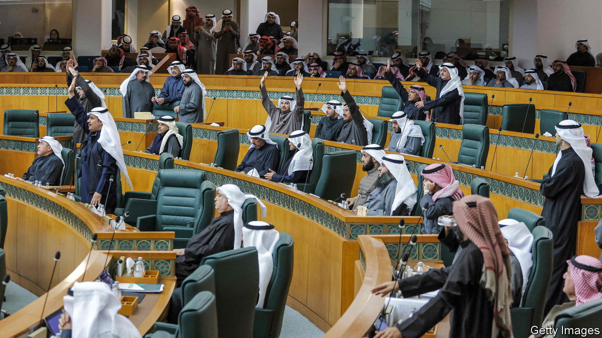

###### No cheques please, we’re Kuwaiti

# A populist plan to pay off private debts is another sign of Kuwait’s ills 

##### Dysfunctional politics and short-sighted economic policies are holding a rich country back 

 

> Jan 26th 2023 

IN OCTOBER KUWAIT’S finance ministry sent a stern message to the government: no frivolous spending. Yes, oil prices were high and the deficit had narrowed, but this was a time for fiscal discipline. And yet a few weeks later lawmakers introduced a bill that would force the state to pay for new cars, holidays or indeed anything else citizens might have bought on credit.

Under the proposal, the government would buy up billions of dinars’ worth of consumer loans. It would write off the interest and schedule repayments on the principal over a long period, with monthly instalments deducted from a cost-of-living allowance paid to citizens. The state would, in effect, pay off private debts.

The proposal has caused an uproar in Kuwait’s parliament, which unlike others in the Gulf has real power. Ministers walked out of a session earlier this month in protest. On January 23rd the cabinet resigned because of its power struggle with parliament, the fifth time since December 2020 that a Kuwaiti government has quit.

Supporters say it would help struggling families. Critics say the measure would blow up the public finances. The central bank estimates that more than 500,000 Kuwaitis have eligible loans worth 14bn dinars ($46bn), 60% of projected revenue in this year’s budget. (MPs claim the plan would cost far less.) It would also set a precedent for future write-offs: the scheme is the epitome of moral hazard.

These ought to be boom times for Kuwait. It is the world’s tenth-largest oil producer, pumping around 2.8m barrels a day, and a tiny country of just 4m people, fewer than half of them citizens. The IMF says GDP grew by 8.7% last year. Its sovereign-wealth fund is one of the world’s biggest, and the government’s debt-to-GDP ratio of 7% is among the world’s smallest.

But dysfunctional politics is holding it back, as it long has. Conservative Islamists did well in last year’s general election. About one-third of the newly elected MPs have signed a pledge that called for gender-segregated schools and other strictures. Last year hardliners tried to ban an annual marathon because it featured musical acts and men and women running together. 

Along with conservatism, parliament has a populist streak. Other Gulf countries are trying to diversify their economies away from oil and entice foreign investors. Kuwait has all but given up on plans to grow its private sector. 

Government policy is little better. Early in the pandemic, amid worries about food security—90% of Kuwait’s food is imported—it imposed price controls. It left them in place long after it was clear that imports were unaffected. Prices shot up when controls were lifted, leading to one of the Gulf’s highest inflation rates last year.

Kuwait now has the highest youth-unemployment rate in the Gulf, with at least one in six out of work. Citizens grumble about everything from potholes to the poor state of public education and health care. Perhaps they should pay to fix their own streets and schools: if they did it on credit, the state might pay them back. ■

