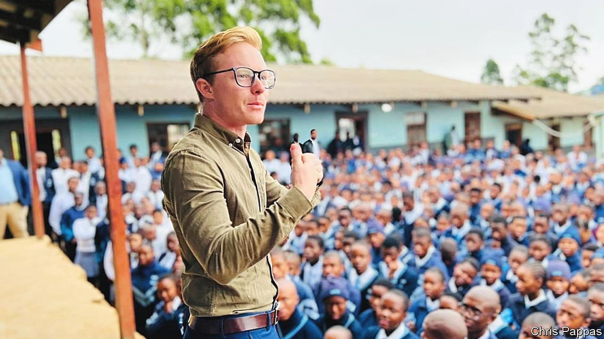
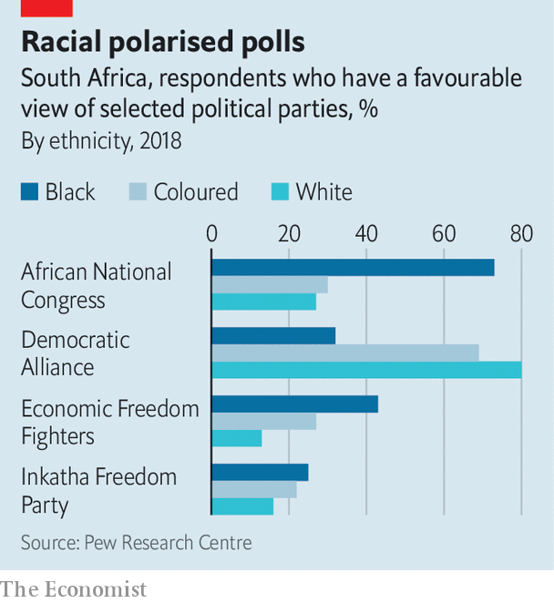

###### Fluent in empathy

# A white, gay, Zulu-speaking mayor is shaking up South African politics 

##### Chris Pappas is an unlikely but effective trailblazer 

 

> Jan 26th 2023 

Isiphethu Semfundo is the only primary school for miles in the upper Mooi valley, a bucolic area in the midlands of KwaZulu-Natal (KZN), the second-most-populous South African province. It educates the children of the rural poor—or at least tries to. For a year it has had no clean water. Nor does it have state-provided transport for its pupils. This abruptly ended after officials were threatened by the owners of private minibuses who wanted the business. A few kids now walk; some cover 20km (12 miles) in a day. But more stay at home. Taking the minibus costs 450 rand ($28) a month, more than the 350-rand welfare grant given to the destitute. 

Running schools is the job of the province, which, along with the national government and eight of South Africa’s nine provinces, is controlled by the  (ANC). But that has not stopped the mayor of the local municipality, Umngeni, from visiting. Chris Pappas (pictured) listens to teachers and mothers and says he will try to help. He does this in Zulu, the ladies’ mother tongue, which he learnt while growing up on a farm. “Having somebody who can speak their language is very, very important,” says Nene Philpine, the head teacher. “It gives a better and complete understanding.”

Mr Pappas is an unusual politician. He is white in a municipality where three-quarters of residents are black. He is fluent in Zulu (it is rare to find whites who speak South African languages other than English and the Dutch-based Afrikaans). He is 31 years old, roughly half the average age of the country’s cabinet. He is gay. And he is from the Democratic Alliance (DA), the official opposition, whose stronghold is in and around Cape Town. A year ago Mr Pappas became the first DA mayor to win an outright majority in a KZN municipality. His story is revealing—and encouraging—about the state of South African politics. 

 


South Africans still vote largely along racial lines. The ANC usually wins a majority of the black electorate, while the DA takes most of the votes cast by the two largest minorities: whites and “coloureds”, or mixed-race South Africans. Yet when South Africans irrespective of ethnicity are asked what matters most to them, polls suggest that they care more about jobs, corruption, crime and electricity blackouts than about race relations. 

Mr Pappas’s election in late 2021 shows it is possible for talented candidates to win support across the old divisions. Black voters in Umngeni, like those across the country, “feel betrayed by the ANC”, he says. The mayor deliberately ran a “localised campaign” that promised tangible improvements but not “miracles”. Though his narrow victory depended on DA voters turning out in relatively high numbers while many ex-ANC supporters stayed home, he also needed to lift his party’s share of the black vote from 8.7% to 11.7%. 

The success of Mr Pappas and his (black) deputy, Sandile Mnikathi, suggests that the monstrous damage caused by the ANC is reversible. Until the DA took over, the municipality had never run a budget surplus. Like most ANC-run local governments, its financial reporting was deemed inadequate by the auditor-general, a watchdog. Over the past year Mr Pappas has got Umngeni into the black by freezing hiring and stopping vanity projects. “There will be far fewer projects where politicians can go around and cut ribbons,” Mr Pappas tells provincial officials. This is freeing up funds for new schemes. 

One involves contracting out simple jobs, such as cutting the grass, to individuals. That sounds basic but it undermines the way ANC councils typically operate, awarding large tenders to politically connected cronies, often from outside the municipality, to get kickbacks. The municipality is also doing more to help the poor, for instance by making more households eligible for some free electricity. 

The mayor’s brand of politics is not flashy. But he argues that the simple act of doing what you said you would do is vital in a young democracy. “South Africans have lost faith in the democratic system as a means for change,” he says. A poll in 2021 found that two-thirds of South Africans “would be willing to give up elections” if an unelected government could provide security, housing and jobs. 

Mr Pappas’s optimism is welcome. South Africans have been ground down by almost 29 years of ANC misrule. Black voters have become increasingly apathetic. Some have given up voting, while many whites retreat into their affluent bubbles. “That’s the problem with South Africa,” says Mr Pappas. “Four hundred people moaning on WhatsApp and no one doing anything.” If modern South Africa’s next big transition, from  to coalition governments, is to work, it will need more of this can-do spirit. 

South Africa could also do with more whites who can speak African languages. When he was in prison, Nelson Mandela encouraged blacks to learn Afrikaans to understand “the language of the oppressor”. Later, he saw it as an emollient gesture: when he spoke to Afrikaners in their language it went “straight to their hearts”, he said. The power of language in politics is patent when you hear Mr Pappas conversing in Zulu. “The ability to listen [in Zulu] is more important than the ability to speak,” he adds. In this age of populism, it is a valuable lesson. ■

