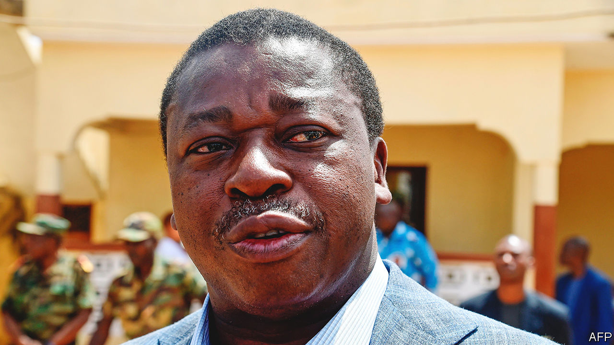

###### A family business

# Togo promises development, not democracy 

##### Yet it is not a deal that Togolese want to take 

 

> Jan 26th 2023 

“Democracy is the best tool we have to address the wide range of challenges we all face, ” President Joe Biden declared at a summit of African leaders in December, “and that belief is shared by Africans and Americans alike.” Some guests may have struggled to keep a straight face. Among those attending were strongmen such as Paul Kagame, who has  for almost 30 years, and  (pictured), whose family has run Togo for 56 years. Although happy to offer platitudes about democracy in Washington in return for aid, at home both presidents are pushing an alternative model on their people: authoritarian rule in exchange for a promise of development.

It is a social contract that is increasingly popular among Africa’s leaders. The Mo Ibrahim Foundation, which this week released its annual index of governance, found that more than 60% of Africans live in countries where democracy has declined over the past ten years. But in the same period measures of health care and economic development improved across most of the continent.

Both aspects of the deal are readily apparent in Lomé, an unusually sleepy city for a west African capital. Here a modern port and the occasional plush hotel or bank stand out from the unpaved streets that make up much of the city. “A half-century of the same family in power, that’s too much,” confides one Togolese man, who worries the government may punish him for speaking to a journalist. ”They do not like that you tell the truth,” he says. 

Not that the truth is much of a secret. Ever since Gnassingbé Eyadéma, a former army sergeant, grabbed power in a coup in 1967, Togo has been a dynastic autocracy. After Mr Eyadéma’s death in 2005, power passed to his son, who has clung to it as the security forces have killed and tortured his opponents and spied on citizens. It is “a state that surveils and punishes”, says Expédit Ologou of Civic Academy for Africa’s Future, a think-tank in Benin.

Togo’s government and its supporters do not put things in quite those terms. Bigwigs speak of emulating Singapore or Dubai, where, they imply, the curbing of political freedoms ushered in stability and prosperity. Part of Togo’s strategy is to show enough technocratic leg to woo Western governments that are keen to back a stable and seemingly competent regime in an unstable region. In this Togo seems to be following not Singapore but Rwanda, a poor dictatorship that combines some progress on economic development with a brutal security service. 

Mr Gnassingbé has also followed Mr Kagame’s lead in trying to build a reputation as a development visionary. He has poured money into upgrading Lomé’s port, which has increased its container volumes by a factor of about five in a decade, albeit from a very low base, to become the region’s leading hub. Now all the talk is of “digital transformation” and similar buzzwords. Cina Lawson, a Harvard graduate who is the “digital economy” minister, is trying to cut the cost of high-speed internet to attract startups. “Digital transformation provides us with a unique opportunity,” she says. There is some action to go along with the talk. When covid-19 hit, the government quickly set up a scheme to send about $20 per month via mobile phones to vulnerable Togolese. 

Yet the government’s deal of development instead of democracy is one that most Togolese reject. More think the country is going in the wrong direction than the right one, according to Afrobarometer, a pollster. Fully 82% of Togolese think the constitution should limit the president to two terms and 68% think democracy is the best form of government. Just 17% support what, in effect, Togo has: one-party rule. 

Even those sympathetic to the dubious idea that political repression goes hand in hand with development would struggle to make a Togo a model. After a half century of family rule it is much poorer than democracies in its neighbourhood such as Ghana and Senegal. “At least in Rwanda things have advanced economically,” says Aimé Gogué, an opposition leader. “In Togo the population continues to suffer.” ■

