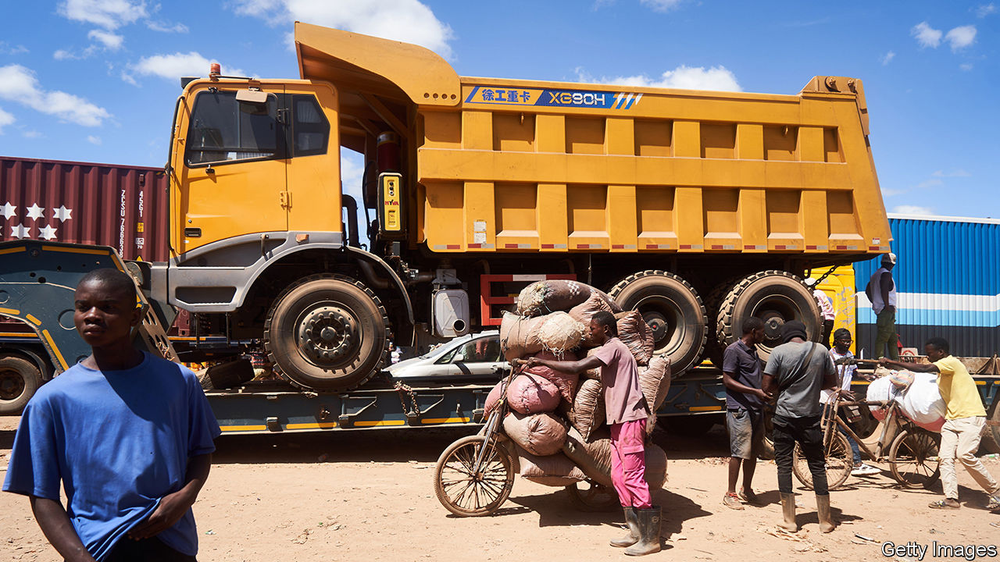

###### Deals on wheels

# Why bicycles are crucial to Congo’s cross-border trade 

##### While lorries wait weeks to pay their dues, two-wheelers zip across on the cheap 

 

> Jan 26th 2023 

In Kasumbalesa, on the Zambian side of the frontier, lorries  to be let into Congo. Long delays at crossings are common across Africa. But in this border town in the north of the country some wheels are still turning. Rickety bicycles piled high with goods zip past the lorries, like river water flowing around boulders. 

There are 4,000 to 8,000 bike “porters” in the town, estimates the World Bank. They load their bicycles with hundreds of kilos of goods, such as nappies, energy drinks and ground corn. A load that heavy would test the thighs of a Tour de France winner, so the cyclists work in teams. A “steerer” is seated at the front while three or four people push from the back. “My job is my work-out,” says one. They dodge shoppers, goat herds and envious lorry drivers. Once out of Zambia, the goods are thrown onto a lorry before being resold, often in Lubumbashi, the nearest large city.

Congo relies on imports because, after decades of war, it makes and grows little itself. More than 70% of food consumed in its south-eastern provinces crosses the Zambian border, some of it bought at Kasumbalesa’s market stalls, where French- and Swahili-speaking Congolese use sign language to bargain with sellers who speak English, Bemba or Gujarati. 

Import tariffs are the same, no matter how the goods are moved. But bicycles save money and time. Fuel is expensive and it costs $400 in vehicle taxes for a round-trip from Zambia. It is also harder to evade bribe-hungry officials when driving a lorry than when riding a bike. 

“Bicycles are the only way we can do business,” says the owner of a firm that exports Namibian fish to Congo via Zambia. He once used lorries but delays meant his fish rotted. Today he uses Congolese middlemen who arrange the bicycle trade. Two-thirds of small-scale trade goes through the official border post; the other third is smuggled. 

Kasumbalesa’s two-wheel exporters hint at the importance of informal and small-scale cross-border trade in Africa. Indeed, the amount of unrecorded exports means that intra-African trade may be 11-40% higher than official figures suggest, notes the Brookings Institution, an American think-tank. When barriers to official trade are so high, entrepreneurs will find. Put another way: the peddlers will keep on pedalling. ■

