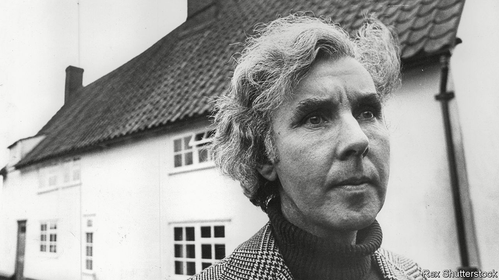

###### Sacredness in Suffolk

# Ronald Blythe recorded the passing, and continuance, of rural life 

##### The writer, essayist and author of “Akenfield” died on January 14th, aged 100 

 

> Jan 26th 2023 

He had not expected his book to be such a success. It had been acclaimed not only in Britain but also in America, where he had never dreamed of going. All Ronald Blythe had thought about, as he sploshed through the muddy fields of east Suffolk and the ditches running with yellow winter water, was the deep obscurity of the lives of rural labourers. They had dug those ditches and laid those hedges, twisting the reluctant twigs of elder and willow. Now the hedges had grown unruly, despite their efforts. They had ploughed their identity, their “I am”, into the flat, clayey fields, and had then gone under that clay. Their names had been carved on headstones, but the Suffolk wind, which cared for no one, had weathered them away. Perhaps he, as a writer, could nonetheless record the voices of country folk still living.

The book he researched and wrote in 1967-68 was called “Akenfield”. It was a collection of lightly anonymised monologues gathered from villagers in the area, mainly Charsfield, but going wider. Slowly, he penetrated their “bony quiet” to hear Davie, an ancient, remembering gangs of men singing as they scythed the corn; the blacksmith who could not open a church door without looking at its hinges; the thatcher who announced that hazel, to which he tied his reed bundles, was the best splitting wood there was. The gravedigger told jokes, as gravediggers will, and reminded him that bodies have to be buried facing east, expecting their resurrection—except for parsons, who must face the other way. 

Yet comfortable tradition sat cheek-by-jowl with struggle. A young schoolmaster told him how he had come to Suffolk to paint its huge skies, like John Constable, but now found himself teaching a pretty slow lot of pupils. The local magistrate talked matter-of-factly of the incest in the district, which could seem to both parties a completely natural occurrence. A visiting nurse disabused him of cottager kindness by relating how the old were often kept in dark corners, even in cupboards, and how those who could not produce their own food sometimes simply starved. A young shepherd who firmly stated that he “belonged to Suffolk” also thought now and then of Australia, and how good it would be to own something, rather than looking after the flocks of other men. 

The modern world was seen with ambivalence. The telly was nice, cars were convenient, but the new commuter families spilling out of Ipswich were judged to be playing at village life. Change was not unwelcome, but happening too fast. To this view, Mr Blythe was gently sympathetic. If he had included a writer in “Akenfield”—besides the poet, lurking near the end of the book, who said he would not have come to live there if he had wanted to get on—it should have been himself.

He had been born near Lavenham, and had stayed in Suffolk all his life. In fact, apart from one stint in Aldeburgh, writing programmes for Benjamin Britten, he had never stirred from the valley of the Stour. His father’s family had been farm labourers there, and agriculture was in his blood. He never saw the point of moving, or working at any uncongenial job, if he could make a living as he liked. As a boy he would escape outside if any chores threatened, to explore the lanes on his bike or lie dreaming in the grass, watching clouds. School ended at 14. Gradually, with the encouragement of the artist-and-writer friends he met in his first, shy-librarian job in Colchester, his longing to be a writer grew. Henceforward, he lived for words. 

In that vocation he chose to be alone. Solitude, though broken by dear visitors and his imperious cats, was good for writers. Alone, he could train his eye and ear to note the glitter of flint, the “starry, branchy, perfect shape” of common cow parsley, the scrape of the old willow at his window. He spent his last four decades in a very old house that had been left to him by the painter John Nash, Bottengoms Farm, at the end of a mile of unmade track that became, with enough rain, a river. There he was provident, independent and happy. In the raftered rooms he hung pictures, in the garden he planted potatoes and runner beans. The freezer held his harvests, with fussy labels of expiry dates. From ten til one he wrote, in a foolscap book with cheap ballpoints, his books, essays, short stories and, for 25 years, his weekly column for the . Four hundred words for the back page. It pleased him to be read by bishops. After work, and lunch, he wandered. “We tried to get you,” the telephone would tell him, plaintively, on his return. 

On such perambulations, though, he was seldom truly alone. His mind swarmed with those, both small and great, who had walked East Anglia’s fields and lanes before him. He saw Constable, with his painty fingers, opening the door of Stoke-by-Nayland church, where sunlight could turn the tower from pink to gold to gossamer. He watched John Clare, best of all nature poets, skiving on a Sunday, lying in the ling to scribble on his hat. Just as vividly he caught St Cedd, preacher to the East Saxons, standing under a dripping oak, and medieval villagers taking his own paths, speaking Chaucer and getting sexy in Maytime, under the hedges where the speckled flowers gave off their erotic scent. 

Chief among his heroes were the three great priest-writers of Anglicanism, George Herbert, Thomas Traherne and Francis Kilvert. They had lived elsewhere, Herbert in the Midlands, Kilvert in mid-Wales, Traherne in Herefordshire. But as a lay reader himself round a cluster of thinly attended little churches, he filled his sermons with these figures and trod in their ways. His head hummed with hymns and chants in which hills danced and trees rejoiced before the Lord. Church festivals marked the rhythms of his days: Passiontide and Easter, Good Shepherd Sunday, Rogation Day tramping the parish boundaries. Like his heroes, he made his local scene sacred. In his writings he celebrated them, Traherne the glorious earth-enjoyer, Herbert continually astonished at the generosity of his Lord. And Kilvert, the intrepid walker, revelling in the light, noting everything and everybody “with a kind of bliss”, listening so patiently to the stories of ordinary country folk that they too were transfigured. ■

