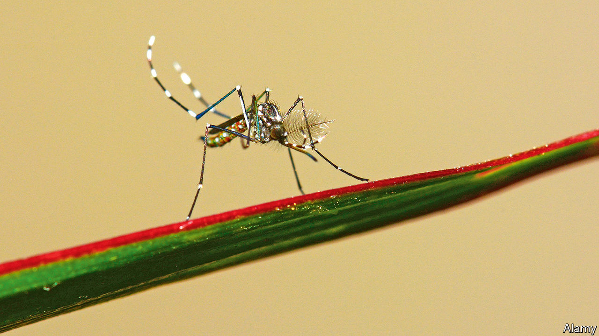

###### Insect repellents

# A better way of keeping mosquitoes at bay is under development 

##### A nifty piece of chemistry may have found a safe, effective, long-lasting protection 

 

> Jan 25th 2023 

Mosquito repellents have come a long way. For decades, the market leader was DEET, which fends the pests off successfully, but only for an hour or two. Recently, Icaridin has become available. This lasts up to eight hours and is just as effective. Yet both are mildly poisonous to cells grown in culture and their toxicity (if any) to human users is constantly debated. The search is thus on for something that is unquestionably .

Francesca Dani of the University of Florence, in Italy, thinks she might have the answer. As she and her colleagues describe in the , they looked at a range of chemicals called aldehydes and ketones, and, with a bit of tweaking, produced something that seems a good, long-lasting, safe .

Dr Dani knew from the scientific literature that some aldehydes and ketones have insect-repelling properties. Such chemicals, however, vaporise faster than DEET. But she also knew from her own work that molecules called hydroxylated cyclic acetals, which form from certain aldehydes and ketones when exposed to an alcohol, evaporate much less readily. That, she thought, might be the key to the puzzle.

She and her colleagues therefore made a score of hydroxylated cyclic acetals and tested their mosquito-repelling qualities against those of DEET and Icaridin. The standard way to do this is to spray some onto the back of a volunteer’s hand and have him or her then put both hands into a mosquito cage. The unsprayed hand acts as a control, and it is thereby possible to decide, by comparing the number of insects landing on each, how effective a repellent a particular chemical is.

As expected, DEET scored 95% protection efficiency (calculated by subtracting the number of mosquito probings on the treated hand from the number on the untreated one, dividing this by the number on the untreated one and then multiplying by 100). Such protection was granted by 8.3 micrograms of the stuff being applied per square centimetre of skin, and lasted two hours. For Icaridin, a fifth of that dose produces an equal repulsion for eight hours.

To the researchers’ delight, two of their hydroxylated cyclic acetals performed as well as Icaridin. And when they tested them on cell cultures they found that one, called 12a in the paper for simplicity’s sake, killed none of the cells exposed to it. 

DEET and Icaridin have had good runs. DEET was developed in the 1940s, to help safeguard American soldiers from mosquito-borne diseases when on campaign. Icaridin, with its longer period of protection, arrived in the 2000s. If 12a passes muster, though, it may be that both will soon come to the ends of their useful lives. ■


