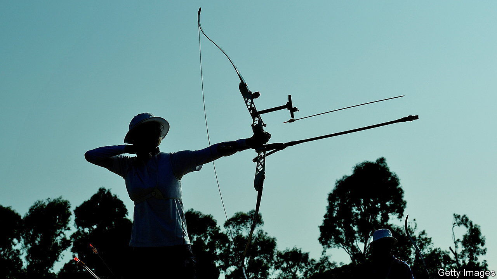

###### Archers and heart rates

# How to measure how stress affects athletes’ performance 

##### Pick a sport where they don’t move much, and study skin flushing 

 

> Jan 25th 2023 

How much  is good for an athlete? Surprisingly, since modern, professional sport of all sorts now seems to be in the hands of number crunchers trying to extract another zillionth of a percent of  from their charges, no one knows. The reason is that, to avoid decrements in performance of equal and opposite magnitude, top athletes are rarely willing to carry even the tiniest monitoring devices when in competition. And when they are not in competition such measurements would be meaningless.

However, two behavioural economists, Lu Yunfeng of Nanjing University, in China, and Zhong Songfa of the National University of Singapore, think they have found a way around this—at least for athletes whose disciplines do not require them to move a lot. 

Dr Lu was inspired to investigate the matter when watching the 2020 Olympic games on television. He noticed that in the archery contests, competitors’ heart rates were shown to viewers as they stood at the mark and shot. Heart rate is well known as an indicator of psychological stress, so he saw this as an opportunity to investigate the relation between stress and performance. To this end, he recruited Dr Zhong, who has a long history of working on stress and behaviour.

When they dug into the matter, the two researchers found that 122 of the 128 archers in the games had agreed to have their heart rates measured. The trick was that, since competitors were stationary, their heart rates could be monitored remotely by a technique called photoplethysmography, which registers changes in the reflectivity of skin caused by flushing when the heart pumps, and correlates well with more conventional measurements such as electrocardiograms. Altogether, they were able to match heart rate to score for 2,247 shots. 

As they report in a paper in , heart rates during the competition varied tremendously between archers. A few hearts pumped at just over one beat per second while one competitor’s raced along at more than three. The average was 138 beats per minute. 

Overall, archers with higher heart rates had lower scores and those with lower rates, higher ones. The average rate for a toxophilite who hit inner gold, or ten-ring (a bullseye, to non-cognoscenti), for a score of ten, was 134.2 beats per minute. It was 135.7 for outer gold (nine-ring). And for eight-ring, the inner red, it was 137.9. Overall, Dr Zhong and Dr Lu calculated that each extra heartbeat per minute resulted in a 0.004-point decrease in score. 

These findings support the notion that the performance of even some of the world’s most elite athletes declines as they experience increased stress. Whether that is peculiar to those who need a steady aim to win, or also applies to athletes who have to run around as they compete, remains to be seen. ■


