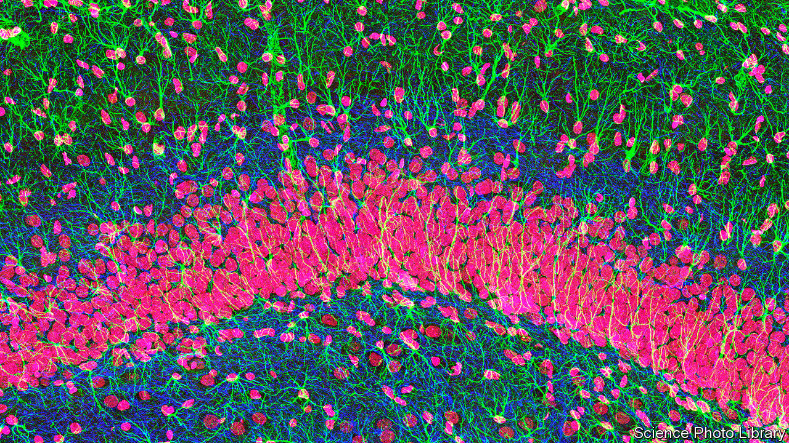
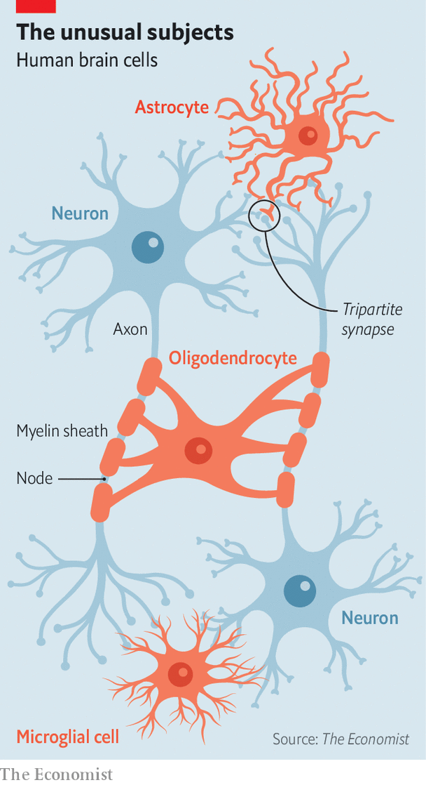

###### Out of ’cyte, out of mind

# Neurons are not the only brain cells that think 

##### Astrocytes, for instance, may play a role in depression and anxiety 

 

> Jan 23rd 2023 

Most people, if they think about the matter at all, probably think of thinking as something done by the huge network of specialised, electrically conductive cells called neurons that occupies the upper half of their skulls. And, as far as it goes, that is true. The 86bn neurons in a human brain do indeed do much of the cognitive heavy lifting. But not all of it. 

Supporting them is a cast of three other varieties of  cell—microglia, oligodendrocytes and astrocytes—collectively called glial cells (short for “neuroglia”, from the Greek for “nerve glue”). Until recently, these were neglected by neurology. That has changed. Glial cells (their filaments stained green in the section of rat hippocampus pictured, with neuron filaments stained blue and the nuclei of both stained red) are . The results have blown away the idea that they are mere glue. 

Microglia are gardeners. They prune links between  to keep the network in order. Oligodendrocytes, long dismissed as mere insulators of the electrically conductive fibres called axons via which neurons communicate, have crucial roles in tweaking axonic signals. And astrocytes, the most interesting of the lot, turn synapses—the junctions where axons meet and transfer signals—into the biological equivalents of transistors, by regulating the flow of information passing through them.

Out of ‘cyte, out of mind

Nor are these results of merely academic interest. Misbehaving glial cells are now implicated in a range of conditions, from autism to multiple sclerosis to obsessive-compulsive disorder. Their study thus has important medical applications. They are also of concern to those who design the brain-simulacra called artificial neural networks, on which machine learning and artificial intelligence depend. So, while it remains true that neurons are the stars of the cranial theatre, the other actors’ roles are being rapidly elucidated. And, with that, the play’s plot is thickening.

For microglia, the crucial paper was published in 2012. In it Dorothy Schafer of Harvard Medical School and her colleagues showed that these cells prune synapses during brain development, and that this is a process which continues into a person’s mid-20s. Beforehand, microglia had been viewed merely as parts of the immune system, important for mopping up pathogens and cellular debris, but basically Cinderellas. Dr Schafer turned them into belles of the ball. She found that, by hunting down and swallowing rarely used synapses, microglia keep the brain lean and mean, streamlining the computations neurons perform and ensuring the organ remains as efficient as possible. 

 


The revelatory moment for oligodendrocytes came two years later, in 2014. Hitherto, their role, though well known, had also seemed humdrum. Oligodendrocytes produce myelin, a mixture of proteins and lipids which they wrap around axons, in outgrowths called sheaths, to improve those fibres’ electrical conductivity. In that year, though, a team led by Armin Seidl of the University of Washington, in Seattle, discovered that oligodendrocytes use myelin to fine-tune the velocity of electric signals in axons.

For example, axons carrying signals from the left and right ears to a particular part of the auditory cortex will differ in length, so those signals might be expected to take different amounts of time to arrive. Oligodendrocyte fine-tuning (achieved by adjusting the diameter of the axon and of the distances between the nodes of the myelin sheath) compensates for this, meaning any remaining difference reflects the actual interval between the times of a sound’s arrival at each ear. And it is that real difference which the brain uses to locate whence a sound has come.

It is the newly discovered abilities of astrocytes, however, that are really exciting researchers. These snowflake-shaped cells sport tendrils, each terminating in an appendage called an “end-foot”. Every astrocyte governs a territory of its own, and these tessellate to form a three-dimensional mosaic across the brain. 

Playing footsie

End-feet hunt down and envelop synapses, allowing astrocytes to eavesdrop on the chatter between neurons and then, by strengthening or weakening particular synapses, exert control over the computation done within networks of neurons. Consequently, there is now compelling evidence that astrocytes play a crucial role in memory formation, especially in the hippocampus, which consolidates relevant short-term memories into long-term ones. 

Biopsies suggest that (depending on the brain region) astrocytes regulate between 50% and 90% of human-brain synapses in this way. Astrocytes’ meddling is thus the rule, not the exception. Many researchers now talk of “tripartite” synapses as being standard in the brain. Their transistor-like three-element composition has one part (the astrocyte) which acts like a transistor’s “base” connection, regulating the passage of signals between the other two (the neurons, the equivalents of a transistor’s “emitter” and “collector”). Since transistors form the logic gates of computers, that is intriguing.

Moreover, astrocytes do not just meddle in the business of neurons. They also seem able to perform computations of their own. Where two astrocytes’ territories meet, their tendrils can connect, letting them form networks like those of neurons. This permits them to communicate using pulses of calcium ions passed from the tendril of one cell to that of another.

Early in 2021 a team of researchers from Tampere University in Finland, led by Michael Barros, used gene-edited astrocytes to show that these calcium-ion signals can perform Boolean algebra, the language of digital computing. In particular, the team were able to run Boolean operations called AND and OR with a rate of accuracy of up to 90%. In 2022 Erik Peterson of Carnegie Mellon University, in Pittsburgh, published a mathematical proof showing that, in principle, an astrocyte network can run any computer algorithm imaginable. This hints astrocytes may form a secondary computational network, parallel to that of neurons, which is able to regulate the primary network via tripartite synapses.

The emerging picture of the brain, then, is less an aristocracy—with neurons looking down on their glial inferiors—than a democratic society of cells working together to produce thoughts. In 2022 Alexey Semyanov and Alexei Verkhratsky of the Russian Academy of Sciences dubbed this idea the “active milieu” within the brain. 

One consequence of the active milieu interpretation is a realisation that when glia misbehave there is trouble. A large body of evidence now suggests that dysfunctional glia play an important role in many neurological and psychiatric conditions. 

Autism is one. In 2017 Ishizuka Kanako of the Nagoya Institute of Technology, in Japan, found a link between an increased risk of autism and the presence of a pair of genetic variants known to disrupt, in microglia, the expression of a protein called CX3CR1. And in 2020 Xu Zhixiang of Scripps Research, in San Diego, showed a range of microglial protein-synthesis problems cause autism-like symptoms in mice. 

Current thinking is that misfiring microglia in people with autism fail to prune synapses thoroughly enough during brain development, resulting in overconnected brains with heightened sensitivity to stimuli, both sensory and emotional. Moreover, the effect that Dr Xu found disproportionately affects male mice—a bias that, perhaps not coincidentally, is also a feature of autism in human beings. 

In the past decade, meanwhile, several lines of evidence, including brain-imaging, post-mortem and genetic studies, have pointed to dysfunctional oligodendrocytes as the cause of psychosis in conditions like multiple sclerosis, bipolar disorder and schizophrenia. Such dysfunction disturbs the myelin on axons, disrupting the timing of their signals. The hypothesis is that this results in the hallucinations—imaginary sights and sounds—that are the defining feature of psychosis. 

There is also compelling evidence that misfunctioning astrocytes play a role in mood disorders such as depression and anxiety, and in neurodegenerative diseases like Alzheimer’s. Most strikingly, in 2021 Liam O’Leary at McGill University in Montreal reported that the brains of depressed suicide victims had markedly reduced densities of astrocytes, compared with healthy brains, in parts of the prefrontal cortex (the brain’s executive), the caudate nucleus (which helps control goal-directed behaviour) and the thalamus (which passes sensory information to the cortex). 

And it is not only psychiatrists who are inspired by the newly discovered roles of glia. Computer scientists are getting in on the act, too. Artificial neural networks are based on an early model of how neurons work—and, though subsequent investigation has shown this was simplistic, these networks’ organisation into interconnected layers of neuron analogues does reflect that of the cerebral cortex. Understandably, therefore, some computer scientists have tried adding artificial glia to networks to see if their performance improves. 

Transistorised, at half the price

It does. Several groups have discovered independently that getting rid of rarely used synapses, the job of microglia, helps artificial neural networks to encode new information and store memories. Coming up with ways to make neural networks sparser is now an important field. 

Artificial astrocytes are also being investigated, along with the idea of artificial neuron-glia networks (ANGNs). These imitate tripartite synapses by using astrocyte analogues to strengthen and weaken synapses in response to how the rate at which those synapses fire changes over the course of time. When tested alongside conventional networks, ANGNs consistently outperform them. As with many things in human engineering, it seems that nature got there first. ■


