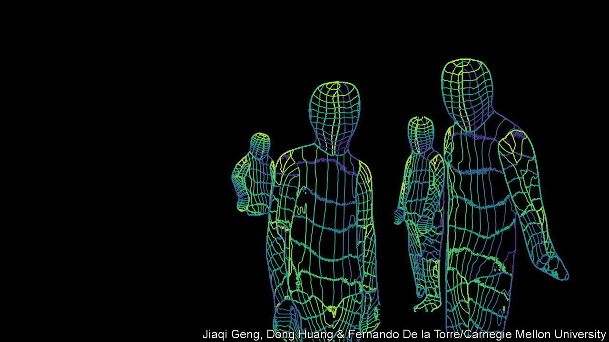

###### Surveillance technology

# Wi-Fi signals could prove useful for spies 

##### A router’s emissions can paint a picture of activity in a room 

 

> Jan 25th 2023 

Like all radio waves,  signals undergo subtle shifts when they encounter objects—human beings included. These can reveal information about the shape and motion of what has been encountered, in a manner akin to the way a  reveal obstacles and prey. 

Starting from this premise Jiaqi Geng, Dong Huang and Fernando De la Torre, of Carnegie Mellon University, in Pittsburgh, wondered if they could use Wi-Fi to record the behaviour of people inside otherwise unobservable rooms. As they describe in a posting on arXiv, they have found that they can. “DensePose from Wi-Fi”, the paper in question, describes how they ran Wi-Fi signals from a room with appropriate routers in it through an artificial-intelligence algorithm trained on signals from people engaging in various, known activities. This algorithm was able to reconstruct moving digital portraits, called pose estimations, of the individuals in the room.

Mr Geng, Dr Huang and Dr De la Torre are not the first to think of doing this. But they seem to have made a significant advance. Earlier experiments had managed to obtain two-dimensional (2D) pose estimations based on as many as 17 “vector points” on the body—such as head, chest, knees, elbows and hands. The new paper, by contrast, describes “2.5D” portraits that track 24 vector points (see picture). And, according Dr Huang, the team has now built an enhanced version capable of generating complete 3D body reconstructions that track thousands of vector points. Moreover, this work employed standard antennas of the sort used in household Wi-Fi routers. Previous efforts have relied on souped-up versions of the equipment. 

Detailed Wi-Fi-based body-tracking with a standard-issue router would have many uses. Mr Geng, Dr Huang and Dr De la Torre talk of employing it to “monitor the well-being of elder people”. A team working on similar technology, led by Yili Ren of Florida State University, suggests it could be used in interactive gaming and exercise monitoring. And, in 2016, Dina Katabi, Mingmin Zhao and Fadel Adib of the Computer Science and Artificial Intelligence Laboratory at the Massachusetts Institute of Technology demonstrated how Wi-Fi-like radio signals could detect a volunteer’s heartbeat (and thus his or her emotional state) remotely. 

These ideas are, however, distractions from what any such system would almost certainly be used for to start with, namely surveillance and espionage. In 2018, for example, Yanzi Zhu of the University of California, Santa Barbara and his colleagues showed how hackers posted outside someone’s home could track the movements (though not then visualise the postures) of people inside, by intercepting escaping Wi-Fi signals. 

It is easy to imagine who might be interested in the ability to turn any building’s Wi-Fi network into a mini panopticon. Dr Huang declined to say who is sponsoring his team’s work. However, another of their projects—developing techniques for detecting specific human behaviours in video-surveillance footage—is paid for by IARPA, the research hub of the Office of the Director of National Intelligence, which oversees America’s spies. ■


