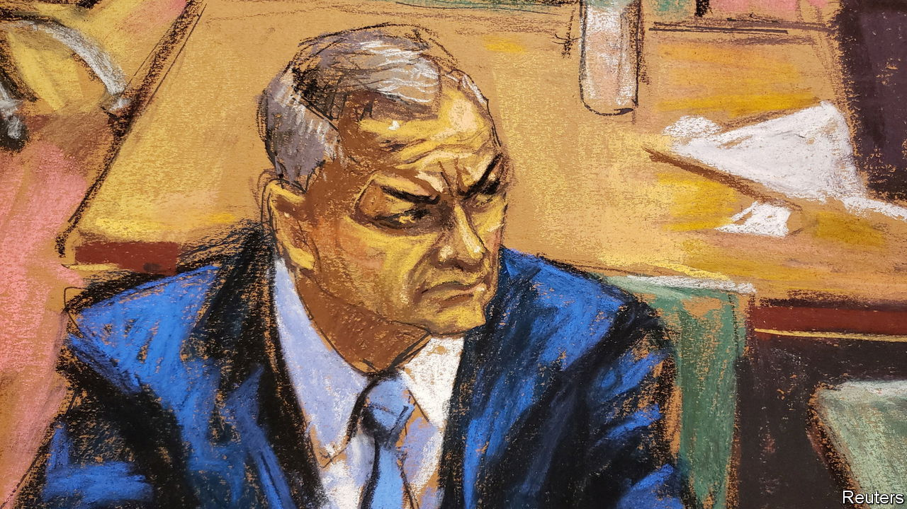

###### El Chapo: the sequel

# A trial in New York exposes US-Mexican counter-narcotics tensions 

##### A former Mexican security minister is accused of abetting a drugs cartel 

 

> Jan 26th 2023 

Even a Mexican  would struggle to come up with a better second season. In 2019 a court in New York sentenced to life in prison Joaquín Guzmán (better known as “El Chapo”), a leading drug trafficker who headed the Sinaloa gang. This week in the same room sat Genaro García Luna, who was the federal security minister during President Felipe Calderón’s “war on drugs” between 2006 and 2012 and a lauded ally of the United States. He was arrested in Texas in 2019, and the following year pled not guilty to five charges, including one of conspiracy to distribute cocaine.

The trial is a reminder of a basic lack of trust that has long dogged the United States and Mexico in tackling the drugs trade and the criminal groups running it. “All the Americans’ Mexican counterparts at one time or another have been suspected of being in cahoots with the criminals,” says Andrés Rozental, a former Mexican diplomat. The paradox is that Mr García Luna was in office at a time when the joint fight against drugs was in its heyday. Today the biggest obstacle to security co-operation is not concern about official corruption, but the policies of Mexico’s president, Andrés Manuel López Obrador.

Co-operation marked by friction is not unusual. The United States partly blames Mexico for its rising toll of deaths from drug overdoses. In 2021 66% of these were from fentanyl, which since 2019 has mainly entered the country from Mexico (rather than China). Mexico in turn attributes the violence it suffers to the demand for narcotics north of the border (and the guns that flow south). But during the Calderón years, “the doors opened completely to the Americans,” says Eduardo Guerrero, a Mexican security analyst. Security agencies co-operated closely and still did so under the next president, Enrique Peña Nieto. Between 2008 and 2021 the US Congress authorised $3.5bn for spending on security assistance to Mexico, ranging from buying helicopters to strengthening institutions.

Mr López Obrador came to power in 2018 pledging to tackle the root causes of crime rather than the symptoms. In practice that has largely meant standing by as criminal groups went about their business. Mr López Obrador ripped up the framework for co-operation, alleging it entailed a level of foreign involvement that violated Mexican sovereignty. Then the arrest by the United States in October 2020 of Salvador Cienfuegos, a former Mexican defence minister, on charges similar to those faced by Mr García Luna, made co-operation even more minimal. The Mexicans were so angry at his capture—partly because they were not informed in advance—that America feared the damage to bilateral ties and in 2021 returned Mr Cienfuegos to Mexico.

In response, Mr López Obrador passed a national-security law, aimed at the Drug Enforcement Administration (DEA), forcing foreign agents to share intelligence with their Mexican counterparts. In his hostility to the American approach, he may have had a point. The two countries’ calculations can differ. Mr Calderón’s policy, backed by the United States, of targeting kingpins led to more violence as the gangs fragmented and multiplied. The annual number of murders tripled between 2007 and 2011 and remains more than 30,000. 

For all the ill-will, some institutions, such as the two navies, have continued to share intelligence. And the national-security law is more a threat on paper than actually applied. A new agreement on security co-operation was reached in late 2021, keeping relations ticking over, but more at arm’s length. 

Moreover, in recent months Mr López Obrador appears to be changing tack and embracing more co-operation, perhaps because of pressure both from abroad and at home, where he is seen as weak on tackling crime. Mr Guerrero calculates that between 2021 and 2022 the number of drug-gang members detained rose by 28%, almost certainly thanks to intelligence from the United States. Last year Mexico captured Rafael Caro Quintero, a drug baron accused of the murder in 1985 of a DEA agent. In January it recaptured Ovidio Guzmán, a son of El Chapo (who was first detained in 2019 but released on Mr López Obrador’s orders after gunmen took to the streets). Mr López Obrador has long railed against soldiers being on the streets, but last year got Congress to prolong the role of the army in public security until 2028.

Still, Mr López Obrador has put a dampener on co-operation with the gringos. He replaced the federal police with the National Guard, which is poorly vetted and little trusted. Mexico is dragging its feet on extraditing people, including the younger Mr Guzmán, to the United States. The attorney-general is compromised by being close to the president. Visits by the president to El Chapo’s hometown have raised eyebrows, as an implicit sign of sympathy for him. Mr García Luna’s trial could be yet another blow to the US-Mexico relationship. Alejandro Hope, a Mexican security analyst, describes it as “a double-edged sword”. “It sends the message that impunity will not be tolerated, but also that however much you do for us [the United States] you’re vulnerable.” ■

