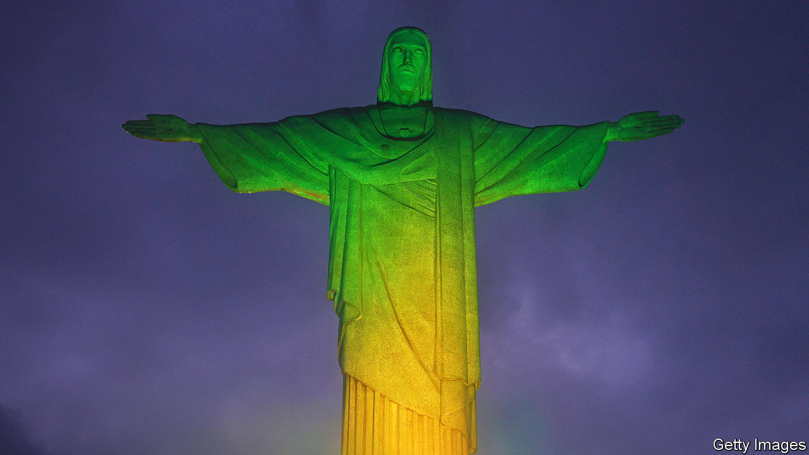
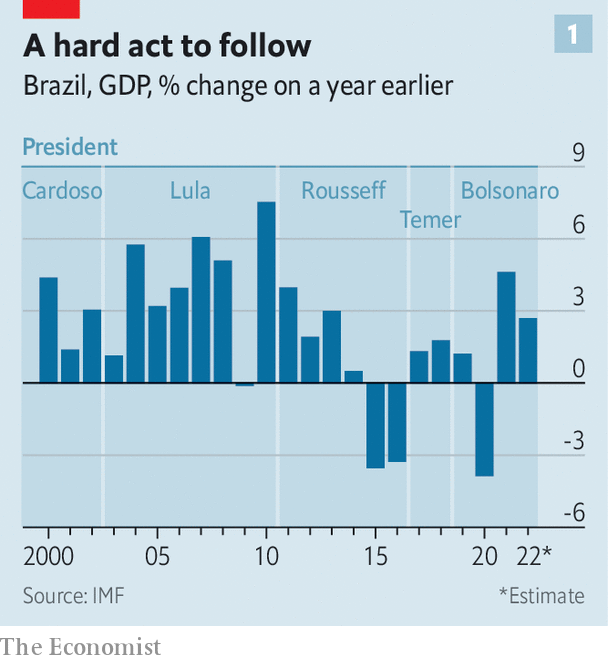
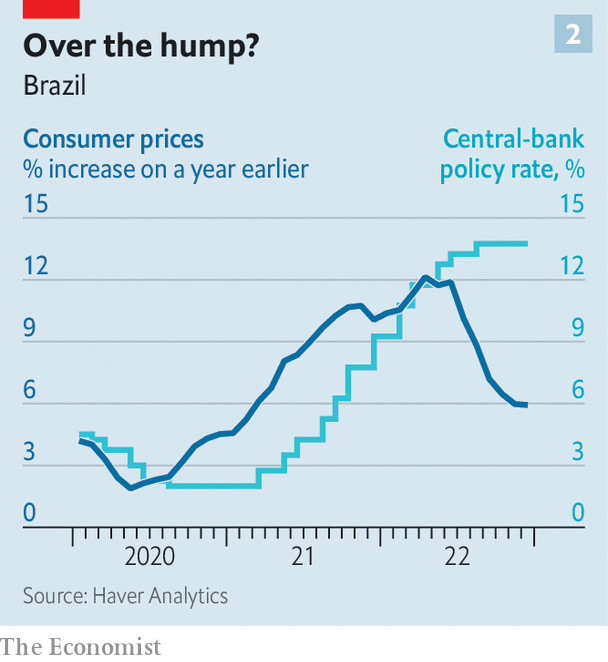

###### Ready for relaunch?

# As Lula takes over, Brazil’s economic prospects are looking up 

##### But he still has his work cut out: inflation is high, and debt and poverty rates soaring 

 

> Jan 26th 2023 

AT FIRST glance Lula’s second presidential act looks badly timed. In 2002 Luiz Inácio Lula da Silva inherited an economy that had just been subjected to wrenching reforms. Lula governed capably, but was bolstered by friendly global forces: soaring demand for Brazil’s commodity exports, low global interest rates and a sagging dollar. He left office in 2010, having presided over average annual growth of 4.5%, a 50% increase in average Brazilian incomes, and a hefty drop in unemployment, poverty and government debt.

 


Yet during last year’s election campaign, few thought Lula’s second stint as president would be as lucky. He inherits an economy hardly richer than the one he bequeathed his successor, Dilma Rousseff (see chart 1). Under her, the country plunged into a deep recession; her impeachment over a corruption scandal tarnished Lula’s Workers’ Party (PT). The economy still bears the scars of the pandemic, which killed nearly 1m Brazilians and knocked 4% off gDP. Gross government debt now stands at 88% of GDP—an eye-watering level for an emerging market with a history of macroeconomic crises—while inflation is well above the central bank’s target. Most disconcertingly, he takes the reins of a country which suffered serious damage to its environment and its democratic institutions under Jair Bolsonaro, his Trumpish predecessor, whose supporters stormed government buildings in the capital, Brasília, in early January.

So Lula does indeed have his work cut out. Brazil sorely needs investment in its infrastructure, as well as spending on education to train Brazilian workers for better jobs and to make up for learning lost during the pandemic. The Amazon rainforest, the health of which depends on efforts to strengthen and enforce rules against deforestation, will require more spending. So will poverty; it soared during the pandemic, after falling for much of the 2010s. Enacting policies to meet these needs means not only maintaining unity in the congressional coalition led by the PT, but also mastering difficult budget arithmetic.

This year’s spending plans threatened to exceed a cap on annual budget growth introduced in 2016. To dodge this potential obstacle, Lula helped shepherd a constitutional amendment through Congress in December, before his inauguration, exempting some spending from the cap. But this carries its own risk: of eroding investors’ trust in Brazil’s commitment to sound budgeting. Recognising this, Lula’s administration has outlined a plan to boost tax revenues and trim spending. But achieving budget reform will prove a legislative challenge. Brazil thus remains vulnerable if investor sentiment is dented by poor growth, a gloomier global economic prognosis or some other shock.

And on those counts, too, it has looked a bad time for Lula to retake the presidency. This year has seemed destined to be a hard one for much of the global economy, as many countries pushed up interest rates to combat high inflation, and as China’s economy continued to sputter under a property-market crash and harsh covid restrictions. Even recently, many economists were warning that a global recession might be coming. The combination of weak global growth, sinking commodity prices and rising interest rates could easily tip Brazil into crisis.

Yet only a few weeks into Lula’s term, his timing does not look so hapless after all. In much of the world inflation rates are falling, often faster than forecast just a few months ago. The global economy looks more resilient, too. Neither America nor Europe is in recession yet, and although China’s economic growth in 2022 disappointed at just 3%, the relaxation of its zero-covid policy and of curbs on property-market investment may presage a rebound. Officials at the IMF have suggested that new forecasts to be released at the end of January will show an upward revision to global growth. 

These better prospects seem to set a floor for commodity prices. High prices for oil, soyabeans and other Brazilian exports help explain growth over the past two years that was faster than many might think. GDP rose by nearly 5% in 2021, and by almost 3% in 2022. Commodity prices have fallen from the peaks reached in the months following Russia’s invasion of Ukraine, but remain well above pre-pandemic levels. High prices could persist, too, if global demand rises, while supply disruptions—from war, climate change and a fracturing of the global trading system—continue. Brazil is well-placed to benefit; in addition to oil and soyabeans, it has helped fill the shortfall caused by reduced shipments of maize from Ukraine, becoming one of the world’s leading exporters.

 


Meanwhile, lower expectations for inflation across the rich world, and in the United States especially, mean that interest rates are unlikely to climb as much as feared this year, and have contributed to a decline in the value of the dollar. That has eased pressure on economies around the world, including Brazil, where the yield on ten-year bonds initially dropped by nearly a full percentage point. Brazilian inflation has fallen too, from a peak rate last year of more than 12% to just 5.8% in December (see chart 2). 

That is still well above the central bank’s target rate for 2023 of 3.25%, and core inflation, excluding more volatile items, has eased more slowly. But declines in Brazilian inflation, combined with easier financial conditions globally, may eventually allow Brazil’s central bank to cut its policy rate, painfully high at 13.75%. The central bank’s aggressive rate-rise campaign, which began in 2021, helped restrain inflation and maintain markets’ confidence. But high rates have raised the government’s borrowing costs and dampened what might otherwise, in a period of buoyant commodity prices, have been a pick-up in investment.

Healthy demand for commodities and more benign financial conditions help. But they do little to fix underlying structural problems. Brazil’s economy needs more sweeping reform. The new government, however, has conceded that it will have to be more careful than it might have been, to avoid further political unrest. A push to reduce trade barriers offers scope for progress and might prove especially beneficial, given global interest in supply-chain diversification. An agreement between the European Union and Mercosur, a trade bloc of large South American economies, which has been held up by European concerns over Amazon deforestation, might be revived now Mr Bolsonaro is gone. But serious reform would require a big push by Lula, who seems to have other priorities—although in a joint article on January 22nd he and Alberto Fernández, Argentina’s president, promised deeper economic integration, including work towards a .

Nor does the turn in global fortunes make Lula’s second presidency an easy one. Current forecasts suggest that Brazil’s economy will grow by just 1% in 2023, so even a dazzling outperformance of projections would compare modestly with the average during Lula’s first.

It is also easier to see how things might go wrong in the near future than it was in the 2000s, because of unanticipated shocks to the global economy or domestic troubles. Lula may well come to rue his decision to try his hand at governing once more. But it is also getting easier to see how he might further burnish his reputation for uncannily good timing. ■

