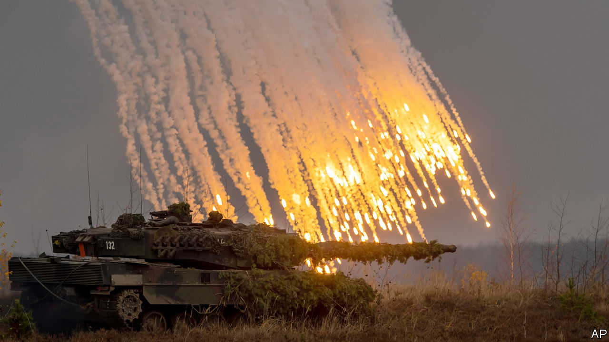
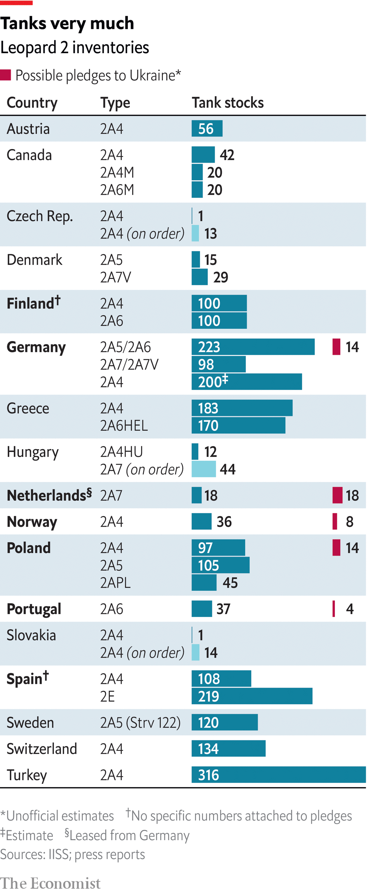

###### The Economist explains

# What makes Germany’s Leopard 2 tank the best fit for Ukraine? 

##### It is easier to run than America’s Abrams—and in plentiful supply in Europe 

 

> Jan 25th 2023 


SOMETIMES PATIENCE is rewarded. On January 25th Olaf Scholz, Germany’s chancellor,  to send 14 of his country’s stock of Leopard 2 tanks to Ukraine—and to allow allies such as Poland to re-export theirs. The decision follows . Mr Scholz had wanted America to agree to send its M1 Abrams, another type of main battle tank (MBT), to Ukraine before he would release the Leopards. He has got his wish: a few hours after Mr Scholz’s announcement, America said it would donate 31 Abrams to Ukraine. Britain has already promised 14 of its own MBT, the Challenger 2. Still, it was the German-made Leopard 2 tanks that Ukraine really wanted. What makes them so special?

Since entering service in 1979 the Leopard 2 has gained a reputation as one of the world’s best MBTs. Several European countries, including Finland and Poland, have large numbers of them, although some are kept in storage (see table). Turkey has more than 300, according to the International Institute for Strategic Studies (IISS), a think-tank. Not all Leopards are identical; the tank has been upgraded several times. Germany says it will send the relatively recent 2A6; other countries will probably send older models, such as the 2A4. 

 


Yet all these models are superior to the  that Russia is using on the battlefield, such as the T-72 and the T-90. These tanks do not have the same level of stabilisation as Western ones, according to the Royal United Services Institute, another think-tank, meaning they are less capable of firing accurately while moving. Tanks like the T-72 also lack blast doors between their crew and ammunition stores. That allows them to be operated by three men instead of the Western-standard four. But it means that strikes from above are more likely to cause catastrophic explosions. 

Crucially for tank-hungry Ukraine, the Leopard 2 also has advantages over its Western counterparts. According to Janes, a defence-intelligence provider, the Leopard 2A4 weighs about 55 tonnes. The Leopard 2A6 is nearly 58 tonnes. Both models have a top speed of 72kph (45mph), making them quicker than both the Abrams (68kph) and the Challenger 2 (56kph). And the range of both Leopard 2 models—how far they can travel before refuelling—is 550km. That is the same as that of their British Challenger counterpart, and superior to that of the Abrams (426km). 

The Leopard 2 does have flaws. In late 2016 at least eight Leopard 2A4s were reportedly destroyed during a Turkish operation against Islamic State in Syria. The insurgents targeted weak points in the tanks’ rear and side armour. And the Abrams has greater firepower. The German and American MBTs both boast a 120mm turret-mounted smoothbore gun as their main weapon. But the Abrams has three additional machineguns, compared with the Leopard 2’s two. The Americans also use depleted uranium to reinforce their shells, improving the Abrams’s ability to penetrate armour. 

But the German tank’s shortcomings are gradually being resolved. Newer versions of the Leopard 2, for instance, have reinforced armour on the turret. The Leopard 2A6 also has a longer 120mm smoothbore gun than its predecessors, which improves the tank’s penetrative power. But even older models have clear advantages for use in Ukraine. Whereas the Abrams runs on a turbine engine that the Americans fill with jet fuel, the Leopard uses diesel, which is more readily available. There are also around 2,000 Leopards in Europe. That makes the tanks easier to export to Ukraine, and eases the supply of spare parts. 

After Germany’s decision, its allies now aim to donate two battalions of Leopard 2s to Ukraine, amounting to perhaps around 80 tanks. On top of the American and British pledges that would raise the number of promised MBTs above the level needed to make a difference on the battlefield. But training is also crucial, as the tanks must be integrated with other systems. Germany says it will soon begin training Ukrainians on the Leopards, while America is already carrying out combined-arms exercises for Ukrainian forces that bring together different specialists. Such efforts will be essential to ensure that the significance of Mr Scholz’s decision is not merely symbolic. ■

