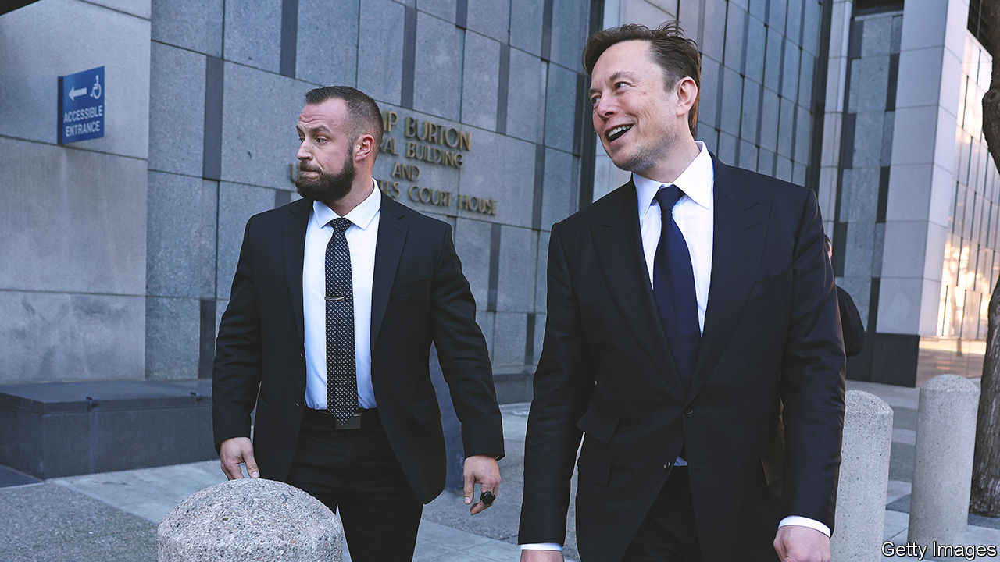

###### The world this week

# Business 

#####  

 

> Jan 26th 2023 

Investors who hoped that 2023 would bring a change in fortunes to America’s tech companies following their walloping in the markets in 2022 were left disappointed by  earnings. The company reported solid revenue and profits for the final quarter of last year, but said the growth in demand for its cloud services, the main driver of its business, had softened as clients curtailed spending. It was the first of America’s tech giants to publish results for the fourth quarter. Markets are nervously awaiting earnings reports from the others. 

The word is out

Meanwhile Microsoft  that it had increased its investment in OpenAI, the startup behind the ChatGPT  bot. ChatGPT has become an AI sensation since its release on the market last November. Taking direction from just a few commands, it has passed exams in law and medical licensing, and completed the final exam in the Wharton MBA programme (which may not surprise anyone who has attended business school). 

America’s Justice Department sued  for anticompetitive behaviour in online advertising. The suit alleges that Google tried to limit its rivals’ access to digital-ad technology by acquiring firms that develop it and wielded its dominance in the market to force advertisers and publishers to use its products. The news comes after Alphabet, Google’s parent company, announced 12,000 job cuts, another instance of the tech industry’s great retrenchment. 

In an indication of shareholder frustration at the strategic direction of some tech firms, , a prolific Wall Street activist hedge fund, has reportedly taken a stake in , one of the world’s biggest software companies. Salesforce has also shed jobs to cut costs, but investors’ exasperation goes beyond its hiring spree to its $28bn acquisition of Slack, which critics think was overvalued. 

Reed Hastings stepped down as chief executive of , which he helped found in 1997 as a DVD rental firm. He’ll remain at the company as executive chairman. The streaming company, meanwhile, said it was pleased with the progress of its new ad-supported subscription option, and that it would ban the sharing of passwords to its service by the end of March. 

 grew by 2.9% in the fourth quarter on an annualised basis, slowing slightly from the 3.2% recorded in the previous three months. GDP expanded by 2.1% for the year as a whole. 

Rupert Murdoch ditched a plan to remerge , the newspaper side of his empire, with , his television assets. The publishing and entertainment businesses were split in 2013 (21st Century Fox, the film studio, was subsequently sold to Disney). Mr Murdoch’s proposal faced resistance from some News Corp investors unhappy at the prospect of being lumped together with Fox News, which they consider a toxic brand. 

A German union said that  is planning to cut 3,200 jobs and move some activities to America. The carmaker has not confirmed the cuts, saying only that it needs to make structural changes amid the shift to electric vehicles. Press reports suggested that Ford was considering selling one of its German factories to BYD, a Chinese maker of EVs. 

Qatar’s investment agency has doubled its stake in  and now owns 6.8% of the Swiss bank, according to a regulatory filing. It is now the second-largest shareholder in Credit Suisse, after Saudi National Bank, which holds a stake of 9.9%. 

A uniform policy

In Boston a federal judge dismissed a lawsuit from three former workers at Whole Foods who claimed they had been sacked illegally for wearing Black Lives Matter masks. The judge found that the company had a legitimate business interest in upholding its , which applies to all slogans and logos, and found no evidence that the three employees had been targeted.

 warehouse workers in Britain held their first strike. The staff at a facility in Coventry walked out in a dispute over pay. Some claim they are monitored for their “idle time”, such as going to the toilet. Many Amazon employees in Europe are unionised. The company has resisted efforts to unionise in America. The first union, at a warehouse in New York, was formed only last April. 

 reported record quarterly revenue and net profit, which came in respectively at $24.3bn and $3.7bn. It was good news for the carmaker after it missed its annual target for delivering vehicles. 

 took the stand at his trial for securities fraud in relation to a spurious tweet in 2018 about taking Tesla private. Mr Musk insisted he had never intended to mislead investors and “would be sad” if some had lost money as a result of the market reaction to the tweet. Asked whether the tweet’s offer of $420 a share was a joke (420 is slang for cannabis) Mr Musk said it was just a coincidence, but there is some “karma around 420”.

