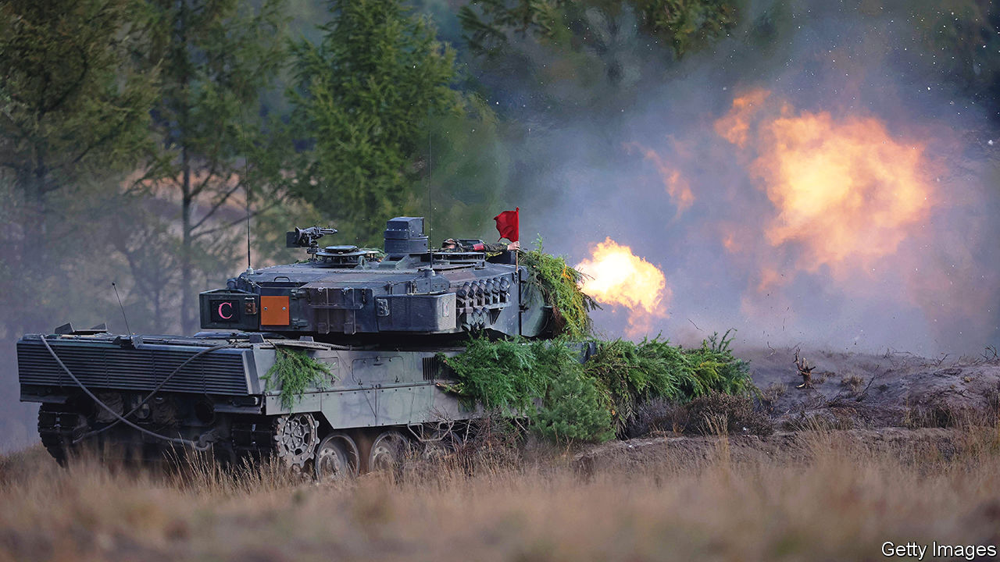
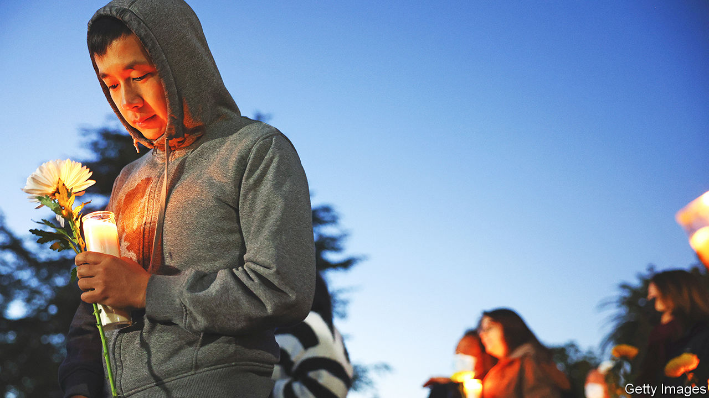

###### The world this week

# Politics 

#####  

 

> Jan 26th 2023 

After months of debate,  is to be  by its Western supporters. Olaf Scholz, the German chancellor, bowed to mounting pressure and said he would send German-made Leopards. He also agreed to drop a long-standing German ban on the re-export of Leopards by other European countries that have them. As part of an international agreement that involved a fair degree of ill-will, America said it would send its main tank, the M1 Abrams. But the tanks will take time to arrive, and Ukrainian soldiers will need weeks of training on them. 

There is a war on you know

Volodymyr Zelensky cracked down on  and the privileges of some Ukrainian officials. The deputy defence minister resigned after food was procured for the army at inflated prices. Several other officials and regional governors also stepped down. Mr Zelensky banned officials from taking foreign holidays; men of fighting age are not allowed to leave Ukraine. 

Turkey’s president, Recep Tayyip Erdogan, said he would not support Sweden’s application to join , after a far-right activist burned a copy of the Koran near the Turkish embassy in Stockholm. The foreign minister of Finland, which also wants to join NATO, said that maybe now was a good time for a brief pause in talks with Turkey. 

,  prime minister, came under pressure over a senior Tory’s tax affairs. Nadhim Zahawi, the chairman of the Conservative Party and a former chancellor, said that he had reached a settlement with the authorities over previously unpaid tax relating to shares in YouGov, a polling company he helped to establish. Mr Zahawi said that he had been found to be “careless and not deliberate”. Mr Sunak has referred the matter to his independent ethics adviser.

 military government has given France a month to withdraw its troops, who have been fighting jihadists there for almost a decade. It is the second country in the Sahel region, after Mali, to expel Western forces and to have reportedly asked Russian mercenaries from Wagner Group for assistance. 

 troops fired on a  fighter jet, claiming it had violated Rwandan air space. Congo denied the jet had crossed the border. The incident comes after months of strain over claims that Rwanda is backing rebels who have taken control of several towns in Congo.

Tundu Lissu, an opposition leader in , returned home after a ban on opposition rallies was lifted. He fled six years ago after being shot in an assassination attempt.

In  a respected lawyer was murdered outside his home in what many believe to be a political killing. Thulani Maseko was a strident critic of King Mswati, Africa’s last absolute monarch. 

Binyamin Netanyahu,  prime minister, reluctantly fired Aryeh Deri from his cabinet following a Supreme Court ruling that he cannot serve as a minister because of a conviction for tax fraud and a suspended sentence. More than 100,000 people took to the streets of Tel Aviv in further protests against the government’s proposed reforms of the Supreme Court.

The judge leading the investigation into the devastating explosion at Beirut’s port in 2020 resumed his inquiry after a 13-month hiatus because of political opposition. In response,  top prosecutor filed charges against the judge and ordered the release of all suspects detained in connection with the case. 

 government closed Machu Picchu, a 15th-century Incan citadel that is the country’s most famous site, amid continuing protests against Dina Boluarte, the president, which have killed dozens of people. A group of left-wing legislators submitted a motion to impeach Ms Boluarte, who was sworn in only last month.

Visiting  largest reserve for indigenous people, President Luiz Inácio Lula da Silva accused the administration of his predecessor, Jair Bolsonaro, of genocide against the Yanomami tribal people. He described the deaths of hundreds of children in the area from preventable diseases over the last four years as a “premeditated” crime.

The trial opened in New York of , security minister between 2006 and 2012. He is accused of having abetted the Sinaloa drug cartel. Arrested in Texas in 2019, Mr García Luna has pled not guilty to five charges, including conspiracy to distribute cocaine.

 


Democrats in California called for stricter gun-control laws following two. The first attacker murdered 11 people at a dance studio in Monterey Park, a suburb of Los Angeles. In a separate incident a gunman shot dead seven people in Half Moon Bay, a coastal town south of San Francisco. The state already has some of the toughest regulations on the use of firearms in America, and the country’s seventh-lowest death rate from gun violence. 

 is to be allowed back on Facebook and Instagram, two years after he was banned because of the risk that he could incite violence. Meta, Facebook’s parent company, says it has put “new guardrails in place to deter repeat offences”. 

Running out of credit 

America’s treasury secretary, Janet Yellen, outlined the “extraordinary measures” her department is taking to keep paying the bills, after it hit a limit on  imposed by Congress. The debt ceiling is $31.4trn, but in a regular partisan showdown Republicans are refusing to lift the cap. The impasse could turn into a crisis by June. 

Chris Hipkins was sworn in as  prime minister following the resignation of Jacinda Ardern. Mr Hipkins was in charge of the response to the covid-19 pandemic. He says his priority as prime minister is to tackle the cost-of-living crisis, which is dragging his Labour Party down in the polls. 

 used emergency powers to block a BBC documentary investigating Narendra Modi’s role in the religious riots that swept Gujarat in 2002, when he was the state’s chief minister. The programme was to be aired on social media. The prime minister has long rejected accusations that he could have stopped the violence, which killed at least 1,000 people, most of them Muslims. The government said the programme propagated a “discredited narrative”. 

The Committee to Protect Journalists, which is based in New York, reported that 67 members of the  were killed last year, the highest number since 2018. 

