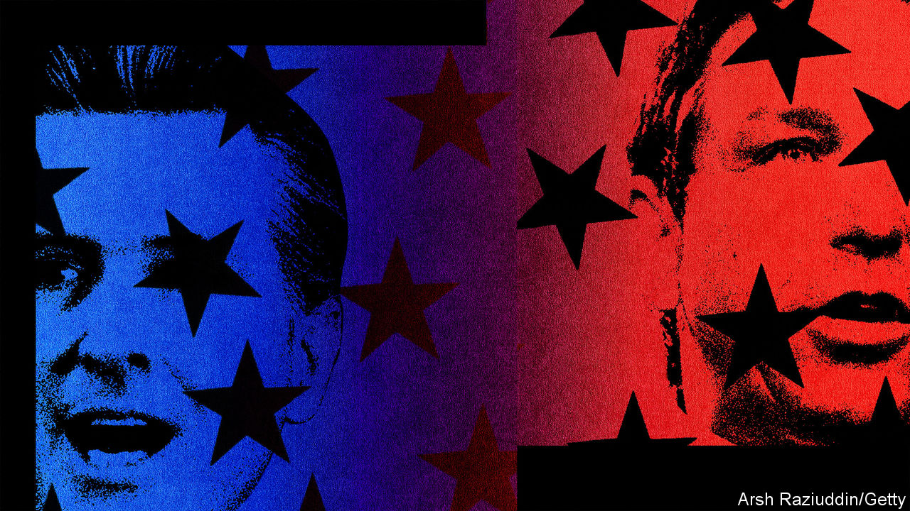
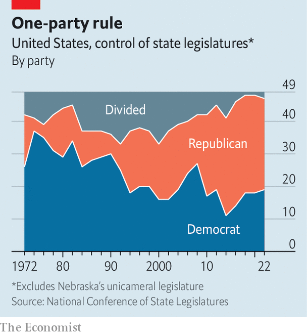

###### Red meat and greet

# Congress is gridlocked. America’s statehouses are very much not 

##### Bans on electric cars and drag shows are on the menu in 2023 

 

> Jan 24th 2023 

WHEN WINSTON CHURCHILL said politics is not “a game” but “an earnest business”, he had no hint of how politicians in Albany would make it so lucrative. During a special session before Christmas, lawmakers in New York state voted to approve a 29% pay rise for themselves. Kathy Hochul, New York’s governor, signed the raise into law on December 31st. “I’ve been many times in their districts, and they work very hard, and they  it,” she had said of her state representatives. Their annual salary of $142,000 now makes them the best-paid lawmakers in America.

State legislatures rarely get the hawk-eyed attention lavished on Congress, but they will be  this year. Those in all 50 states will be back in session in 2023, with many returning to work this month. (Four states—Montana, Nebraska, North Dakota and Texas—have legislatures that meet only every other year.) These are good times for state lawmakers, and not only New York’s money honeys. States are flush with cash. How their lawmakers choose to spend, and which new laws they push, will offer a lens on where the country is heading.

Three big themes will play out across state capitols this year. First is the continuing rise of hyper-polarised policies. Red and blue states will push further apart on , abortion, gay rights, education and taxation. One-party control has a lot to do with it. There are 39 “trifecta” states, in which a single party controls all three branches of government (both chambers of the legislature and the governor’s office). This allows states to “make decisions and make them relatively quickly”, says Peverill Squire of the University of Missouri, an expert on legislatures. “The contrast with Washington will be stark.”

Lawmakers in Wyoming recently proposed a bill banning the sale of all new electric vehicles starting in 2035, in order to protect the state’s oil and gas industry. It was a riposte to regulations passed in California last year that aim to ban the sale of petrol-powered cars from 2035. The Wyoming bill died in committee, but it “served its purpose”, which was to raise questions about the transition to renewable energy, says Brian Boner, a state senator who co-sponsored the bill. 

Guns will be another battleground. California, which recently suffered three mass shootings in three days, already has strict gun laws. But new proposals are emerging, such as higher taxes on firearms and longer sentences for gun-related crimes. Some Republican states, such as Florida, are pushing in the opposite direction, and are likely to legalise the carrying of weapons without a permit or training. (“Permitless carry” is already legal in 25 states.)

A second theme will be governments taking aim at companies that defy state lawmakers’ agendas. “The weaponisation of business is an emerging phenomenon,” says Maggie Mick of MultiState, a government-relations firm. She points to proposals in Republican states, including Texas, that would revoke firms’ tax incentives if they help employees get abortions.

Lawmakers in California, which already has the highest petrol prices in the continental United States, are mulling a cap on oil firms’ profits. By contrast several states, including Arkansas, Missouri and South Carolina, are proposing bills that would prohibit or punish firms that use environmental, social and governance (ESG) principles: corporate concepts that Republicans despise. How to treat TikTok, a popular Chinese-owned app, will be another topic of debate. Around half of states (mostly Republican ones) have already pushed for full or partial bans on state-owned devices running TikTok. Here, they are sprinting ahead of Congress because there is a “perceived vacuum at the national level”, says Harry Broadman of Berkeley Research Group, a consulting firm.

A third theme to watch is how some governors will use these legislative sessions as résumé-building for higher office. This will be most obvious in Florida, where the governor, Ron DeSantis, is a leading contender for the Republican nomination for president. “There will be a lot of red-meat issues again, because this is his launching-pad year for 2024, and there are certain boxes he has to check,” predicts Jeff Brandes, a Republican former Florida state senator. Mr Brandes says that “whatever the most extreme state is” in 2023 in terms of new conservative policies, Mr DeSantis will try to “match that”. In addition to removing restrictions on guns, Mr DeSantis will try to tighten them on abortion and devise fresh torments for woke liberals.

Meanwhile, Texas and other states may copy some of Mr DeSantis’s signature policies, such as  on what students can be taught about sex and sexuality; doing that vaulted Mr DeSantis to the top of the news agenda last year. Other governors will use this legislative session to raise awareness of their political prowess. They include Glenn Youngkin of Virginia and Kristi Noem of South Dakota, both Republicans; and Gretchen Whitmer of Michigan and Gavin Newsom of California, two Democrats. 

 


Mr Newsom and Mr DeSantis, who are shaping their states into embodiments of their competing ideas for America’s future, are locked in a rivalry, real and rhetorical. During their respective inaugural addresses in January, Mr DeSantis used “freedom”, his favourite word, a dozen times, while Mr Newsom uttered it 17 times. But the two governors mean very different things by it.

Big states like California, Florida and Texas can be political weathervanes for the nation. But two smaller ones, Michigan and Minnesota, that became Democratic trifectas in 2022, will generate headlines too. If rumblings that Michigan is going to repeal its anti-union “right-to-work” law prove correct, it would be the first state to do so since 1965, says Chris Warshaw of George Washington University.

One way to think of the 2023 legislative sessions is as a long-running television drama. They can be viewed as a stand-alone episode, but will feature many of the same characters and issues from last time: abortion, rights for lesbian, gay, bisexual and transgender (LGBTQ) people, and culture-war debates on curriculums in public schools. Already 202 LGBTQ-related bills have been introduced; a record, according to the American Civil Liberties Union, an advocacy group. (Missouri, with 31, has the most, followed by Oklahoma’s 27.) 

Proposals include banning trans children from having surgery or anyone born male from taking part in girls’ sports. There is talk of banning and even criminalising drag shows. According to Jason Sabo, a lobbyist in Austin, “The obsession with people’s private parts is getting a little weird. Big Brother keeps on getting bigger and bigger, and for people who are anti-government, that is deeply ironic,” he says.

More prosaic concerns, such as worker shortages, will also be discussed. States are contending with job vacancies and a lack of public-sector workers. Several, including Florida and Oklahoma, are proposing to raise teachers’ pay. “At some of our state prisons we have over 50% vacancy rates”, which is “untenable”, says Robin Vos, Wisconsin’s speaker of the house.

Luckily, many states are enjoying large surpluses, thanks to high tax receipts and federal money. Texas has a record surplus this year of $33bn, which the governor, Greg Abbott, has said he wants to use to cut property taxes. Indeed, tax cuts are on the agenda in many Republican states. California, facing a shortfall of around $20bn this year, is a notable exception to the bonanza, owing to its heavy reliance on personal-income tax, which is tied to the stockmarket’s performance. It is one of eight Democratic states in which lawmakers are proposing a wealth tax on top earners, which risks provoking their flight.

Most legislatures would be wise to squirrel away some of their surplus for times of economic duress, says Justin Theal of Pew Charitable Trusts, which monitors states’ fiscal health. But for politicians, saving has never generated as many headlines as raving. ■


