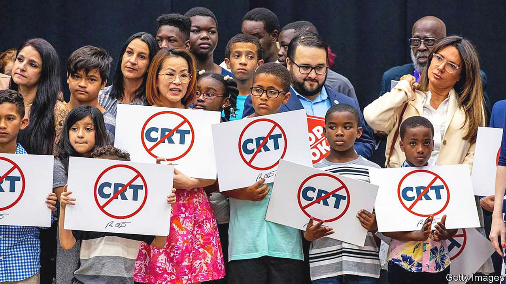

###### Florida’s woke wars

# Ron DeSantis wants to limit free speech in the name of free speech 

##### The Sunshine State’s public colleges are getting a dose of illiberal right-wing politics 

 

> Jan 26th 2023 

Students throwing frisbees on a lawn framed by charming historic buildings. Raucous parties filled with young people and debauchery. Students sitting in a circle debating controversial topics with a professor as their guide. For many these are the quintessential images of college life. Yet in Florida, one of these things may soon be illegal (and it’s not the frat parties).

Florida’s public colleges and universities have become the object of much . The most disruptive is probably House Bill 7, more snappily known as the Individual Freedom Act, or the Stop Wrongs To Our Kids and Employees (Stop WOKE) Act. Signed by the governor, , last April, the law prevents training in or discussion of eight topics related to race and sex in particular. Specifically it prohibits the idea that “a person…bears personal responsibility for and must feel guilt, anguish, or other forms of psychological distress because of actions …committed in the past by other members of the same race, colour, national origin, or sex,” and that “such virtues as merit, excellence, hard work, fairness, neutrality, objectivity, and racial colour-blindness are racist or sexist,” among other things.

Several organisations, including the American Civil Liberties Union and the Foundation for Individual Rights and Expression (FIRE), a pro-speech outfit, filed lawsuits challenging the law for violating the first and fourteenth amendments. The lawsuits have been successful. The provision pertaining to universities was blocked by a federal judge in November, but could still become law. The state has appealed the decision to the 11th circuit court of appeals. Mr DeSantis and his friends in the state legislature wanted the law to apply to companies too, though the courts blocked that in August. The law is still in effect for primary and secondary schools.

Despite being weakened, the Stop WOKE Act has had an effect on campuses. Twenty-eight presidents of public colleges signed a letter on January 18th promising to defend “Florida values”. “Our institutions will not fund or support any institutional practice, policy, or academic requirement that compels belief in  or related concepts such as intersectionality, or the idea that systems of oppression should be the primary lens through which teaching and learning are analysed and/or improved upon,” the letter says.

Usually when people want to prevent an idea they dislike, they limit who can speak on campus, says Adam Steinbaugh, a lawyer at FIRE. (Liberals have been accused of using this practice against their conservative enemies recently.) But the Stop Woke Act is different. “Florida is skipping the pretext,” Mr Steinbaugh says. “They’re skipping the middleman and just limiting ideas themselves.”

The law has created a culture of fear on campus, says a faculty member at the University of Florida, who wishes to remain anonymous. His university inbox is filled with emails about the act. Academics worry about accidentally breaking the law and being reported, he says. The University of South Florida, a different public university in Florida, has a website for students to report discrimination which specifically asks for “violations of House Bill 7.” The consequences could be steep for public universities, which stand to lose millions of dollars in state funding.

This fear makes standard interactions difficult, the faculty member explains. One day in class, one of his students appeared withdrawn and was not participating in the group discussion. Instead of assuming that the student was simply having a bad day, he assumed the worst. “I was like oh my God, is this kid recording me? Is this kid a spy?” The faculty member says he is now seeking employment in another state, and he does not appear to be alone. A survey by the  shows that 63% of faculty say they will leave if they receive a comparable offer.

Perhaps this is the goal—to have lefty professors resign and decamp to California. But Mr Steinbaugh warns Florida’s Republicans against overreaching. “The natural impulse of people is to try to censor their opponents,” he explains. “But if you empower people…to limit speech, then that is a cudgel that your ideological opponents are going to wield against you.”■


