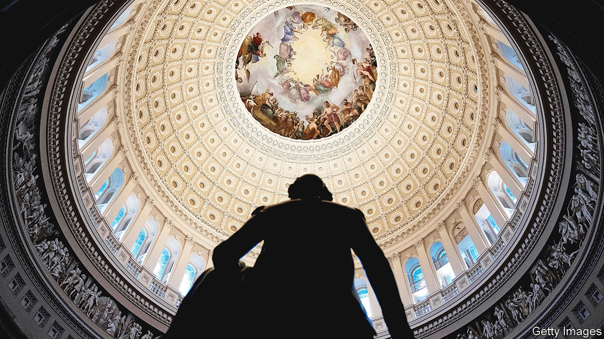

###### Trillion-dollar chicken

# There is no easy escape from America’s debt-ceiling mess 

##### Defaulting is unthinkable, but the “workarounds” to avoid default bring their own dangers 

 

> Jan 23rd 2023 

MOST GAMES of chicken do not have trillion-dollar stakes. America, when  face off with a  over the debt ceiling, is exceptional. This legal limit on the amount of debt issued by the Treasury is periodically raised—but never by enough to avoid a repeated standoff. Without a bipartisan political deal to raise the ceiling America would be in dangerous territory, bumbling into pointless default.

On January 19th Janet Yellen, the treasury secretary, announced that the country had hit its maximum debt (of $31.381trn) and that she had begun taking “extraordinary measures”—accounting tricks such as deferring pension investments to conserve cash. These measures, which have become routine, buy several months before the calamity actually arrives, called the “X-date”. The last close call, in 2011 when Barack Obama was president and Joe Biden was vice-president, was resolved with only days to spare, spooking stockmarkets and leading one rating agency to downgrade the federal government’s credit. The impasse of 2023 may well be just as dramatic.

Republicans, who have newly taken control of the House of Representatives, say that they cannot abide runaway spending and must rein it in. This deep concern is episodic. When Donald Trump was president, the debt ceiling was increased three times with Republican support, and the national debt rose by $8trn over his term ($3.2trn of which came before covid-induced spending began in 2020). Those increases were not particularly contentious, and the White House wishes the same for this one. “Raising the debt ceiling is not a negotiation; it is an obligation of this country and its leaders to avoid economic chaos,” Mr Biden’s press secretary said in a statement released on January 20th.

But it may not be so simple. Republicans are unlikely to let their leverage over Mr Biden lapse. Kevin McCarthy squeaked into his position as speaker of the House by promising many concessions to hardliners, including pledging  over the debt ceiling. Mr McCarthy has vowed to secure spending cuts in exchange for raising the debt limit, and pledged to put the country on the path to a balanced budget in a decade. As part of his bargain to attain power, the speaker also had to allow a parliamentary manoeuvre that would make his own removal easier. Mr McCarthy may not be able to keep his promises, in which case his own party could end his speakership in its first year.

This is forcing financiers, lawyers and officials to focus on the unthinkable. The starting point of such contingency planning is that a sovereign default would be cataclysmic: stocks would plunge, borrowing costs would soar, growth would suffer and the dollar’s status as the world’s dominant currency would be shaken. Any way to avoid this series of disasters merits attention. The problem, unfortunately, is that each proposed workaround has severe—possibly unworkable—drawbacks.

Start with magical thinking. By law the Treasury is allowed to mint platinum coins for commemorative purposes in any denomination. One, possibly satirical, suggestion is to mint a $1trn platinum coin and deposit it at the Federal Reserve. The Fed would then credit the Treasury’s account, thereby allowing it to go about its business unconstrained by the debt ceiling—and Americans would live happily ever after. The #MintTheCoin movement, as it is known on social media, has gathered support from some lawmakers on the left of the Democratic Party. Most serious thinkers, including Ms Yellen, have dismissed it as a gimmick. That is because the economic implications would be disturbing. It would amount to the monetisation of debt: the Fed would be directly funding the government. And what would stop future administrations from minting yet more coins to pay for their pet initiatives, whether cash handouts or tax cuts? It would be a recipe for fiscal recklessness and, ultimately, untethered inflation.

A second suggestion, which seems almost equally crazy, would be for the Treasury to issue ultra-high-interest bonds. Because only the face value of bonds counts toward the debt limit, the Treasury could, in theory, sell $1bn-worth of one-year bonds with an interest rate of 105% for twice their face value (since the prevailing market rate is closer to 5%). That would allow the Treasury to raise $2bn of funding but add only $1bn to the national debt. Although clever, such chicanery would suggest that the political underpinnings of the American economy are wobbly, an unsettling prospect for markets.

A final proposed workaround is more legalistic. Some argue that a usually ignored provision of the 14th Amendment to the constitution provides a solution to the debt impasse. In one section it states that the validity of American public debt “shall not be questioned”. That sounds simple enough: Treasury can just issue bonds in defiance of the debt ceiling. But opponents would challenge that interpretation, setting up a case that would almost certainly wend its way to the Supreme Court. The sword of Damocles would still be there, but wielded by the nine justices. An adverse ruling would mean that all the bonds issued in defiance of the debt ceiling could be deemed invalid, suddenly cutting off the Treasury from borrowing and setting it up for a giant battle with investors holding now-worthless paper.

The mere possibility of such a ruling would probably spook investors. The same can be said for the platinum coin and high-interest bonds: doubts about their legality would render them even less effective as workarounds. “None of these ideas is going to evoke enough confidence for markets to stay calm,” says Maya MacGuineas of the Committee for a Responsible Federal Budget, a think-tank. “If any of those were actually viable, we would have pulled the chute on any one of them in 2011,” says Rohit Kumar of PwC, an accounting firm, who served as a Republican Senate aide during the debt-ceiling debacle a decade ago.

Some argue, optimistically, that the government could break through the debt ceiling in an orderly fashion. The Treasury could give priority to critical payments, to bondholders and to essential programmes like Medicare, and thus stave off sovereign default. But solvency is not like quantum mechanics: you can’t be in two states of the world at once. Foreign investors would still have to confront the reality that America was no longer meeting obligations to its citizens. Markets would have to confront the economic damage: tax revenues cover only about four-fifths of government spending. Abruptly halting the other fifth would be akin to ripping out 5% of GDP overnight, putting America on course for a crushing recession.

That suggests that the only way through is a bruising political negotiation. There is no way to improve America’s fiscal trajectory without restructuring its entitlement programmes, which some Republicans are keen on and Democrats will never accept. The result may be that the kind of self-imposed austerity that plagued the Obama years makes a comeback. At the moment, neither side has any incentive to back down. Impending market cataclysm might be the only motivating factor, though it will not arrive for several months. Trillion-dollar chicken has a while yet to go.■


