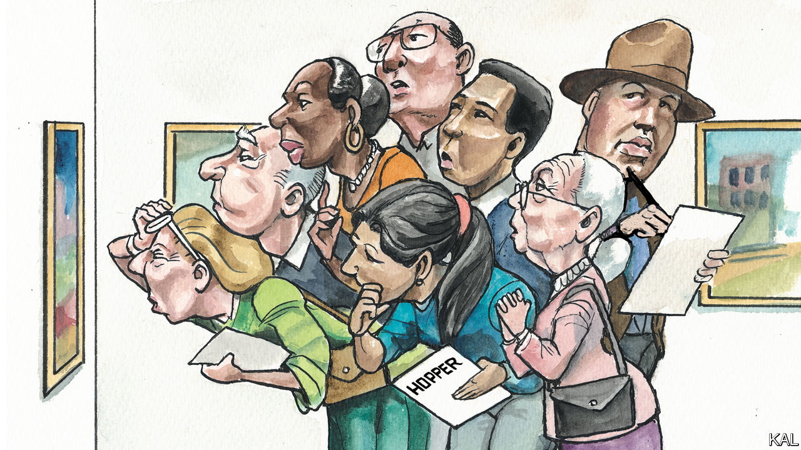

###### Lexington

# What Edward Hopper saw 

##### An exhibition of his paintings in New York reveals timeless insight into the city and its people 

 

> Jan 26th 2023 

Edward Hopper must have been desperate to turn for help to Robert Moses, of all people. It was 1947 and Mr Hopper, his reputation as one of  by then secure, was facing eviction with his wife, Josephine, from their apartment on Washington Square, in New York’s Greenwich Village.

Moses, , had been trying for years to ram a wide road through the square, yet Hopper hoped to enlist him in a campaign to block New York University from pursuing its own development goals by buying his building and others.

No public official could get involved “even if he agreed with your point of view,” Moses replied, adding, in case he had been too oblique: “Personally, I don’t agree with it at all.”

This exchange of letters, alongside others Hopper wrote resisting development of Washington Square, comes as a shock to the visitor wandering through “Edward Hopper’s New York” at the Whitney Museum of American Art, in Manhattan’s Meatpacking District. To encounter the author’s plain-spoken voice in strenuous argument is to appreciate anew its subtlety, if not its absence, in the paintings themselves. Hopper’s artistic perspective is always clear, if uncanny, but his intellectual point of view is enigmatic. What does he believe, what messages is he trying to send?

There is so much missing from the scores of sketches, etchings and paintings in this exhibition, which covers the six decades, from 1908 to 1967, that Hopper made the city his home. Where are the convulsions of history—the two world wars, the Great Depression, the labour strikes, the civil rights movement, the ticker-tape parades? Where, for that matter, is the Empire State Building or the Brooklyn Bridge, or any of the city’s celebrated landmarks? Where are all the people? 

Hopper gives us instead, in “The City” (1927), a view of his beloved Washington Square that includes his block of town houses but also imagined buildings of various styles. Is he bemoaning any change, or is he celebrating the ad hoc, vibrant version of it so ? In “Early Sunday Morning” (1930), he presents a deserted streetscape of two-story buildings, low yellow light drawing long shadows from a fireplug and a candy-striped barber pole. Does that grey rectangle looming in the upper-right corner signal disapproval of the skyscrapers rising in Manhattan? 

Again and again, he shows us solitude: A woman sits alone in “The Automat” (1927), framed by lights reflected in the window behind her as she stares at the coffee cup she holds; an usher in “New York Movie” (1939) ignores the film as, haloed by a sconce, she cradles her chin in one hand and silently contemplates a story of her own; a man in shirtsleeves sits at his sunlit desk in “Office in a Small City” (1953), gazing at a water tower and chimneys across the way. What are they thinking? Are they lonely and alienated, as many viewers infer? Or is their experience more grand and romantic? Are they imagining, reflecting, envisioning a future? 

Hopper was a taciturn man. He was known to sit silently in Washington Square Park as he thought through a painting. “Sometimes talking with Eddie is just like dropping a stone in a well,” Josephine said, “except it doesn’t thump when it hits bottom.” Hopper resisted explaining his work, insisting “the whole answer is there on the canvas”. He would ride the elevated subways—today mostly submerged—prizing his glimpses down at sidewalk life and through backlit windows into the city’s infinite intimate tales.

“The inner life of a human being is a vast and varied realm”, Hopper wrote in “Reality: A Journal of Artists’ Opinions,” which he helped found in 1953 to protest against the growing dominance of Abstract Expressionism. In a joint statement, Hopper and his confederates objected to the art world’s mania for “the excitation of texture and colour” and the “ritual jargon” that went with it, which were creating “an atmosphere of irresponsibility, snobbery and ignorance.” Texture and colour, along with other elements of painting, were rightly understood as “only the means to a larger end, which is the depiction of man and his world”. 

Hopper’s own ambition, he wrote in his private journal, was to create “a realistic art from which fantasy can grow”. That he achieved his goal may account for the crowds packing the exhibition and turning its sold-out catalogue into “one of the hottest gifts in town”, in the words of the . 

The billion-footed beast

Like many institutions,  to address the politics of the moment, mounting exhibitions that declare where society went wrong and how it might yet get things right. What the visitor to the Whitney senses instead is something quieter, something timeless and universal by way of being as ephemeral and particular as a shaft of sunlight on a woman’s face: Hopper’s respect for the uniqueness of his subjects and of his audience, for the vast and varied realm within each. Jostled by the crowd as they stand before Hopper’s works, viewers are free to puzzle out for themselves whether they are grasping his meaning about place and person, or arriving at their own. 

Would Hopper be happy to know that, though NYU did take over his building, it preserved his top-floor studio? He would no doubt be relieved that Jane Jacobs, the urban theorist and activist, stymied Moses in bulldozing an expressway through Greenwich Village. (He might be less pleased that zoning has made the Village an ossified idea of urban life struggling artists cannot afford.) 

One wonders what he would make of the glass-and-steel tower that is the Whitney itself, amid the extravagant jumble of the Meatpacking District. The area has changed so much this century. Yet that is thanks to the High Line, the park developed from an old elevated train track, terminating at the Whitney. It helps millions of people each year see life as Hopper did, at an odd angle and on a human scale, identifying their own New York as they enact their unique dramas within the . ■


