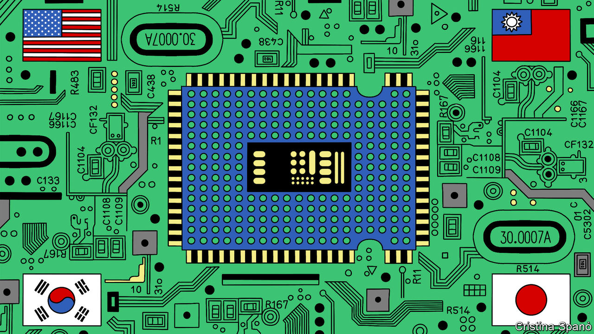
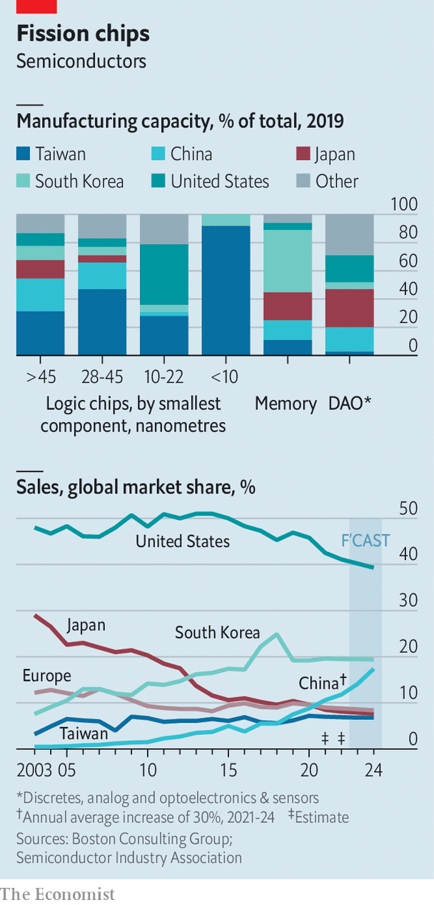

###### Chip networks, chip wars

# America’s hoped-for Asian semiconductor pact looks tricky 

##### Democratic or not, Asia’s chipmakers are in competition with each other 

 

> Feb 2nd 2023 

Cranes tower over a bustling construction site on the edge of Kumamoto, a midsized city on Japan’s southern island of Kyushu. Motivational banners hang from its scaffolding: “Always smile”. White fences line the perimeter, dividing the rising steel structures from nearby cabbage and carrot fields. There is little to suggest that this is one of Asia’s most geopolitically significant building sites. 

Yet there are clues to the project’s importance. “jasm”, the name of a Japanese subsidiary of , is written on a wall of the construction site. Down the road stand nondescript complexes belonging to Sony and Tokyo Electron, two big Japanese semiconductor firms. In a couple of years, the new plant will begin , primarily for use in cars. Japanese officials hope it will help jump-start the country’s once-mighty, now flagging chip industry. Kabashima Ikuo, Kumamoto’s governor, speaks of reviving Kyushu’s reputation as a “Silicon Island”.

tsmc’s arrival in Kumamoto is one sign of broader shifts in the semiconductor business across Asia. Concern about Chinese aggression towards Taiwan, home of most of the world’s advanced chip production, is reshaping supply chains. America is reinforcing that development by limiting China’s access to advanced chips and enticing chip firms to set up shop on its shores. President Joe Biden’s administration has called for a “Chip 4 alliance” of America, Japan, South Korea and Taiwan to co-ordinate chip policy. Yet America’s allies in Asia are all pursuing their own self-interested chip strategies, which are just as often in tension with each other as they are symbiotic. “There are two sides of the coin: chip networks and chip wars,” says Kuroda Tadahiro of the University of Tokyo. 

 


The semiconductor industry is no stranger to geopolitical wrestling. By the 1980s Japan accounted for more than 50% of global semiconductor production. Wary of Japanese power, America rammed through a chip trade deal to the detriment of the Japanese industry. Competitors in South Korea and Taiwan rose, often with lots of support from their governments. Countries developed distinct chipmaking strengths (see chart). These days, America specialises in design while Taiwan dominates production of the highest-end logic chips. South Korea focuses on memory chips. Japan has niches in optical sensors and the materials and kit needed to make semiconductors. China, which has poured money into its own chipmaking industry, has made most progress in lower-end logic chips. 

America’s Asian allies, in particular Japan and Taiwan, also worry about China getting technology that could give it a military edge. “China has become too strong, Western countries must collaborate and co-operate in technology,” says Seki Yoshihiro, who heads a chip strategy group inside Japan’s ruling Liberal Democratic Party. After much cajoling, Japan (and the Netherlands) reportedly signed on to America’s export controls against China last week. Yet national interests are trickier to align in economics than in hard security. “It’s really difficult in economics to get a united front in areas like this,” says Robert Ward of the Geo-economics and Strategy programme at iiss, a British think-tank. 

America has offered big subsidies to its domestic chip industry: the chips and Science Act passed late last year includes 25% tax credits for new semiconductor investments as well as some $50bn in additional public investment. Asian chip giants are joining the state-aid bandwagon too. “It’s all the rage”, quips Vinod Aggarwal of the University of California, Berkeley.

South Korea has passed support measures for its industry, in what is known colloquially as the “K-Chips Act”. The amounts on offer are piddling so far: an 8% tax credit for large firms’ investments in domestic facilities. But pressure to keep up with the Joneses is rising. Samsung and sk Hynix, the two biggest South Korean chip firms, are investing big in America. While that could make Korean firms more competitive, it could result in a “hollowing-out” of the South Korean semiconductor industry, says Lee Seung-joo of Chung-Ang University in Seoul. Perhaps with that in mind, Yoon Suk-yeol, the country’s president, would like to hike the tax credit for big firms’ investments to 15%, plus another 10% for extra investments made in 2023.

Similar dynamics are in play in Taiwan. An amended innovation law passed in January and nicknamed “Taiwan’s chips act” offers domestic chip companies 25% of their research and development costs in tax credits. In tsmc, Taiwan holds the chipmaking prize everyone else aspires to attract or duplicate with subsidies. In addition to its Japanese fabrication plant, tsmc plans to build two plants in America. Though its foreign investments do not involve its most advanced technology, they are causing consternation at home. Many in Taiwan fear tsmc’s sorties could reduce America’s incentive to defend Taiwan from China. The firm is keen to assuage the anxiety. At a plush ceremony in December to mark the start of its mass production of advanced chips, tsmc‘s chairman noted that the firm had invested $60.7bn in a fab in southern Taiwan, about 50% more than it had in America. 

Japan has also loosened its purse-strings. A supplementary budget package passed in late December features 1.3trn yen ($10bn) for chips, including funding for nearly half the cost of tsmc’s plant in Kumamoto. tsmc is considering building a second plant in Japan; Tim Cook, the ceo of Apple, tsmc’s biggest customer, paid a visit to Kumamoto late last year. The Japanese government has also provided 70bn yen in seed capital to Rapidus, a new joint venture between leading Japanese electronics companies that will collaborate with foreign giants such as America’s ibm and Belgium’s imec in the hopes of developing a base for r&amp;d and production of leading-edge chips in Japan. 

The vision of a “democratic semiconductor supply chain” is not implausible. But creating chip networks rather than fuelling chip wars will require careful co-ordination within individual governments, between allied governments and across public and private sectors. Taiwanese and South Korean chipmakers are locked in a fierce contest to produce next-generation chips. Differences over history poison relations between Japan and South Korea—and have spilled over into the chip trade in the past. None of the countries’ bureaucrats are well-equipped to handle the complexity of semiconductor supply chains. The Chip 4 alliance itself reflects “limited thinking on this”, argues Martijn Rasser, a former senior American official: “How can you have a real conversation about semiconductor supply chains without the Netherlands and probably Belgium?”

America’s unilateral attacks on China have made it harder to foster a spirit of co-operation. The Biden administration’s announcement of controls on chip exports to China last October caught many in Asia off-guard. “Oh, so you’re doing this alone?” a senior Japanese official recalls thinking after he heard the news. Ahn Cheol-soo, a South Korean tech entrepreneur-cum-politician, likens America’s approach to Marlon Brando’s mafioso “offer you can’t refuse” in “The Godfather”. South Korea has yet to join the ban.

In part, Asian chipmakers worry about losing market share in China. Japanese semiconductor firms generate 20-30% of their business there, and stand to lose about 70% of it as a result of America’s curbs, reckons Minamikawa Akira of Omdia, a research firm. Tokyo Electron cut its annual operating income forecast by nearly 25% following the new American restrictions. Both Samsung and sk Hynix have significant manufacturing and r&amp;d facilities in China; between January and September of last year, about 40% of Korean chip exports went to China. There are also many ways China could make life difficult. Japan recalls a painful Chinese ban on exports of rare-earth metals occasioned by a row over the disputed Senkaku/Diaoyu islands in the early 2010s. China has explicitly warned South Korea not to join America’s Chip 4 group.

When the chips are down

Other risks abound. Parallel industrial policies could produce a supply glut. Of executives surveyed by kpmg, a consultancy, 65% thought the supply shortage that hit some chips recently would ease in 2023. A profit warning from Intel, which once led the industry and on January 26th forecast one of its worst ever quarters, has intensified concerns about excess production.

A focus on fabrication ignores the tail ends of the supply chain, such as raw materials, packaging and testing, where South-East Asia and China play key roles. Many also fret that America’s curbs on China’s ambitions for high-end chips will only mean China focusing its resources on legacy chips. Its successes in flooding the market to corner the production of solar panels and rare earths are troubling precedents.

Even if governments prove willing to subsidise the inefficient construction of duplicate supply chains, they may not find enough engineers to work them, especially in demographically-challenged East Asia. South Korea’s semiconductor industry is predicted to be short of at least 30,000 workers in the next decade. C.C. Wei, the ceo of tsmc, has said a shortage of capable engineers is the company’s main bottleneck: engineers with basic capability need 8 years of training to work in one of tsmc’s fabs. Some 300 Taiwanese engineers will move to Kumamoto to run the new plant there. Japan is meanwhile scrambling to train talent of its own. Building the next phase of the industry, says Mr Kuroda, will require more than just money and Moore’s law: “We need more people.” ■

