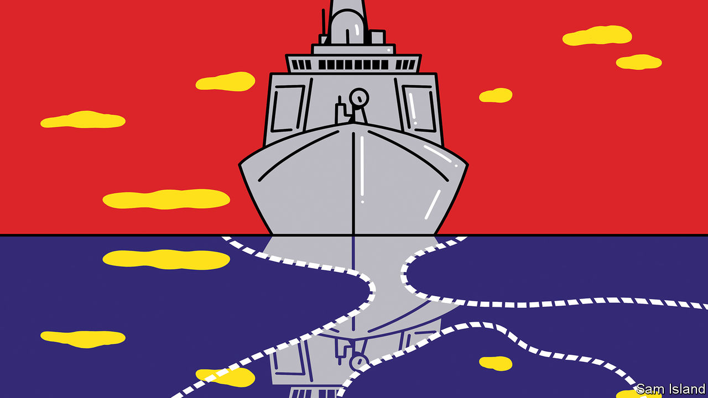

###### Banyan

# China’s put-upon maritime neighbours are pushing back 

##### China can no longer count on getting its way in the South China Sea 

 

> Feb 1st 2023 

THE SOUTH CHINA SEA is a third larger than the Mediterranean and has valuable fish stocks and untapped oil and gas reserves. Connecting East Asia’s economic miracle with much of the rest of the world, its waters play an outsize role in global maritime trade and security. Yet there is a problem. All seven nations that border the sea maintain overlapping rights to it. And one of them, China, claims nearly the entire maritime expanse—and  like a municipal swimming-bath bully.

With massive terraforming, China has turned remote reefs into airstrips and bases. It uses its navy and coastguard, as well as “maritime militias” of armed fishing fleets, to intimidate its South-East Asian neighbours. It forcibly curtails their fishing and exploration for hydrocarbons. It is obstructing the Philippines’ efforts to resupply a remote island outpost. Yet for the first time in a decade, China is no longer making all the running in and around the sea. South-East Asians are at last refusing to yield to its provocations. This might—just—represent a turning-point in their struggle against the regional thug.

Much of the discord concerns maps. China’s infamous “” is a tongue of cartographic aggression sticking out over 700 nautical miles from the Chinese coast. Its alleged basis is as vague as it is unfounded in international law. In 2016 a tribunal at The Hague—in a case brought by the Philippines—struck down most of China’s claims, ruling them inconsistent with the un Convention of the Law of the Sea (unclos).

Since then other countries with rival claims in the South China Sea, including Indonesia, Malaysia, the Philippines, Vietnam and tiny Brunei, have insisted that international law must form the basis of any settlement of their disputes. In legal discussions with China, a senior South-East Asian diplomat notes, its maritime neighbours are taking enormous care not even to acknowledge its bogus nine-dash line claims. Partly as a result, China is seeing its various proposals to individual countries—for a bilateral fisheries agreement, say, or a deal on jointly exploring for hydrocarbons—turned down. Similarly, China is failing, after years of negotiations bedevilled by the outrageousness of its demands, to cajole the ten-country Association of South-East Asian Nations (asean) into signing off on a tension-reducing code of conduct in the sea. China wants, in effect, a right to veto whatever naval exercises or oil and gas projects asean members might wish to conduct with outside powers. But they are having none of that. And it is hardly good optics for China that the negotiations continue to breeze past whatever deadline it calls for. 

Ever more obviously, South-East Asians are mastering and applying international law to push back against China. Malaysia’s submission to the un in 2019 for an extended continental shelf implied yet another rebuke of China’s nine-dash line. Even more significant is a recent agreement between Indonesia and Vietnam to demarcate their exclusive economic zones. Huong Le Thu of the Perth USAsia Centre, an Australian think-tank, considers it an important model for South-East Asian countries to resolve claims among themselves.

Hard-nosed types will reply that what matters is what takes place on the water. There China’s naval, coastguard and especially “grey zone” activities, whereby Chinese vessels swarm reefs and obstruct fishermen, have not let up. Yet some pushback to them, too, is apparent. Vietnam is reinforcing its outposts on the Spratly Islands.  between the Philippines and the United States are rapidly thickening. Last year the two countries launched a “maritime dialogue” on grey-zone threats in the sea. Senior Biden administration officials have since flowed to Manila. The defence secretary, Lloyd Austin, visited this week to secure expanded access to Philippine bases. It was reported on February 2nd that an agreement had been struck granting America four new sites, in addition to the five it is already using. 

None of the South-East Asian states wants to provoke China openly—that is not the asean way. But an increasingly steadfast spirit of resistance is a growing feature of their response, in various spheres, to Chinese assertiveness. Even as China becomes less welcome in the , it may be too much to think of it being pushed back in the South China Sea. But after a decade of China swanning about it unchecked, the maritime region’s emerging stalemate is welcome.■


