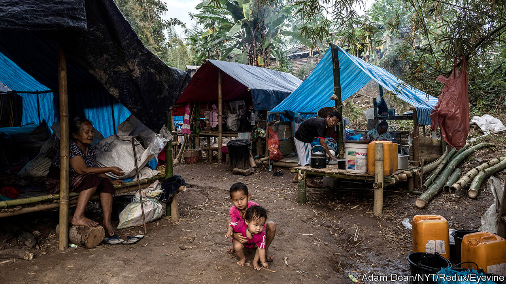
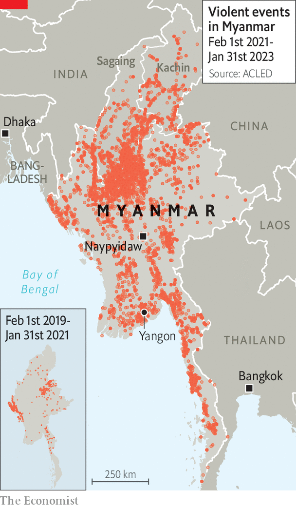

###### Asia’s multi-headed conflict

# Myanmar’s civil war has moved to its heartlands 

##### Two years after an army coup, a country that was once a democratic hope is falling apart 

 

> Jan 31st 2023 

For a glimpse of the labyrinthine conflict in , head to the gemstone markets along the country’s border with Thailand and try on a ring encrusted with the finest imperial jade. If you meet the merchant’s asking price of 300,000 baht ($9,200), your purchase will bolster at least three different sides in Myanmar’s complicated and spreading civil war. You will help , which controls the jade mines in the Himalayan foothills of Kachin state, worth tens of billions of dollars a year. And you will help an ethnic militia or two, representing minority groups that for years have fought for autonomy or independence in their homelands around Myanmar’s periphery. They collect a tax on goods that are trafficked across their turf.

You will also be contributing, via the shopkeeper, to a more recent military enterprise: the People’s Defence Force (pdf), a network of militias that has sprung up among the country’s Bamar majority to oppose its junta. Thein Han is a Bamar refugee from Sagaing province in Myanmar’s heartland. Two years ago, after General Min Aung Hlaing seized power in a violent coup and threw Aung San Suu Kyi and her recently re-elected government in jail, Mr Thein Han took to the streets in protest. He fled across the border after soldiers sought to arrest him one night; instead they nabbed his sister, who remains locked up. Mr Thein Han (not his real name) wants his future back. So each month he sends his savings to a chapter of the.df. 

The new pdf militias represent a grim development in Myanmar’s long-running conflict, which in the past two years is estimated to have claimed 30,000 lives and driven 2m people from their homes. The country had previously witnessed small-scale and decades-long ethnic conflicts. Separatists from the Karen minority have been up in arms since shortly after Myanmar (then called Burma) gained independence in 1948. Such micro-wars typically took the form of skirmishes in the dry season punctuated by regular ceasefires. Yet the coup that was launched by General Min Aung Hlaing in February 2021—the latest of many military takeovers in Myanmar—has profoundly altered the nature of the country’s violence.

It sparked peaceful street protests, which the junta brutally crushed. Around 140 protesters are estimated to have been killed by the security forces on a single day in March 2021. Instead of quelling the protests, this ruthlessness has radicalised many young Burmese men and women, says Michael Vatikiotis of the Centre for Humanitarian Dialogue, a conflict-mediation group. The resultant armed Burmese resistance, exemplified by the pdf groups, represents a decisive break within the majority group from the non-violence preached by Ms Suu Kyi. The resistance groups have also broken new ground by making common cause with several of the ethnic minority militias, which are providing them with shelter, training and arms in their jungle hideaways. As a result, Myanmar’s conflict has for the first time moved from the country’s periphery deep into the Bamar heartland, including especially the pdf stronghold of Sagaing state. 

 


This new resistance lacks a charismatic leader. The National Unity Government (nug), a shadow administration largely in exile, operates collectively and includes representatives of the country’s main ethnic groups. The especially-persecuted Rohingyas, a Muslim people in a majority-Buddhist country, are among them. Yet the pdf groups are mostly not taking orders from the shadow government. There is a generational split between the political and armed groups. The shadow government represents an old guard, including staunch followers of Ms Suu Kyi who still cling to the principle of non-violent resistance. The pdfs are led by Young Turks who grew up watching democracy flower only to see it mown down. These young radicals sometimes refer to their more patient elders as Generation —which means “penis” in Burmese.

pdf volunteers are poorly armed but becoming more adept at hit-and-run guerrilla warfare. By watching tutorials on YouTube, one volunteer said he learned how to drop bombs from a piece of pvc pipe attached to a cheap drone. He claimed it took him six months to be able to bomb junta convoys and use his drone’s noise to divert the army’s attention from his comrades’ imminent attacks. The pdfs’ drone warfare has grown so effective that the armed forces are increasingly resorting to air strikes on towns and villages suspected of harbouring militants, rather than using infantry. The country’s bigger cities, formerly the scene of protests and street-violence, are calm by comparison. 

The fractured, ill-equipped opposition is not able to seize much territory. Yet the junta struggles to impose its writ across large parts of the country. The coup and its aftermath have shrunk the economy by a fifth. The resources available to General Min Aung Hlaing to wage war and keep the army’s civilian cronies sweet have dwindled as a result. Gas, gemstones, opium and methamphetamines are the junta’s main sources of hard currency. 

Hundreds of thousands of the displaced have fled abroad, including to refugee camps in Bangladesh and Thailand. Myanmar is also exporting disorder, with drugs flooding into its neighbours. Even so, outsiders are wary of wading into the morass. Despite its intense geopolitical rivalry with China, America is reluctant to risk a proxy war by sending weapons to resistance forces on China’s doorstep, says Scot Marciel, a former American ambassador to Myanmar. China, with interests in Myanmar that include imports of rare-earth metals and oil and gas pipelines to the Bay of Bengal, seeks to be on friendly terms with the country’s prickly generals. Yet it is also in touch with the nug and loth to get too drawn into the mess. 

The un says roughly 18m people, or a third of the country’s population, urgently need aid. And with neither side capable of victory, the situation looks certain to get worse. On February 1st the junta formally extended the state of emergency that it imposed after the coup. Its opponents are meanwhile growing increasingly organised and emboldened. A country long known for violence and dysfunction has become a catastrophe. ■

