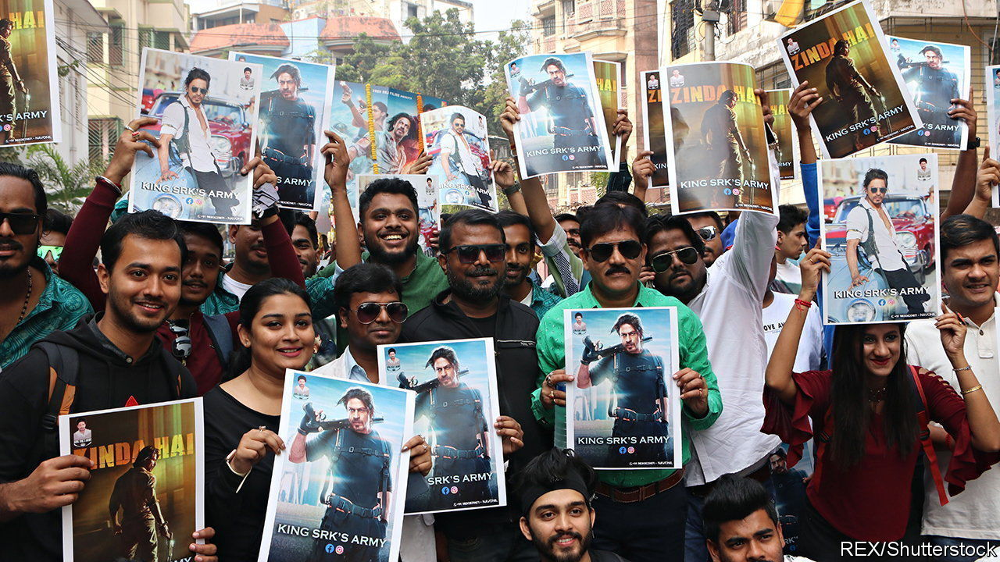

###### Bollywood v BJP

# Shah Rukh Khan faces down India’s Hindu right 

##### Threats of violence fail to deter the Muslim megastar’s fans 

 

> Feb 2nd 2023 

There are two ways to interpret the raucous cheering that erupted in Kochi’s Sridhar cinema at the sight of Deepika Padukone wearing a saffron bikini. One is that the mostly male audience, gathered one evening last week to see the new Bollywood blockbuster “Pathaan”, appreciated the almond-eyed Ms Padukone’s charms. Another is that the hooting and clapping, which the bikini scene has elicited in , was an explicit rebuke to the joyless bullies of , who had objected to thus cladding Ms Padukone in their religion’s sacred colour. These explanations, it must be said, are not mutually exclusive.

The scene in question comes early in “Pathaan”, a spy thriller so over-the-top it makes Hollywood’s “Mission: Impossible” series seem like gritty realism. For weeks “Pathaan” and its lead man, Shah Rukh Khan, had received extremist threats because of it. Members of the Bajrang Dal, the youth wing of a family of Hindu-nationalist groups that includes the ruling Bharatiya Janata Party (bjp), claimed to believe that by wearing saffron while gyrating to a song titled “Besharam Rang” (“shameless colours”) Ms Padukone had insulted their religion. Cinemas and members of the public were threatened with violence if they dared screen or watch the film. Senior bjp leaders in at least two states threatened to prevent its release.

The Hindu right often agitates against high-profile Bollywood releases. Its activists loathe the Mumbai film industry’s liberal culture and the fact that its biggest stars are Muslim men. Last August the Hindu brigade went after “Laal Singh Chaddha”, a big-budget remake of “Forrest Gump”, on the basis that its (Muslim) lead actor, Aamir Khan, had once complained about growing intolerance in India. The film flopped, presumably because it was long and tedious, but the Hindu zealots claimed a scalp. 

Both Shah Rukh Khan and Ms Padukone are favourite targets of Hindu nationalists—he on account of being Muslim and preaching the need for interfaith tolerance, she for having supported some student protesters in 2020 that the Hindu right disliked. But they are also favourites of India’s film-loving public. And it thronged to cinemas over the long Republic Day weekend, January 26th-29th, helping “Pathaan” to smash box-office records by taking in over 6.25bn rupees ($76m) in its first week.

Perhaps recognising that the confected row was making his party look silly, Narendra Modi, the prime minister, had by that point asked bjp leaders to stop making “unnecessary comments [about films] that would overshadow the hard work we do”. The bjp’s hate-filled ideology may have a lock on the ballot box; but at the box office, “King Khan”’s message of love and fraternity still reigns. ■

