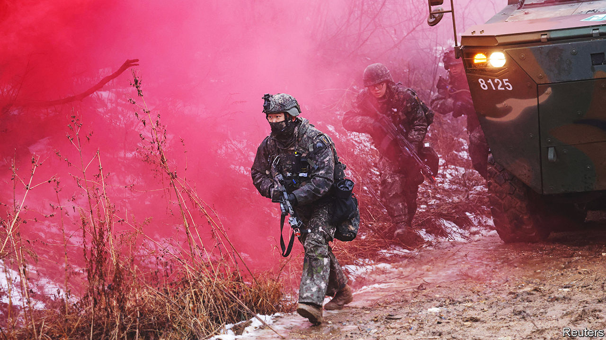

###### Defending Ukraine

# South Korea still refuses to send arms to Ukraine 

##### The country’s president has global ambitions and parochial opponents 

 

> Feb 2nd 2023 

When Yoon Suk-yeol talked up the need for South Korea and nato to protect “universal values” at the alliance’s meeting in June 2022, he might not have imagined how soon his words would come back to bite him. But so they have. On a visit to Seoul on January 30th Jens Stoltenberg pushed South Korea’s president to help meet  It was time, according to nato’s secretary general, for  to “step up”.

Since the invasion of Ukraine last February, South Korea has supplied it with non-lethal aid including gas masks and medical supplies. And under Mr Yoon, who took office last May, it has robustly condemned Russia’s aggression. In a recent interview Mr Yoon called it “unlawful and illegitimate”. He also suggested allowing the war to grind on might embolden his country’s vicious neighbour, North Korea, into thinking “the international community would fail to respond to an act of invasion with the appropriate sanctions”. Such statements are consistent with Mr Yoon’s stated ambition, as Mr Stoltenberg might have reminded him, to make his country a more assertive global leader and defender of the rules-based order. Yet, despite having one of the world’s biggest and fastest-growing defence industries, South Korea still refuses to send Ukraine arms.

The country’s law and political sentiment are both against it. Under its Foreign Trade Act, South Korea is forbidden to export arms except for “peaceful purpose[s]”. It has not scrupulously adhered to that. It has signed arms deals with the United Arab Emirates and Saudi Arabia, both of which have sent weapons to the civil war in Yemen. Moreover, as Mr Stoltenberg reminded Mr Yoon publicly, plenty of other countries, including Norway, Germany and Sweden, have scrapped such self-imposed restrictions in order to ship arms to Ukraine. Yet even if Mr Yoon wanted to follow their example, he appears unable to do so.

South Korea’s parliament would have to change the law. And it is controlled by an opposition leader, Lee Jae-myung, hostile to Mr Yoon and at best lukewarm towards Ukraine. Mr Lee initially accused its president, Volodymyr Zelensky, of being partly to blame for the war. And though Mr Lee claims to have revised that view, he is in no mood to let Mr Yoon bend the rules or claim a major foreign-policy shift. Mr Lee accuses the president of launching a vendetta against him in the form of two separate corruption probes in which the opposition leader has been implicated.

Such inward-looking politics underline how hard it will be for Mr Yoon to make South Korea the agenda-setting “global pivot state” he has envisaged it as. In a poll last year, only 15% of respondents were in favour of supplying the Ukrainians with arms. And even in the country’s small foreign-policy elite, there is only moderate enthusiasm for doing so. Many fear enraging Russia, which is believed to have important influence with North Korea. Such wariness was evident last November after the Biden administration was reported to be negotiating with South Korea to buy artillery shells in order to send them to Ukraine. Vladimir Putin, Russia’s president, had previously warned South Korea that sending weapons to Ukraine would “destroy our relations”. Mr Yoon’s government quickly insisted that America would be the shells’ end user.

This ambiguous position is straining not only Mr Yoon’s hope of global leadership but also credulity. South Korea’s defence companies, which are known for producing lots of high-quality weapons rapidly at competitive prices, are booming on the back of the global demand for arms that the war has unleashed. The country’s defence exports increased from nearly $7.3bn in 2021 to $17bn in 2022. And a lot of them are going to countries arming Ukraine, ostensibly to allow them to replenish their depleted stocks. A recent deal with Poland, worth a reported 20trn won ($16.4bn), allowed the Poles to replace the howitzers they gave Ukraine last year.

In such circumstances, South Korea’s legalistic distinction between arming Ukraine and its allies looks moot. In reality, says Jang Won-joon of the Korea Institute for Industrial Economics and Trade, a government think-tank, South Korea’s view is that once its arms have been shipped, “it’s none of our business” where they end up.

Mr Yoon’s aim to grow the defence industry at least looks to be on track. He wants to make South Korea, in 2021 the eighth-biggest arms exporter, the fourth-biggest after America, France and Russia. But it is a shame his country’s weak-kneed Ukraine stance is costing it an obvious opportunity to align his mercantile and global leadership ambitions. In its sometimes tortuous effort to occupy a space between America, its essential security partner, and China, its most important economic one, South Korea tries to manage two irreconcilable forces. This is almost the opposite case. In its Ukraine policy, it is failing to capitalise on the conjoined commercial and geopolitical opportunity that the war has handed it. ■

