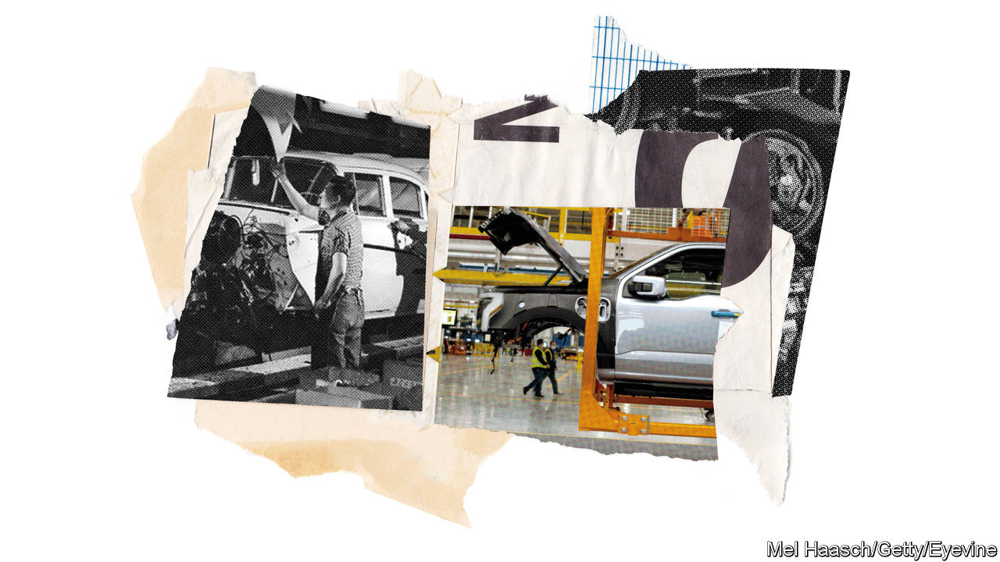
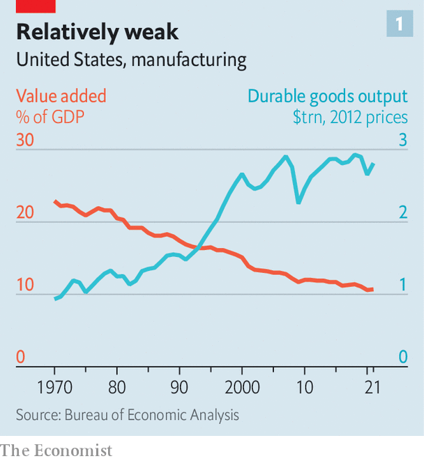
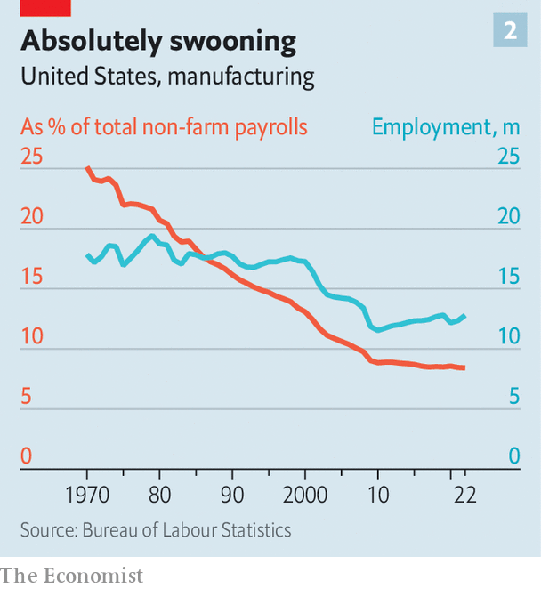
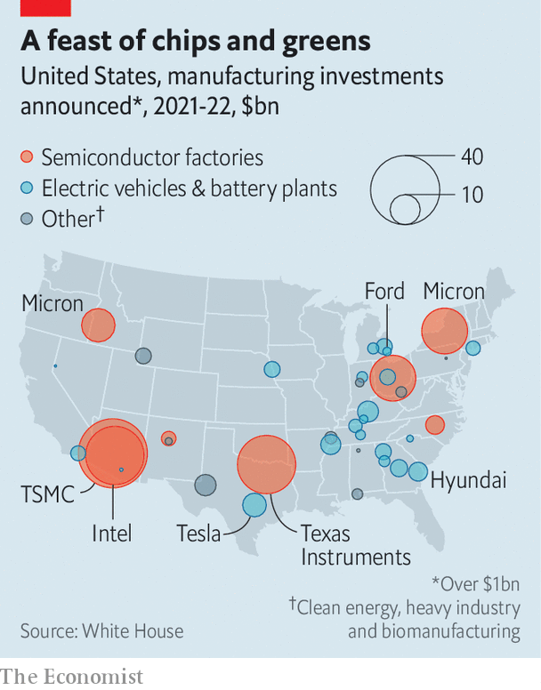
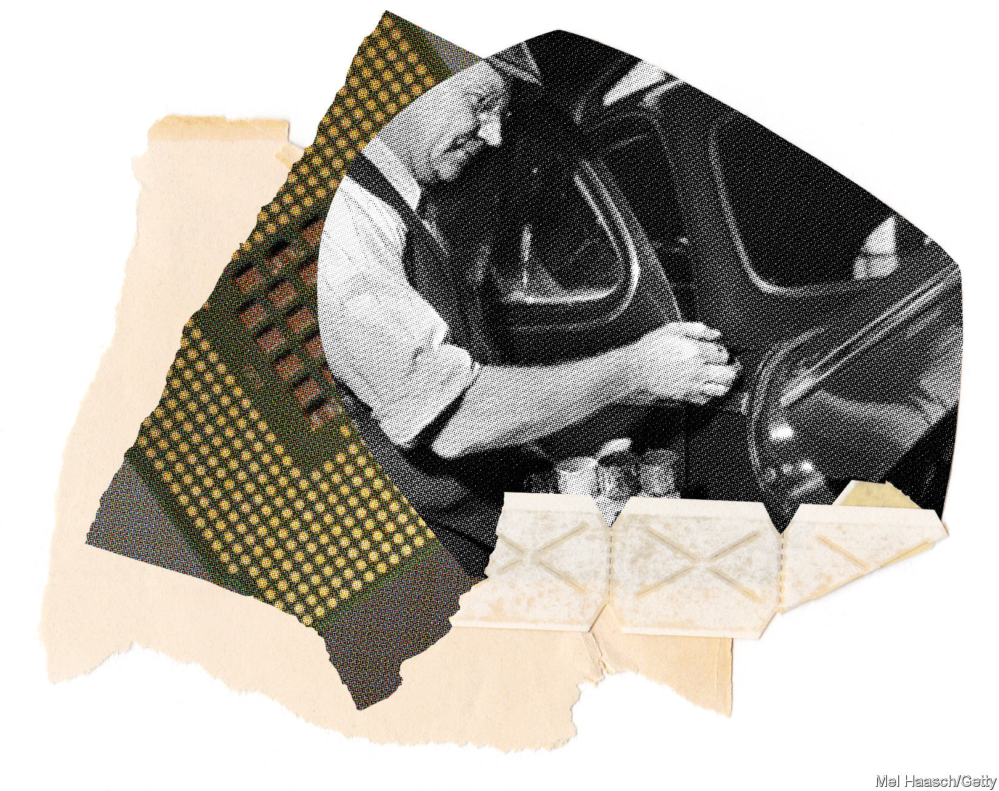

###### Rosy for riveters

# America’s government is spending lavishly to revive manufacturing 

##### Can an industrial renaissance make America stronger, greener and richer? 

 

> Feb 2nd 2023 

At its apogee in the 1930s Ford’s River Rouge complex, just outside Detroit, employed some 100,000 people and produced a car every 49 seconds. Diego Rivera, a Mexican artist, painted a series of murals depicting the heroic workers and futuristic machines, working in harmony to usher in a new era of prosperity.

Almost a century later River Rouge is getting a new lease on life. Construction workers are busily expanding the assembly lines that produce the F-150 Lightning, the electric version of America’s bestselling pickup. There is less clanging than when Rivera visited, and more whirring. Mechanical claws effortlessly whisk vehicle frames from place to place. Self-driving carts glide around the factory floor. Ford is hoping for a surge in sales thanks to lavish new tax credits for people who buy American-made electric vehicles. But it is not just the factory that is enjoying a renaissance: so is the dream that River Rouge once embodied, of an America made prosperous by multitudes of jobs in cutting-edge manufacturing.

Over the past two years, urged on by President Joe Biden, Democrats in Congress have enacted a series of laws to revive manufacturing in America, as part of a $2trn overhaul of the economy. The CHIPS Act, passed in July, includes $39bn to spur domestic production of semiconductors, along with even bigger investments in research and development. The Inflation Reduction Act (IRA), approved in August, boosts clean energy in many ways, including tax credits for manufacturing. The Congressional Budget Office estimates these will cost $37bn over a decade, although it could be much more, since the ira does not limit the total value of credits that can be claimed. There are indirect subsidies for manufacturers, too, in the form of tax credits for consumers who purchase American-made goods. Then there are a multitude of factory-friendly regulations, such as “Buy American” rules for government procurement. In 2021 Congress also approved $1.2trn in spending on infrastructure, intended in part to make American manufacturing more competitive.

The subsidies apply mainly to two industries: clean energy and semiconductors. The intention is not just to spur manufacturing, but also to curb climate change, limit dependence on China and pep up parts of America that have fallen behind. This ambitious agenda helps explain why the laws feature so many complicated and overlapping incentives.

Some take the form of tax credits tied to production volumes: $3 for every kilogram of green hydrogen, for example, or $35 for every kilowatt-hour of battery capacity. Solar panels, wind turbines and even certain minerals used in clean technology benefit from similar credits. There are tax credits for investments, as well, in manufacturing facilities producing gear used in all manner of clean-energy projects, from geothermal power to carbon capture and storage.

The same industries will also be boosted by plentiful indirect subsidies. Investment in low-carbon power-generation will enjoy bigger tax credits if the equipment involved is made in America. The same is true of the power generated by such facilities. By the same token, tax credits for consumers who buy electric cars can be claimed only if the cars in question are made in North America.

States are doling out handouts, too. Georgia recently provided over $3bn in financial incentives to two carmakers building electric-vehicle factories, in addition to other perks. Michigan, dismayed by Ford’s announcement in 2021 that it would build new factories in Kentucky and Tennessee, is mimicking southern states by assembling plots for manufacturers that might invest in the state, before specific companies have expressed interest. The idea is to help firms build factories as quickly as possible.

Pumps and accelerators

These elaborate efforts to foster certain industries already seem to be bearing fruit, despite a slowdown in manufacturing more broadly (a prominent index of manufacturing activity slid in January). Carmakers announced $68bn-worth of projects in 2021 and 2022—the industry’s biggest building boom in decades. Since Mr Biden became president, the White House points out proudly, manufacturers have announced some $290bn in investment. 

Much of that investment was initiated before Congress approved the new subsidies. But since the IRA became law, First Solar, a manufacturer of solar modules, has said it will expand production in Ohio and build a new factory in Alabama. In January Hanwha Qcells said it would spend $2.5bn to increase its output in Georgia by a factor of five.

Chipmakers have announced a similar surge of investment, with $200bn spread across 16 states. TSMC, a Taiwanese firm, is building a new factory in Arizona, Intel one in Ohio and Micron one in New York. Smaller firms that supply these chipmakers are also making big plans. Tom Stringer of BDO, which advises manufacturers about where to build new factories, is assisting several dozen chip suppliers scouting for good locations. 

All told the ira may spur $1.7trn in public and private investment, reckons Credit Suisse, a bank. The spending unleashed by it, the CHIPS Act and the infrastructure bill are “among the most significant investments that we’ve ever made”, Janet Yellen, the treasury secretary, declared last year. On a visit to TSMC’s new factory in Arizona in December, Mr Biden exulted, “We’re making things here in America and shipping the products overseas rather than shipping the jobs overseas to make things overseas and bring them back home.”

 


All this marks a huge reversal. For the past 40 years, successive American governments have followed a different prescription for growth: free-trade deals, low taxes and relatively little regulation, especially about where things are made. Indeed, America used to bemoan such policies when other countries adopted them.

Manufacturing has long been declining as a share of America’s gdp. Most economists, however, view this as natural. As countries become richer, a rising share of output routinely shifts from manufacturing to services. In absolute terms, after all, manufacturing output has continued to grow (see chart 1).

 


Admittedly, the same is not true of jobs in manufacturing, which have declined outright as factories have become more efficient. They fell from a peak of 19.5m in 1979 to a nadir of 11.4m in 2010, before climbing again slightly to 12.8m today. As a share of total employment, the drop has been even more precipitous (see chart 2).

Economists tend to assume that Americans who lose factory jobs will be able to find other types of work. That confidence has been borne out by the unemployment rate, which has declined even as factory jobs have evaporated, and currently stands at 3.5%, its lowest for 50 years.

Politicians have not tended to be so blasé, however. That is because the new jobs are often not in the same parts of the country as the old ones were, leaving some former industrial hubs down on their luck. Donald Trump won the presidency in part by lamenting America’s industrial decline—a lesson absorbed by both parties. “Where is it written,” Mr Biden asked on his visit to TSMC’s chipmaking factory in Arizona, “that America can’t lead the world once again in manufacturing?”

 


“In recent decades the focus became very narrow,” Ms Yellen explains to . For the past year she has been touting an alternative vision, which she calls “modern supply-side economics”. It emphasises the beneficial effects of public investment—in training, social services, clean energy and the manufacture of certain goods. This agenda cleverly weds the aim of succouring manufacturing to several other goals, including reducing America’s emissions of greenhouse gases, limiting its dependence on imports of strategic goods and shoring up its technological lead over China.

The president’s national-security strategy, published in October, declared “out-competing” China his administration’s top priority. It identified semiconductors, the most advanced of which are made in Taiwan and so could become unobtainable if China invaded, and clean-energy equipment, an industry that China dominates, as critical vulnerabilities. “Our manufacturing capacity has really eroded very substantially,” says Ms Yellen, “so that’s not just about long-term growth in productivity, it’s also about national security.”

This view is not confined to Democrats. The CHIPS Act passed with Republican support. And even some Republicans who voted against it, such as Marco Rubio, a senator from Florida, support the logic behind it. “You can’t be a great power if you’re not an industrial power,” he warned last year. “You have to be able to make things.” 

What is more, notes Brian Deese, the head of the National Economic Council, Mr Biden’s would not be the first administration to make big investments in strategic industries or infrastructure. He points to the federal government’s outlays in the middle of the 20th century on things like rural electrification, interstate highways and the space race. It invested roughly 6% of GDP a year in such things at the time.

Mr Biden’s spending is not that generous. His subsidies for favoured industries amount to around 0.5% of gdp. But that is more than any other big economy bar China. The sum is also remarkable in that it is going mainly to private enterprises. And it involves a wide range of industries, from nuclear power to chipmaking. What is more, the support is not just for nascent technology but also for widely used goods such as semiconductors and solar panels. 

The subsidies are already reshaping American industry, with supply-chains being reforged along the lines that America’s politicians had hoped. On January 31st General Motors, a big carmaker, announced a $650m investment in a new lithium mine in Nevada. Eventually America could become a net exporter of goods whose domestic production is currently negligible: Credit Suisse reckons that American-made solar panels may meet 90% of domestic demand by 2030, a prospect that would have been unimaginable before the passage of the IRA.

The manufacturing push will also help to realise Mr Biden’s green ambitions. The IRA cleverly turns cuts to America’s emissions of greenhouse gases into a boon for industry, rather than a monumental burden, and thus makes them much more politically palatable. The federal government estimates that the act will help reduce America’s emissions to 60% of their level in 2005 by 2030, about ten percentage points less than would otherwise have been the case. That would be a huge achievement, given Congress’s previous refusal to vote for emissions cuts. 

But if coating greenery with gravy solved a political problem, it creates many practical ones. In some instances, it will be hard to develop new suppliers as quickly as the IRA envisages. It will be difficult to build new solar factories, for instance, without using equipment from China, which has more or less cornered the market. “We want a lot of things that are inconsistent with the facts on the ground,” says Willy Shih of Harvard Business School.

Much the same applies to the tax credits for electric cars. For buyers to receive the full $7,500 rebate, a rising share of the materials used to make the car’s battery must have come either from America or a country with which it has a free-trade agreement. The trouble is, many of the minerals concerned are concentrated in countries with which America does not have a free-trade agreement, including Malaysia and Indonesia in the case of nickel, and Argentina in the case of lithium. New mines take years to develop (and hammering out new trade deals is even more arduous, in America at least), so manufacturers may have to forgo the full tax credit rather than comply with the ira’s strictures.

Loosening the rules would lower the cost of EVs and speed their adoption. The Treasury has signalled it may do just that, in detailed regulations to be published in March. But Joe Manchin, a senator who nearly torpedoed the IRA, is among those inveterately opposed to any lenience. In late January he introduced a bill intended to tie bureaucrats’ hands. “The IRA is first and foremost an energy-security bill,” he declared, “and the EV tax credits were designed to grow domestic manufacturing and reduce our reliance on foreign supply-chains.” An embarrassing row is looming.

Other elements of the manufacturing push may suffer from the opposite problem: a glut. Many of the goods that America is seeking to manufacture are at risk of oversupply as it is, including both chips and solar panels. Chipmakers’ margins are already falling, thanks to a recent fall in sales of personal computers: on January 27th Intel reported a staggering 32% drop in revenue in the final quarter of last year, compared with the same period the year before. It is hard to imagine that the opening of $20bn-worth of new semiconductor factories will not exacerbate its woes.

Shafts and screws

The proliferation of subsidies in America is also fomenting complaints from other manufacturing powers, which fear that their companies will be disadvantaged. South Korea is up in arms about electric-vehicle rules, which it says harm even those South Korean carmakers that are building new factories in America, since their suppliers do not yet meet the IRA’s standards. Reports in November that Northvolt, a European battery-maker, might invest in America rather than Germany sent shivers through Europe. 

 


Such rows may spiral into a trade war. On February 1st the European Commission announced a new plan to support green industry, to which it plans to redirect some €250bn ($272bn). The intention is to prevent America from sucking green capital across the Atlantic. China, the eu, India, Japan, South Korea and Taiwan all now offer generous subsidies to chipmakers. Mark Rutte, the prime minister of the Netherlands, has warned of a “race to the bottom on state aid”.

These tit-for-tat handouts will make the impending glut in chips even worse. And they may set off a cycle of dependence, as struggling chipmakers ask for further assistance to stay in business, prolonging the period of oversupply and increasing the bill for taxpayers. Subsidies on offer to chipmakers around the world add up to 60% of their total annual turnover—a massive distortion. Yet Intel is asking for greater subsidies for a proposed semiconductor factory in Germany.

Mr Biden’s supporters retort that lowering the cost of crucial goods is part of the goal of the manufacturing drive, not an unfortunate side effect. Indeed, they argue that the world will benefit from American subsidies, which will help usher nascent technologies along the learning curve and thus make them cheaper for everyone in the long run. “The Inflation Reduction Act is going to stimulate declines in the cost of clean energy that are going to have positive spillovers around the world,” asserts Ms Yellen. But gratitude is in short supply among America’s trading partners.

Another potential problem is tension among the many different goals of the new industrial policy. To maximise the benefit to workers, the Democrats attached requirements to some of the tax credits for companies to pay good wages and hire a certain number of apprentices. Other rules encourage the construction of new facilities in places with coal mines or oil and gas deposits, so that workers who lose jobs in dirty energy can slip seamlessly into cleaner employment. But all these stipulations raise the cost of building or manning new facilities, and thus diminish the attractiveness of investing on the margins.

In all sorts of ways, government help will bring government meddling. The commerce department told chipmakers last year that, in doling out subsidies, it would favour companies that invest in research and training, rather than returning profits to shareholders through buy-backs. But if the subsidies come with a risk of diminished shareholder returns, some companies may not seek them. 

Perhaps the biggest question mark hangs over Mr Biden’s central goal of resuscitating the middle class by creating lots of high-paying jobs in factories. In part, that is because resuscitation is not obviously needed. Nearly nine in ten men of prime working age (between 25 and 54) either have or are looking for jobs, a labour-force participation rate that puts America on a par with most of its peers in the rich world, from Norway to South Korea. The decline in the share of jobs and output tied to manufacturing is no greater than in other rich countries. Relative to GDP, America manufactures more than Britain or France, but less than Germany and Japan.

More to the point, even as manufacturing has weakened, other parts of the economy have strengthened. Software and research account for a much bigger share of output than they used to, for instance. These shifts have benefited not just the wealthy, but also the middle class. Since 2010 disposable income for the median American household is up by about 20%. Better yet, as the labour market has tightened in recent years, America’s poorest workers have shared in the bounty. Since 2015 those in the lowest quarter by earnings have enjoyed the fastest wage growth, helping to chip away at inequality.

That is just as well, since the Biden administration’s industrial push seems bound to disappoint in terms of job creation. In September, after the IRA and the CHIPS Act had become law, the Bureau of Labor Statistics (bls), a government agency, published its forecasts for job growth between 2021 and 2031. It predicted the creation of 2.6m jobs in health care and social assistance, 1.9m in leisure and hospitality and 1.5m in professional and business services. Manufacturing, it said, was likely to shed about 140,000 jobs.

Counterweights and mufflers

New jobs in, for instance, green hydrogen or electric-vehicle assembly may not constitute a net gain, but rather a replacement for work in oil refining or existing car factories. Moreover, the development of these new industries relies, to a great extent, on subsidies and regulation, which impose costs on the economy through higher taxes and prices. After accounting for such effects, the Penn Wharton Budget Model, an academic watchdog, concluded that the IRA would not bring about any change in GDP by 2030 compared with the status quo ante. The implication is that America’s labour market may become greener, but not bigger.

Even if relatively few new jobs are created, they might still be better-paying ones. Since the mid-20th century, productivity in manufacturing has grown faster than in other parts of the economy, which has allowed factories to pay higher wages. But the increase in productivity is a double-edged sword: it reflects the fact that fewer people are doing more work, assisted by more robots. American carmakers and their suppliers ordered about 40% more robots in 2022 than they did in 2021.

That makes generating employment through investments in cutting-edge manufacturing wildly expensive. The $200bn of private investment in factories involved in making chips will create about 40,000 jobs (not counting any positive knock-on effects), according to the Semiconductor Industry Association. That works out at roughly $5m a job. Semiconductors are an extreme example because making them is especially capital-intensive. But the same trend is apparent in all manufacturing. The University of Massachusetts Amherst estimates the IRA will create 912,000 jobs each year over the next decade, at a cost of $98bn a year in public and private investment. That’s more than $100,000 a worker. 

Indeed, many economists are just as inclined to blame the gradual loss of America’s factory jobs on automation as on competition via trade. The long-running decline in employment in manufacturing, starting in 1980, long before free-trade agreements proliferated, supports this view. So does research such as that of Daron Acemoglu of MIT, who has found that places in America that install more robots tend to lose more manufacturing jobs. 

There will still be lots of new jobs in up-and-coming industries. In the BLS’s list of the 20 occupations likely to grow the fastest over the next decade, wind-turbine technicians rank second and solar-panel installers 18th. But both are expanding from small bases. That means that America will still produce 20 new nurses for every turbine technician or solar installer over the next decade, the bls reckons.

What is more, many of these clean-energy jobs will not involve well-paid work in factories. They involve hard physical labour, often in remote locations, at the mercy of the elements, for meagre reward. Both turbine technicians and solar installers make about $50,000 a year, much less than the roughly $80,000 that nurses can expect, though the IRA’s rules on wages may raise their pay.

Indeed, the real challenge for America’s labour market may not be the creation of enough good jobs but rather ensuring that there are enough good workers for all the jobs that the government is labouring to create. Around 75% of women of prime working age are in the labour force, five percentage points below the average for the rest of the G7, a club of big, rich economies. In the rest of the G7 the share of women in work has increased over the past two decades; America is the only member to have suffered a decline. The absence of so many potential workers will only become more glaring as the population ages in the coming years. When Ms Yellen first began promoting “modern supply-side economics”, she emphasised elements of Mr Biden’s agenda intended to free more women to work, including hefty spending on child care and early education. But these policies were abandoned amid wrangling with Congress. 

In fact, Mr Biden’s manufacturing drive has involved an awkward political balancing act from the start. Not a single Republican voted for the IRA; even a few Democrats, such as Mr Manchin, proved difficult to win over. There was no groundswell of voters agitating for its adoption: polling suggests that most Americans have little idea what the law is all about.

Now that the money has started flowing, Republicans will be less inclined to oppose it. After all, much of the investment is going to Republican-governed states, such as Texas and Tennessee. The CHIPS Act, with its message of countering China, has always had bipartisan backing.

But different interest groups have had to be bought off with all manner of expensive policies: the labour movement with high wages and apprenticeships, industry with exorbitant subsidies, sooty places with new factories and so on. The cost of all of this will fall on taxpayers, consumers and shareholders. They, in effect, are paying for urgently needed emissions cuts that America’s politicians were not previously willing to make. Mr Biden’s complex political compromise is distressingly inefficient and definitely not the dawn of a new era of manufacturing-driven prosperity, but it will change America and the world nonetheless. ■


