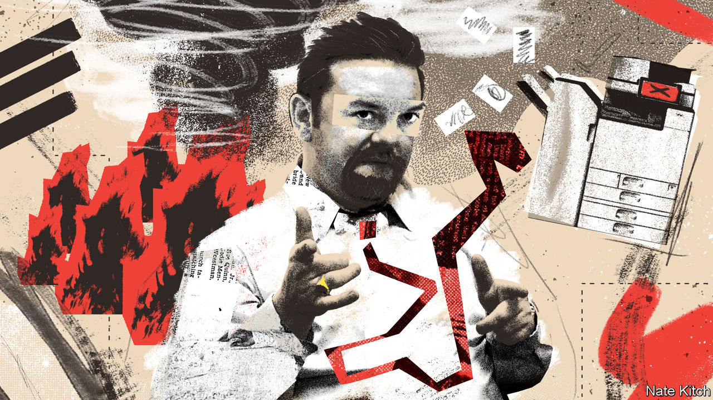
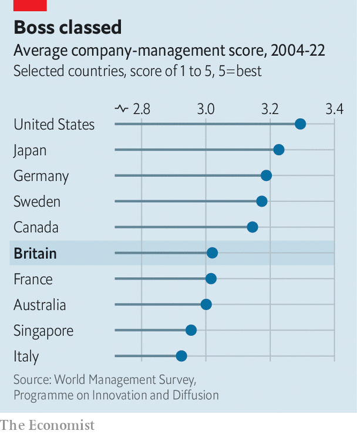

###### David Brent Ltd

# For Britain to grow faster it needs better managers 

##### British bosses lag behind some of their peers. Why? 

 

> Jan 31st 2023 

Imagine the typical plot of a British period drama. The setting is a stately home. His Lordship is amply endowed with English virtues: reserve, fair play and a sizeable chunk of Northumberland. But he lacks commercial nous and his education (Homer, Virgil, Catullus for fun) does not help. Chronic mismanagement has driven the family estate to the brink of insolvency. The hunt is on for a dashing—and, more importantly, rich—American to marry the heir and shore up the balance-sheet.

The British establishment has been fretting about its administrative abilities for decades. In 1920 a desire to turn out better public servants was one of the things that prompted Oxford dons to design a new degree course called “Modern Greats”; its updated form, the , continues to educate future leaders. In the 1960s, as the country was gripped by worries about post-war industrial decline, universities built management institutes and business schools, mimicking American ones that had been around since the turn of the century.

Yet management—the business of  productively, efficiently and reliably—remains a topic that often prompts a smirk or an eye-roll. Unlike in America or Germany, says Ann Francke, boss of the Chartered Management Institute (CMI), “manager” is not a title to aspire to in Britain. Depictions in popular culture tend towards toe-curling awkwardness or slapstick incompetence: think of sitcom characters such as David Brent in “The Office” or Basil Fawlty in “Fawlty Towers”. 

The same blind spot afflicts political debate. Politicians are swift to praise front-line workers in the National Health Service (NHS). The managers and consultants who administer the NHS seldom get a look in, unless it is to be accused of draining its budget. Policymakers know that Britain has a , one underlined by new forecasts from the International Monetary Fund this week predicting that it will be the only G7 economy to contract this year. Yet upping the quality of management barely gets a mention. It should. If British firms were better run, the impact on productivity could be striking. 

Performance reviewed

Management is a slippery topic that is not much studied by economists. Assessing it involves speaking to businesses—and as one dismal scientist says, economists tend to avoid speaking to companies in much the same way that biologists tend to avoid speaking to chimps. But two of their number, John Van Reenen and Nicholas Bloom, have been attempting to correct that. Since 2003 they have been developing and running the World Management Survey (WMS), an attempt to put the study of management practices onto a rigorous footing.

To date, the WMS has carried out over 20,000 interviews with medium-sized firms, hospitals and schools in 35 countries, some rich economies and others emerging markets. Researchers ask firms open questions about how they are run, from documenting process improvements and setting targets to  and promotion criteria. They then grade them in a range of categories. 

The firms do not know that their responses are being graded. The interviewers do not know anything about the firms’ financial performance or productivity. Each interviewer’s results are then adjusted in an effort to remove their own biases (such as consistently grading firms more harshly or leniently than the survey average).

The results allow for a ranking of countries based on differences in their firms’ management practices. Such differences are not just large; they also persist across borders. Among the WMS’s findings is the fact that companies’ offices abroad tend to be managed as well as those in their home country, meaning that the London branch of an American business, say, will typically be managed to the same standard as its offices in New York or Chicago. (Multinationals achieve higher management scores than domestic firms wherever they locate.)

In the grand scheme of things, Britain’s managers do not do terribly. If you aggregate the results of the surveys that have been conducted since 2004, the country comes sixth, outperforming the likes of France, Australia and Singapore. 

 


But it could still do an awful lot better (see chart). Britain sits below an elite group that is headed by America and also includes Japan, Germany, Sweden and Canada. This shortfall matters. Well-managed firms tend to score highly on a host of other metrics as well. They are likely to be more productive and profitable, to export more and to see their output grow more quickly. They also provide their employees with a better work-life balance. 

If the factors associated with good management seem intuitive, just how much it matters is still startling. The correlation between a high management score and productivity is so strong that management seems to account for more of the difference between the most and least productive firms within countries than factors like research and development spending or use of IT. Mr Van Reenen and Mr Bloom reckon that more than half of the productivity gap between Britain and America can be attributed to poor management. 

That is a bold claim. Rather than better management driving productivity gains, it could be that productive firms are able to attract better managers with higher salaries, for instance, or to pay pricey consultants to help them. And however strong the effect of good management, it can easily be swamped by other influences. Japanese firms may be well managed, for example, but few would hold Japan up as an obvious exemplar of high productivity.

Even so, Britain should take its management deficit more seriously. Having better-run companies and public-sector organisations might not be sufficient to solve the country’s , but it is probably necessary. And happily, the measures that would encourage this improvement are likely to bring other benefits. 

Take the role of . They form the backbone of many economies, including more productive ones like Germany. But one of the best predictors that a firm will be very poorly managed is that it is family-owned and has a chief executive whose position is due to inheritance, and specifically to being the eldest male child. Family firms that separate ownership and management, and even those who select their chief executive from a pool of all family members rather than via primogeniture, do not suffer from this deficiency. Mr Van Reenen talks about the “Carnegie effect”, whereby children who inherit wealth—or, in this case, power—are less likely to work hard.

 


British family firms are much more likely to be passed down via primogeniture than American or German ones. An early WMS study found that two-thirds of British family firms chose their CEO in this way, compared with a third of American family firms and a tenth of German ones. 

One reason for this may be the tax code. British businesses that are passed down the generations are liable for inheritance-tax relief of up to 100%. No such exemption exists in America, and the one in Germany is 50%. Mr Bloom points out that such firms also tend to have low debt levels, meaning that they can be run unproductively for a long time without getting into financial difficulty. Reducing the tax incentive to keep businesses in the family, or making it contingent on a meritocratic selection process for the chief executive, could nudge the management of many British firms into better hands.

One of the best predictors of good management, meanwhile, is that a firm is exposed to strong competition in its product market. It was a lack of this competition, argues Geoffrey Owen, a historian, in his book “From Empire to Europe”, that led to the poor management of businesses during Britain’s post-war industrial decline. 

By reducing the amount of competition British firms face, therefore, Brexit-induced restrictions risk impeding improvements to how well they are run. The better news is that Britain has maintained a fairly relaxed attitude to foreign ownership in recent years. Politicians would be wise to continue that stance, by using powers to block acquisitions—such as those granted by the National Security and Investment Act passed in 2021—sparingly. 

Another boost could come from more investment in management training. The CMI’s Ms Francke notes ruefully that Britain’s apprenticeship levy, a tax designed to encourage firms to invest more in training, often comes under fire for how much money is allocated to mid-career management training rather than to apprenticeships for teenagers entering the workforce. 

As well as laughing at their managers, then, Britons should also acknowledge their importance. Characters who incrementally reduce a factory’s waste, raise employee retention and chivvy their teams to achieve greater productivity would make for less entertaining TV than David Brent. But to get out of its growth rut, Britain needs more of them. ■


